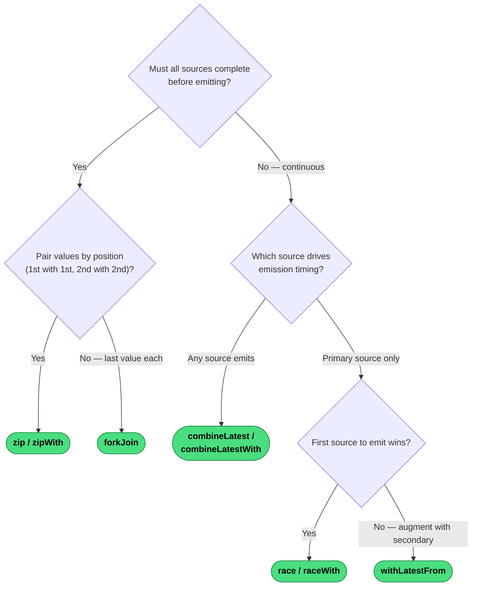

# Which Combination Operator?

The first question divides the space cleanly: do all sources need to *complete* before you get a result?

---
→ [Category reference](../categories/combination) · [All decision trees](../decisions/)
