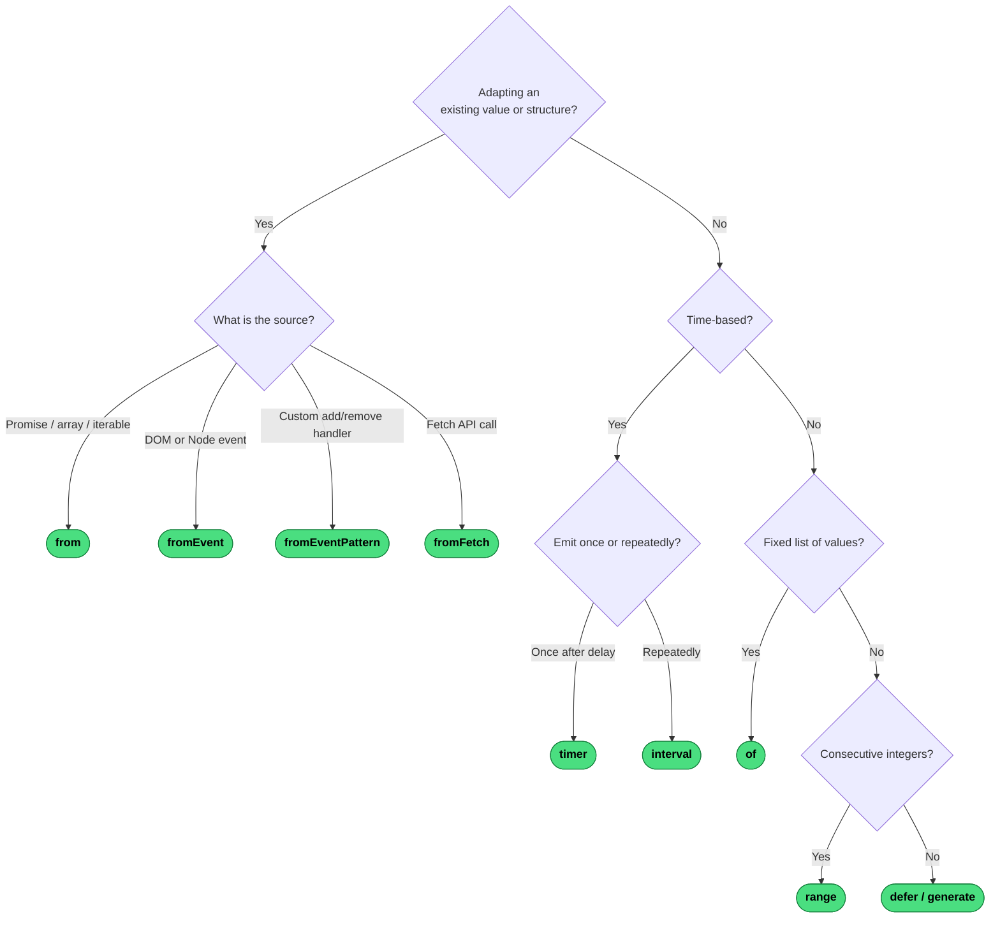

# Which Creation Operator?

Creation operators produce an Observable from scratch — no upstream source needed.

---
→ [Category reference](../categories/creation) · [All decision trees](../decisions/)
