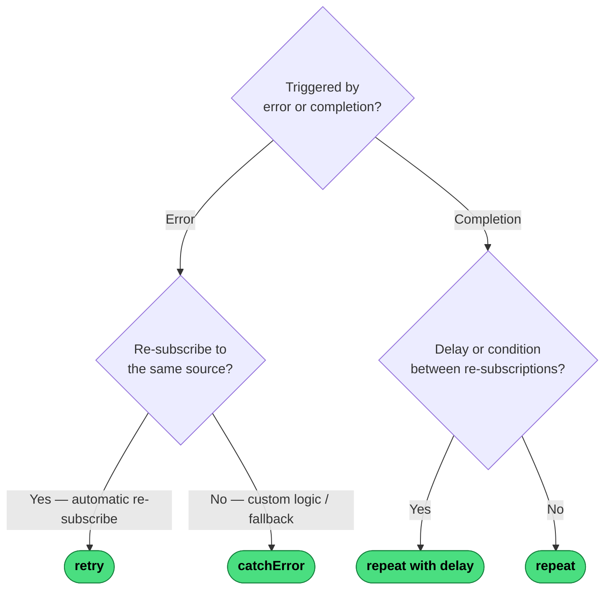

# Which Error Handling Operator?

The first split: are you reacting to an upstream **error** or an upstream **completion**?

---
→ [Category reference](../categories/error-handling) · [All decision trees](../decisions/)
