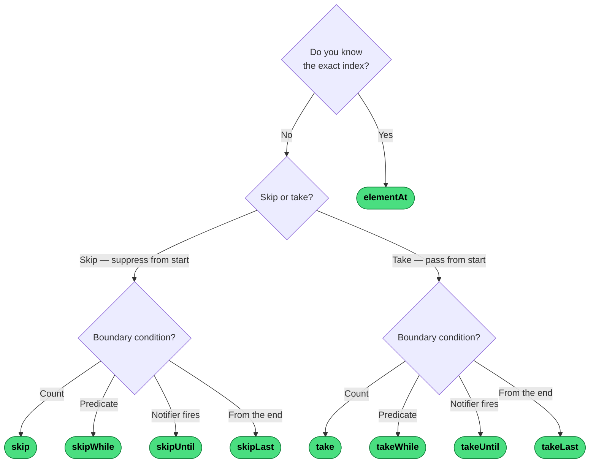
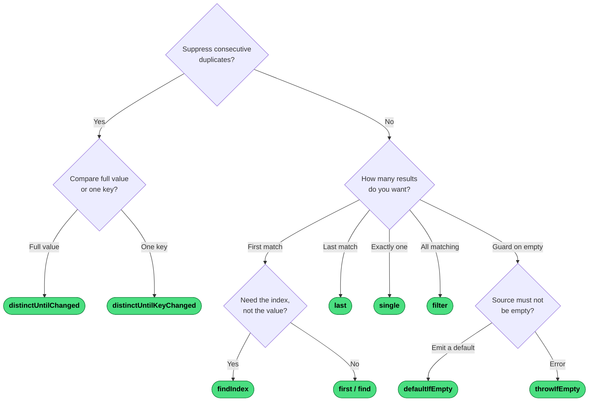

# Which Filtering Operator?

Filtering has two distinct axes: **position/count** (where in the sequence) and **value/predicate** (what the value is). Use the diagram that matches your question.

## By Position or Count

## By Value or Predicate

---
→ [Category reference](../categories/filtering) · [All decision trees](../decisions/)
