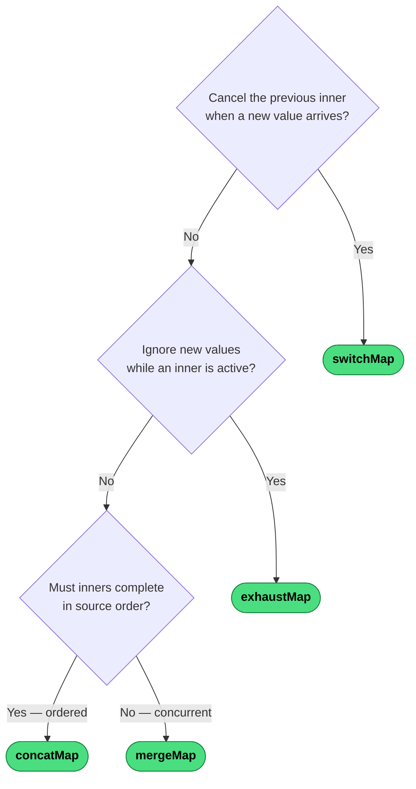

# Which Flattening Operator?

Each source value is projected into an inner Observable. The question is what happens to the *previous* inner when a *new* source value arrives.

| Operator | Concurrency | On new inner |
|---|---|---|
| `switchMap` | 1 | Cancel previous |
| `exhaustMap` | 1 | Ignore new |
| `concatMap` | 1 | Queue new |
| `mergeMap` | ∞ | Subscribe immediately |

---
→ [Category reference](../categories/flattening) · [All decision trees](../decisions/)
