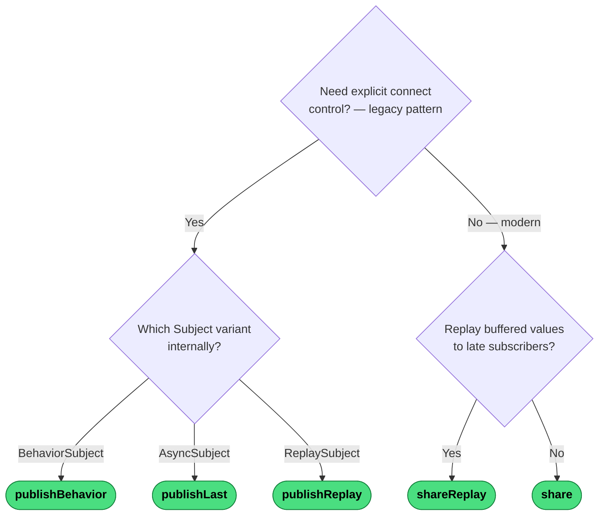

# Which Multicasting Operator?

All multicasting operators share one upstream subscription. The questions are whether you need replay and whether you need explicit `connect()` control.

---
→ [Category reference](../categories/multicasting) · [All decision trees](../decisions/)
