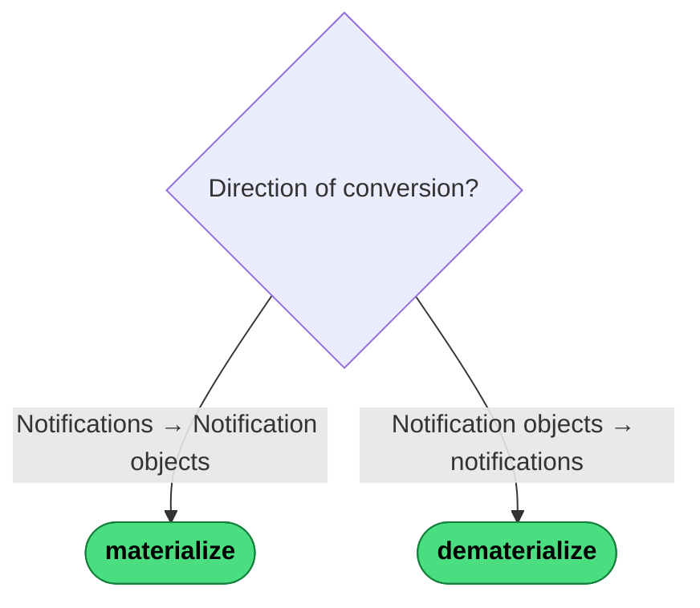

# Which Notification Operator?

`materialize` and `dematerialize` are inverse pairs — one converts events *to* objects, the other converts objects *back to* events.

---
→ [Category reference](../categories/notification) · [All decision trees](../decisions/)
