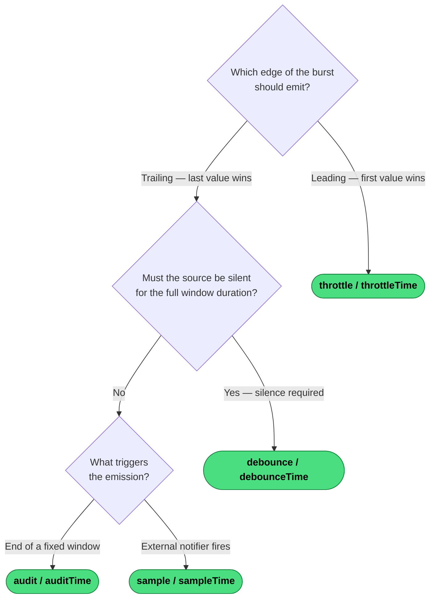

# Which Rate-Limiting Operator?

All four families are lossy — values that fall in the suppression window are dropped. The key question is which edge of a burst should survive.

---
→ [Category reference](../categories/rate-limiting) · [All decision trees](../decisions/)
