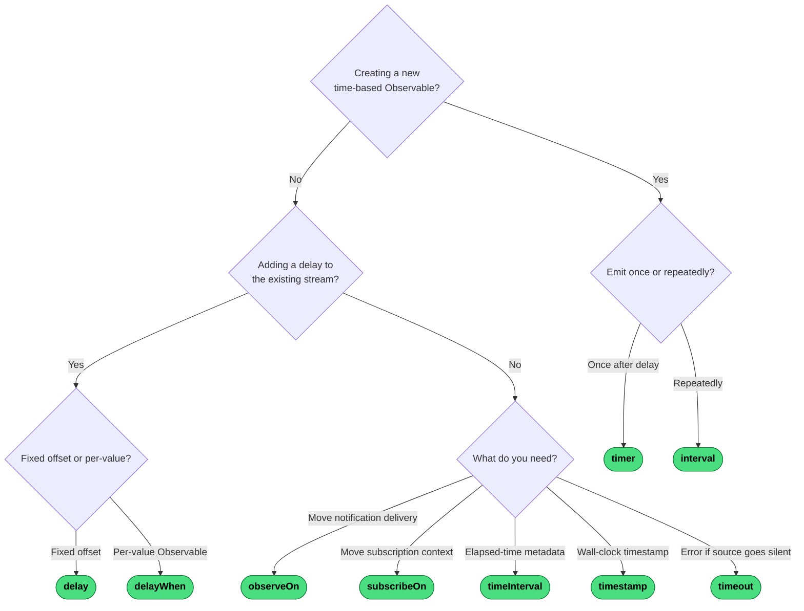

# Which Scheduling or Timing Operator?

Start by asking whether you are *creating* a new time-based Observable or *decorating* an existing stream.

---
→ [Category reference](../categories/scheduling-timing) · [All decision trees](../decisions/)
