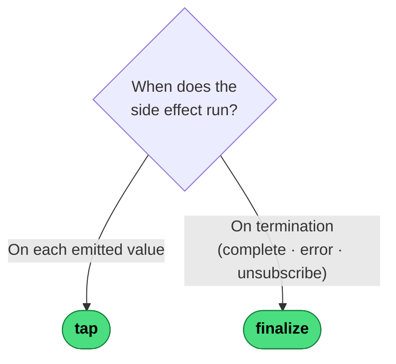

# Which Side-Effect Operator?

Both operators are transparent to the data flow — they observe without altering. The only question is *when* the effect runs.

---
→ [Category reference](../categories/side-effects) · [All decision trees](../decisions/)
