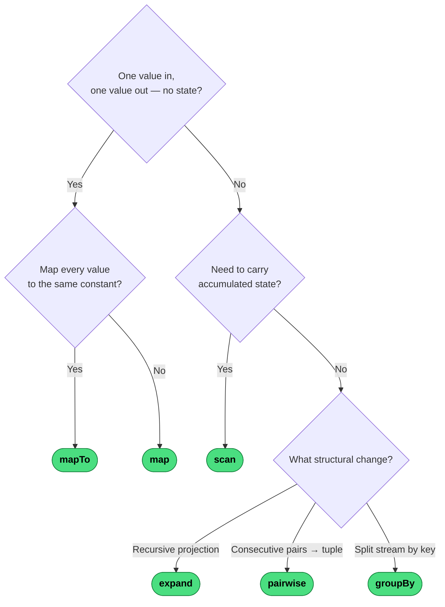

# Which Transformation Operator?

Transformation operators reshape each emission without changing which values pass or how subscriptions work.

---
→ [Category reference](../categories/transformation) · [All decision trees](../decisions/)
