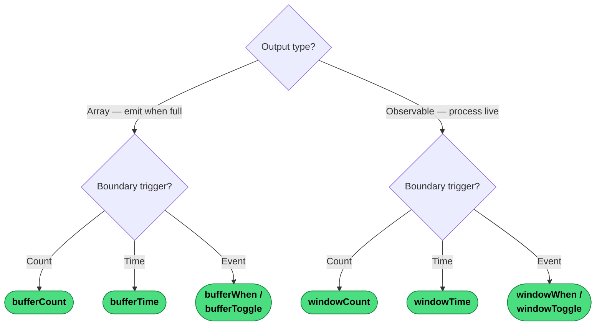

# Which Windowing or Buffering Operator?

Both families collect source emissions into groups. The first question is the output type; the second is what triggers the group boundary.

---
→ [Category reference](../categories/windowing-buffering) · [All decision trees](../decisions/)
