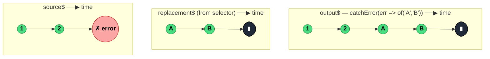

### `catchError<T, O>(selector: (err, caught) => O)`

> Intercepts an error from the source and hands control to a selector function that returns a replacement Observable — effectively turning "the stream failed" into "the stream continues from here".

---

#### Policies

| Policy | Value |
|--------|-------|
| **Family** | Error Handling |
| **Arity** | Higher-order — selector returns an Observable |
| **Time-sensitive** | No |
| **Value-sensitive** | No — only reacts to the error channel |
| **Lossy** | No — source values before the error pass through; the replacement's values are forwarded |
| **Completion required** | No |
| **Backpressure policy** | None |
| **Scheduler-aware** | No |
| **Multicast** | Unicast — each subscriber gets its own recovery path |
| **Error propagation** | Catch — errors in the source are intercepted; the selector can rethrow or return a new error stream |
| **Subscription lifecycle** | Per-subscriber |
| **Purity** | Pure (selector should be) |
| **Synchronicity** | Sync-by-default — handles synchronous errors correctly |

**Completion behaviour** — Source values pass through until an error occurs. On error, `catchError` unsubscribes the source, calls `selector(err, caught)`, subscribes to the returned Observable, and mirrors *it* from that point. The `caught` argument is the same source wrapped in the same `catchError` — making `catchError((e, caught) => caught)` equivalent to `retry()`. Source completion passes through unchanged.

**Lossy behaviour** — Not lossy. Every value before the error is forwarded; every value from the replacement Observable is forwarded. The error itself is *consumed*, not emitted downstream (unless the selector rethrows).

---

#### ASCII Marble Diagram

```
source:     --1--2--#
            catchError(err => of('A', 'B'))
output:     --1--2--A--B|

source:     --1--2--#
            catchError(err => throwError(() => new Error('wrapped')))
output:     --1--2--#    (re-thrown)

source:     --1--2--#
            catchError((err, caught) => caught)     // infinite retry
output:     --1--2--1--2--#...
```

---

#### Mermaid Marble Diagram



---

#### Signature

```typescript
export function catchError<T, O extends ObservableInput<unknown>>(
	selector: (err: unknown, caught: Observable<T>) => O
): OperatorFunction<T, T | ObservedValueOf<O>>
```

- `err` — the thrown value (use `unknown` and narrow, don't assume `Error`)
- `caught` — the source re-wrapped, for recursive retry patterns

---

#### Five Use Cases

- **Fallback value on failure** — on API error, emit a cached or default value so the UI stays populated
- **Error-to-action mapping** — convert an error into a domain action (`{ type: 'fetchFailed', error }`) to feed a reducer
- **Retry via `caught`** — implement `retry()`-like behaviour by returning the `caught` argument
- **Swallow-and-complete** — return `EMPTY` to silently complete the stream on error (quiet failure)
- **Error enrichment & rethrow** — wrap the error with extra context, then re-throw via `throwError` to propagate further up

---

#### Primary Code Sample

```typescript
import { Observable, catchError, of, timer, defer, switchMap } from 'rxjs'

// Scenario: fallback value on failure — API failure yields cached data, stream continues
interface Data {
	items: string[]
}

const cached: Data = { items: ['cached-a', 'cached-b'] }

declare function fetchData(): Observable<Data>

const data$: Observable<Data> = fetchData().pipe(
	catchError((err: unknown): Observable<Data> => {
		console.warn('fetchData failed, using cache:', err)
		return of(cached)
	})
)
```

**MVU relevance:** inside an NgRx-style Effect, the canonical shape is `actions$.pipe(ofType(...), switchMap(action => api(action).pipe(map(res => okAction(res)), catchError(err => of(failAction(err))))))`. The `catchError` must live **inside** the `switchMap` — if it's outside, a single error tears down the entire effect forever (the outer stream has errored and will not re-subscribe).

---

#### Gotchas

1. **Place `catchError` inside `switchMap`/`mergeMap`, not outside** — an error in the outer pipeline terminates it permanently. Wrap just the inner Observable to keep the effect alive for subsequent actions.
2. **`err` is `unknown`, not `Error`** — use `instanceof Error` or type narrowing. Don't blindly access `.message`.
3. **Returning `caught` is infinite retry** — unbounded. Use `retry({ count: N })` or compose with `take(N)` to cap.
4. **Selector errors rethrow** — if the selector itself throws synchronously, the output errors with the selector's thrown value. Guard the selector or use `defer` to contain failures.
5. **Source is already terminated** — once `catchError` runs, the source is done. Any side effects on the source (closing sockets, aborting requests) have already fired. The replacement Observable is a completely fresh stream.

---

#### Related Operators

| Operator | Key difference | Choose when |
|----------|---------------|-------------|
| `retry` | Resubscribes to source, doesn't replace | You want to retry the same source, not substitute |
| `retryWhen` | Retry with a notifier-driven strategy (deprecated) | Use `retry({ delay: ... })` instead |
| `onErrorResumeNextWith` | Sequences multiple fallbacks | You have a list of fallback sources |
| `materialize` + `map` | Inspects Notifications | You want to handle errors as data |
| `finalize` | Runs cleanup, doesn't catch | You just need cleanup regardless of path |

---

#### Decision Rule

> Use `catchError` when you want to **turn an error into a new stream** — fallback, transform, or rethrow with context. Prefer `retry` when you want to re-subscribe to the same source, or `finalize` when you only need cleanup.
