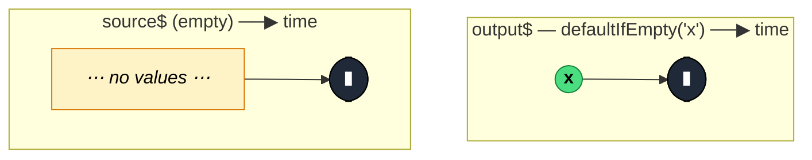

### `defaultIfEmpty<T, R>(defaultValue: R): OperatorFunction<T, T | R>`

> Mirrors the source; if the source completes without ever emitting, emits `defaultValue` first, then completes.

---

#### Policies

| Policy | Value |
|--------|-------|
| **Family** | Insertion / Completion |
| **Arity** | Unary |
| **Time-sensitive** | No |
| **Value-sensitive** | No — only checks "was there any emission at all?" |
| **Lossy** | No — all source values pass through untouched |
| **Completion required** | Partial — default emission only on source completion with no prior values; non-empty sources don't need completion |
| **Backpressure policy** | None |
| **Scheduler-aware** | No |
| **Multicast** | Unicast |
| **Error propagation** | Forward |
| **Subscription lifecycle** | Per-subscriber |
| **Purity** | Pure |
| **Synchronicity** | Sync-by-default — default is emitted synchronously with source completion |

**Completion behaviour** — If the source emits anything, `defaultIfEmpty` is a straight pass-through, including completion. If the source completes with no `next` ever sent, it emits `defaultValue` and then completes. On infinite sources with no values, it stalls forever (waiting for completion that never comes).

**Lossy behaviour** — Not lossy. Every source value flows through unchanged. The operator only adds a default when nothing else would be emitted.

---

#### ASCII Marble Diagram

```
source:  --a--b--|
         defaultIfEmpty('x')
output:  --a--b--|

source:  -----|            (empty)
         defaultIfEmpty('x')
output:  -----(x|)
```

---

#### Mermaid Marble Diagram



---

#### Signature

```typescript
export function defaultIfEmpty<T, R>(
	defaultValue: R
): OperatorFunction<T, T | R>
```

Output type is the union `T | R` — downstream code must accept either the source's values or the default.

---

#### Five Use Cases

- **Empty-list fallback** — on a search result stream, substitute `[]` or a "no results" placeholder when nothing came back
- **Loading-state safety net** — ensure a UI state stream always emits at least one value so the view doesn't stay on a spinner
- **Reactive forms** — provide an initial blank value if the user never typed anything before the form completed
- **API response smoothing** — when a server might return an empty 204 stream, substitute a domain default object
- **Optional stream handling** — upstream of a `switchMap`/`combineLatest`, guarantee each branch emits at least once so the overall combinator emits

---

#### Primary Code Sample

```typescript
import { of, EMPTY, defaultIfEmpty, Observable } from 'rxjs'

// Scenario: empty-list fallback — substitute "no results" for an empty search stream
interface SearchResult {
	id: string
	title: string
}

declare const searchResults$: Observable<SearchResult[]>

const safeResults$: Observable<SearchResult[]> = searchResults$.pipe(
	defaultIfEmpty<SearchResult[], SearchResult[]>([])
)

// Now downstream can always safely `.length === 0` check
safeResults$.subscribe((rs: SearchResult[]): void => {
	if (rs.length === 0) console.log('No results')
})
```

`defaultIfEmpty` lives at the end of pipelines that use `filter`, `takeWhile`, or `takeUntil` — anywhere the source might filter all values away and leave the subscriber with nothing.

---

#### Gotchas

1. **Only fires on source completion** — if the source emits one value and never completes, `defaultIfEmpty` behaves like a plain pass-through. On an infinite empty source, you never get the default.
2. **Different from `startWith`** — `startWith` always prepends a value. `defaultIfEmpty` only emits the default *if* the source was empty. Do not use them interchangeably.
3. **Output type union can surprise TypeScript consumers** — if `T` and `R` are the same type, it's invisible; if they differ, downstream code must handle both. Consider using a value of type `T` as the default to keep the type stable.
4. **Does not handle errors** — a source that errors before emitting any value still errors the output. If you want "default on error *or* empty", compose with `catchError(() => EMPTY)` before `defaultIfEmpty`.
5. **Not a replacement for `startWith(initial)`** — for "initial value first, then source values", use `startWith`. `defaultIfEmpty` is specifically for the empty-completion edge case.

---

#### Related Operators

| Operator | Key difference | Choose when |
|----------|---------------|-------------|
| `startWith(seed)` | Always prepends seed, whether source emits or not | You want a guaranteed first value |
| `throwIfEmpty` | Errors on empty instead of substituting | Empty should be an error |
| `isEmpty` | Replaces values with a boolean | You want a yes/no summary, not a fallback |
| `endWith(final)` | Appends a final value on completion | You want a sentinel at the end regardless |
| `catchError(() => of(default))` | Handles error case, not empty-complete | You want a fallback on error |

---

#### Decision Rule

> Use `defaultIfEmpty` when you want the source's values if any, otherwise **a fallback emitted at source completion**. Prefer `startWith` to always prepend, `throwIfEmpty` when empty is an error, or `catchError` for error fallback.
