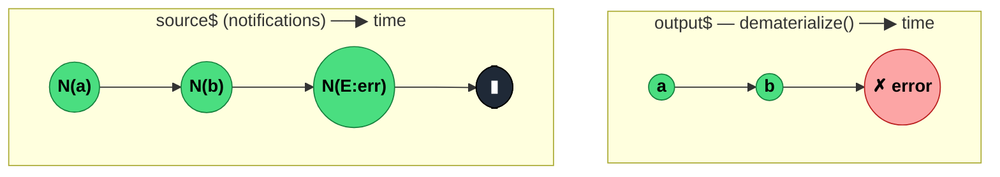

### `dematerialize<N>(): OperatorFunction<N, ValueFromNotification<N>>`

> Unwraps `ObservableNotification` objects back into real `next` / `error` / `complete` signals — the inverse of `materialize`.

---

#### Policies

| Policy | Value |
|--------|-------|
| **Family** | Notification / Utility |
| **Arity** | Unary |
| **Time-sensitive** | No |
| **Value-sensitive** | Yes — inspects each notification's `kind` to decide how to emit |
| **Lossy** | No |
| **Completion required** | No |
| **Backpressure policy** | None |
| **Scheduler-aware** | No |
| **Multicast** | Unicast |
| **Error propagation** | **Replace** — a `{kind: 'E'}` value in the source becomes an actual `error` notification downstream |
| **Subscription lifecycle** | Per-subscriber |
| **Purity** | Pure |
| **Synchronicity** | Sync-by-default |

**Completion behaviour** — For each source `next(notification)`: if `kind === 'N'`, emits `next(value)`. If `kind === 'E'`, emits `error(error)` and terminates. If `kind === 'C'`, emits `complete()` and terminates. Source errors or completions that bypass the notification flow just pass through directly.

**Lossy behaviour** — Not lossy; round-trip with `materialize` is an identity transformation.

---

#### ASCII Marble Diagram

```
source (notifications):  --N(a)--N(b)--N(c)--N(C)|
                         dematerialize()
output:                  --a--b--c--|

source:                  --N(a)--N(E:err)|
                         dematerialize()
output:                  --a--#    (error unwrapped and emitted)
```

---

#### Mermaid Marble Diagram



---

#### Signature

```typescript
export function dematerialize<N extends ObservableNotification<unknown>>(): OperatorFunction<
	N,
	ValueFromNotification<N>
>
```

The generic `N` carries the notification type; `ValueFromNotification<N>` extracts the inner value type.

---

#### Five Use Cases

- **Close an error-as-data section** — after `materialize → filter/map → dematerialize`, restore normal signal semantics
- **Replay recorded streams** — emit an array of notifications as if they were arriving live, errors included
- **Testing harnesses** — feed hand-crafted notification sequences to exercise downstream operator behaviour
- **Cross-boundary serialization** — transmit notifications across a worker/socket/channel as JSON-friendly data, then re-synthesize
- **Fixture-based integration tests** — simulate a finite stream that errors at a specific point without using `throwError`

---

#### Primary Code Sample

```typescript
import { of, materialize, filter, dematerialize, Observable, ObservableNotification } from 'rxjs'

// Scenario: error-suppressing pipeline — materialize, drop errors, dematerialize
const raw$: Observable<number> = /* a stream that may error */ new Observable<number>()

const withoutErrors$: Observable<number> = raw$.pipe(
	materialize(),
	filter((n: ObservableNotification<number>): boolean => n.kind !== 'E'),
	dematerialize()
)
```

The canonical `materialize → inspect → dematerialize` sandwich. Intermediate operators can inspect or drop error notifications as data, and `dematerialize` restores the expected signal kind.

---

#### Gotchas

1. **Assumes source emits only notifications** — if the source emits a non-notification value as `next`, `dematerialize` will throw. Keep the materialization discipline end-to-end.
2. **Error in source → stream error; error in notification → stream error** — both paths error the output, but only the notification-based one is "recovered" information. Subtle distinction when debugging.
3. **`{kind: 'C'}` terminates after emission** — downstream sees `complete()` as normal. If you had values after the `C` notification in your fixture, they are discarded.
4. **Do not hand-craft notifications with wrong shape** — missing `value` on `kind: 'N'` or missing `error` on `kind: 'E'` leads to runtime surprises. Use the `nextNotification` / `errorNotification` helpers or `COMPLETE_NOTIFICATION` constant.
5. **Rare in direct app code** — typically appears in library-level operators, testing utilities, or integration layers. If you're reaching for it in business logic, consider whether `catchError` or `tap({ error })` would be clearer.

---

#### Related Operators

| Operator | Key difference | Choose when |
|----------|---------------|-------------|
| `materialize` | Inverse — wraps notifications as data | You're entering an error-as-data section |
| `catchError` | Replaces errored source with another | You want recovery, not notification introspection |
| `of(notif1, notif2, ...) + dematerialize` | Build a stream from hand-crafted notifications | Testing or fixture replay |

---

#### Decision Rule

> Use `dematerialize` to **close a materialize-based error-as-data pipeline** or to replay a stream from hand-crafted notifications. For normal error handling, prefer `catchError` or `retry`.
