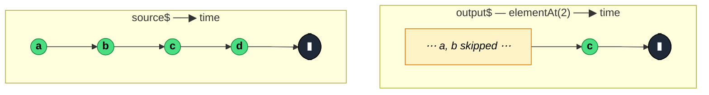

### `elementAt<T, D>(index: number, defaultValue?: D)`

> Emits the value at the given zero-based `index` in the source stream and completes — errors with `ArgumentOutOfRangeError` if the source completes before reaching that index and no default was supplied.

---

#### Policies

| Policy | Value |
|--------|-------|
| **Family** | Filtering / Selection |
| **Arity** | Unary |
| **Time-sensitive** | No |
| **Value-sensitive** | No — decision is purely by position, not content |
| **Lossy** | Yes — all values before and after the target index are dropped |
| **Completion required** | No — completes as soon as the target index is reached |
| **Backpressure policy** | None — emits at most once |
| **Scheduler-aware** | No |
| **Multicast** | Unicast |
| **Error propagation** | Forward; also `ArgumentOutOfRangeError` for index < 0 or unreached index without default |
| **Subscription lifecycle** | Per-subscriber — each subscriber has its own counter |
| **Purity** | Pure |
| **Synchronicity** | Sync-by-default |

**Completion behaviour** — Emits the Nth value and unsubscribes from the source. If source completes before reaching index N and no default was provided, errors with `ArgumentOutOfRangeError`. If a default was provided, emits the default and completes. `index < 0` throws synchronously at operator construction time, not at subscription.

**Lossy behaviour** — Lossy by design: all values except the one at the target index are silently ignored.

---

#### ASCII Marble Diagram

```
source:  --a--b--c--d--|
         elementAt(2)
output:  --------c|

source:  --a--b--|
         elementAt(5, 'none')
output:  --------(none|)

source:  --a--b--|
         elementAt(5)          (no default)
output:  --------#             (ArgumentOutOfRangeError)
```

---

#### Mermaid Marble Diagram



---

#### Signature

```typescript
export function elementAt<T, D = T>(
	index: number,
	defaultValue?: D
): OperatorFunction<T, T | D>
```

Throws `ArgumentOutOfRangeError` at construction if `index < 0`.

---

#### Five Use Cases

- **"Third click" gesture** — react only to the Nth UI interaction (triple-click, Nth scroll stop)
- **Protocol indexing** — pick a specific frame in a fixed-order handshake (e.g. third message in a three-step SASL exchange)
- **Replay buffer access** — on a `ReplaySubject` or buffered source, grab the emission at a known index
- **Deterministic testing** — in a unit test, assert the value at a known position without building up an array
- **Nth-item extraction** — take the header row (index 0), or a specific summary row at a known index

---

#### Primary Code Sample

```typescript
import { fromEvent, elementAt, Observable } from 'rxjs'

// Scenario: "third click" gesture — respond only to the 3rd click in a session
const thirdClick$: Observable<MouseEvent> = fromEvent<MouseEvent>(document, 'click').pipe(
	elementAt(2)
)

thirdClick$.subscribe((e: MouseEvent): void => {
	console.log('Third click at', e.clientX, e.clientY)
})
```

`elementAt(2)` = 0-based, so this fires on the **third** click. For "first", prefer `first()` or `take(1)` — `elementAt(0)` is the same result but uses a different error type (`ArgumentOutOfRangeError` rather than `EmptyError`), which matters if you branch on errors.

---

#### Gotchas

1. **Zero-based index** — `elementAt(0)` = first value, `elementAt(2)` = third value. Off-by-one is the most common bug.
2. **Throws synchronously on negative index** — `elementAt(-1)` throws at operator-construction time, before you even subscribe. This is intentional (it is always a programming error).
3. **Out-of-range error vs default** — without a `defaultValue`, you get an `ArgumentOutOfRangeError` on short sources. With one, you get the default silently. Choose based on whether "too few values" is a bug or acceptable.
4. **Each subscriber has its own counter** — for late subscribers to a multicasted source (`share`), the counter starts at 0 from when *they* subscribed, not from the source's absolute start. Use `shareReplay` if you need consistent indexing across subscribers.
5. **No negative indexing like arrays** — you cannot do `elementAt(-1)` to mean "last". Use `last()` or `takeLast(1)` instead.

---

#### Related Operators

| Operator | Key difference | Choose when |
|----------|---------------|-------------|
| `first` | Matches by predicate, not index | Selection is content-based |
| `take(n)` | Emits the first N values, not just the Nth | You want a prefix, not a single value |
| `skip(n) + take(1)` | Same effect as `elementAt(n)` | You prefer explicit composition |
| `last` | Emits the last value of a finite stream | You want the tail, not a specific position |
| `single` | Assert exactly one value | Uniqueness, not position |

---

#### Decision Rule

> Use `elementAt(n)` when you need **the value at a specific zero-based index** and the source reliably has at least that many emissions. Prefer `first`/`take(1)` for index 0, `last` for the final value, or `skip(n) + take(1)` when you want to spell the intent out.
