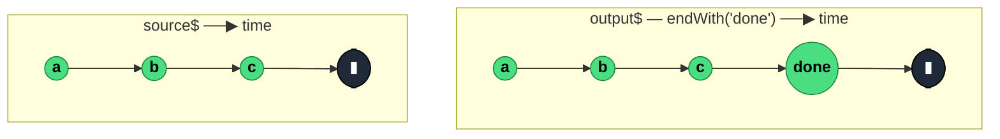

### `endWith<T, A>(...values: A): OperatorFunction<T, T | ValueFromArray<A>>`

> Mirrors the source, then synchronously emits the provided values immediately after the source completes — useful for marking "the end" of a stream with a sentinel.

---

#### Policies

| Policy | Value |
|--------|-------|
| **Family** | Insertion / Suffix |
| **Arity** | Unary |
| **Time-sensitive** | No |
| **Value-sensitive** | No |
| **Lossy** | No — source values pass through unchanged, suffix is appended |
| **Completion required** | Yes — suffix only emits on source completion |
| **Backpressure policy** | None |
| **Scheduler-aware** | No |
| **Multicast** | Unicast |
| **Error propagation** | Forward — source errors pass through *before* the suffix fires; erroring source produces no suffix |
| **Subscription lifecycle** | Per-subscriber — suffix fires on each subscriber's completion |
| **Purity** | Pure |
| **Synchronicity** | Sync-by-default — suffix emits synchronously with source completion |

**Completion behaviour** — Source values pass through. On source `complete`, `endWith` synchronously emits the suffix values in argument order and then completes itself. On source `error`, the suffix is **skipped** — errors short-circuit before the suffix can fire. On infinite source, the suffix never emits.

**Lossy behaviour** — Not lossy. All source values pass through; values are only added, never removed.

---

#### ASCII Marble Diagram

```
source:       --a--b--c--|
              endWith('done')
output:       --a--b--c--done|

source:       --a--b--|
              endWith('x', 'y')
output:       --a--b--xy|
              (multiple suffix values, synchronously)

source:       --a--b--#        (error)
              endWith('done')
output:       --a--b--#        (suffix skipped)
```

---

#### Mermaid Marble Diagram



---

#### Signature

```typescript
export function endWith<T, A extends readonly unknown[] = T[]>(
	...values: A
): OperatorFunction<T, T | ValueFromArray<A>>
```

---

#### Five Use Cases

- **Termination sentinel** — emit a "DONE" marker after a finite stream so downstream knows a batch is complete
- **Teardown status message** — pair with `takeUntil` to emit a "stopped by user" message after a manually terminated stream
- **Drain signal** — emit an explicit last value to flush downstream UI state (e.g. "connection closed")
- **Progress finalisation** — after a progress stream ends, emit a `100%` or `done` frame regardless of whether the last source value reached it
- **Summary suffix** — on finite data streams, append a computed summary after the last data value

---

#### Primary Code Sample

```typescript
import { interval, map, fromEvent, startWith, takeUntil, endWith, Observable } from 'rxjs'

// Scenario: teardown status with takeUntil — mark stream end on user click
const ticker$: Observable<string> = interval(1000).pipe(
	map((): string => 'tick')
)

const documentClicks$: Observable<Event> = fromEvent(document, 'click')

const monitored$: Observable<string> = ticker$.pipe(
	startWith('interval started'),
	takeUntil(documentClicks$),
	endWith('interval ended by click')
)

monitored$.subscribe((msg: string): void => console.log(msg))

// Output (user clicks after 3s):
// 'interval started', 'tick', 'tick', 'tick', 'interval ended by click'
```

The `startWith + takeUntil + endWith` trio is the canonical way to bracket a stream with "starting" and "ending" markers around a finite runtime.

---

#### Gotchas

1. **Suffix skipped on error** — if the source errors, the suffix values never emit; the error is the terminal notification. If you want a suffix on *both* paths, compose with `catchError` that re-emits the suffix, or use `finalize` for a side effect.
2. **No suffix on infinite sources** — `endWith` needs source completion. Pair with `take`, `takeUntil`, or a terminator upstream.
3. **Not a replacement for `finalize`** — `finalize` fires a callback on *any* terminal (complete, error, or unsubscribe); `endWith` only emits values on complete. If you need cleanup regardless of path, use `finalize`.
4. **Emits synchronously with completion** — the suffix is emitted in the same tick as the source's complete notification. If downstream operators defer, they might see the suffix later than expected.
5. **Suffix values are plain values, not Observables** — you can't `endWith(someObservable$)`. If you need an async tail, use `concat(source$, tailObs$)` instead.

---

#### Related Operators

| Operator | Key difference | Choose when |
|----------|---------------|-------------|
| `startWith` | Prepends instead of appends | You need a prefix |
| `finalize(fn)` | Runs a callback, no emitted value | You need side-effect cleanup, not a data marker |
| `concat(source$, of(sentinel))` | More verbose equivalent | You prefer explicit composition |
| `takeUntil + endWith` | Combined pattern for bracketed streams | You want to mark both start and end of a lifecycle |
| `concatMap` after completion | Async tail | Your suffix needs to do async work |

---

#### Decision Rule

> Use `endWith(...values)` when you want to **append sentinel values after a finite source completes**. Prefer `finalize` for side-effect-only cleanup, or `concat` when the tail is another Observable rather than a fixed value.
