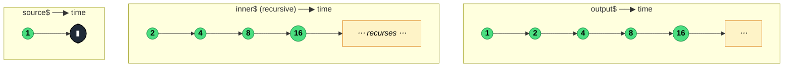

### `expand<T, O>(project: (value: T, index: number) => O, concurrent?: number)`

> Recursively projects each value — source *and* output — through `project` to produce an inner Observable, merging all emissions into the output; it is `mergeMap` applied to its own results.

---

#### Policies

| Policy | Value |
|--------|-------|
| **Family** | Transformation (Higher-order / Recursive) |
| **Arity** | Higher-order — the projection returns an Observable |
| **Time-sensitive** | No |
| **Value-sensitive** | Yes — the projection consumes the value |
| **Lossy** | No — every emitted value, source or recursive, is forwarded |
| **Completion required** | No — completes when all inner Observables complete and the source completes |
| **Backpressure policy** | Buffer — values beyond `concurrent` are queued internally |
| **Scheduler-aware** | Yes — accepts a scheduler for inner subscriptions |
| **Multicast** | Unicast |
| **Error propagation** | Forward — any inner error kills the whole stream |
| **Subscription lifecycle** | Per-subscriber |
| **Purity** | Pure (projection should be) |
| **Synchronicity** | Async-by-default — recursive expansion typically involves async work |

**Completion behaviour** — `expand` completes only when the source has completed **and** every spawned inner Observable has completed. Because each output value is itself fed back into `project`, the recursion can continue indefinitely if the projection never terminates. Unbounded recursion is a genuine risk — use `take(n)` downstream or make `project` return `EMPTY` at a stopping condition.

**Lossy behaviour** — Not lossy. Every value emitted — whether from the source or from a recursively produced inner Observable — is forwarded to the output *and* fed back into `project`.

---

#### ASCII Marble Diagram

```
source:          --1-----------------|
                 expand(x => of(2 * x).pipe(delay(10)))

inner from 1:      --2--
inner from 2:         --4--
inner from 4:            --8--
inner from 8:               --16-- ...

output:          --1-2-4-8-16-32- ... (grows until a stop)
```

Every output value re-enters the projection; the stream recurs forever unless bounded by `take()`, a guard inside `project` returning `EMPTY`, or source/inner completion.

---

#### Mermaid Marble Diagram



---

#### Signature

```typescript
export function expand<T, O extends ObservableInput<unknown>>(
	project: (value: T, index: number) => O,
	concurrent?: number
): OperatorFunction<T, ObservedValueOf<O>>
```

- `concurrent` defaults to `Infinity` — all spawned inners run in parallel. Setting it to `1` serialises the recursion (breadth-first becomes depth-first).
- The output type `ObservedValueOf<O>` is the emission type of the inner Observable.

---

#### Five Use Cases

- **Paginated API crawling** — fetch page 1, then recursively fetch each `nextPageToken` until the API returns no more pages
- **Tree traversal** — starting from a root node, expand each emitted node into its children and recurse until leaves
- **Recursive polling** — after each response, schedule the next poll request, creating a chain that can adapt to response content
- **Graph / dependency resolution** — expand each visited node into its unresolved dependencies until the closure stabilises
- **Retry-with-growth** — emit the current backoff delay, then expand to the next delay on a multiplicative schedule (rarely the best tool for this; `repeat` + `delay` is usually simpler)

---

#### Primary Code Sample

```typescript
import { defer, expand, EMPTY, from, Observable, reduce } from 'rxjs'

// Scenario: paginated API crawling — fetch every page transparently
interface Page<T> {
	items: T[]
	nextCursor: string | null
}

const fetchPage = <T>(cursor: string | null): Observable<Page<T>> =>
	defer((): Promise<Page<T>> =>
		fetch(`/api/items?cursor=${cursor ?? ''}`).then((r): Promise<Page<T>> => r.json())
	)

const allItems$: Observable<string[]> = fetchPage<string>(null).pipe(
	expand((page: Page<string>): Observable<Page<string>> =>
		page.nextCursor === null ? EMPTY : fetchPage<string>(page.nextCursor)
	),
	reduce((acc: string[], page: Page<string>): string[] => [...acc, ...page.items], [])
)
```

The recursion terminates when a page returns `nextCursor === null`, at which point `project` returns `EMPTY` — this is the canonical "how to stop `expand`" pattern. `reduce` then flattens all pages into a single final array emission.

---

#### Gotchas

1. **Easy to produce an infinite stream** — because every output re-enters `project`, forgetting a base case creates an unterminated recursion. Always ensure `project` returns `EMPTY` (or the stream completes) at a stopping condition, or bound with `take(n)` downstream.
2. **`concurrent` controls breadth vs depth** — default `Infinity` means every branch runs in parallel (breadth-first). Set `concurrent: 1` for strict depth-first (each branch fully resolves before the next starts), useful for rate-limited APIs.
3. **Memory grows with buffered values** — when `concurrent < Infinity` and emissions arrive faster than inners complete, values queue internally. For long recursions on slow APIs this can balloon.
4. **Don't confuse with `mergeScan`** — `mergeScan` also recurses but threads an accumulator through; `expand` re-projects each emission standalone. Use `mergeScan` when the next step depends on accumulated state rather than just the current value.
5. **Errors terminate the whole tree** — any inner Observable erroring cancels every other in-flight inner and errors the output. Wrap individual inners with `catchError(() => EMPTY)` if you want to skip failures and continue.

---

#### Related Operators

| Operator | Key difference | Choose when |
|----------|---------------|-------------|
| `mergeMap` | Projects each source value but does **not** re-project outputs | One level of flattening; no recursion needed |
| `mergeScan` | Recurses while threading an accumulator | The next step depends on running state, not just current value |
| `concatMap` | Serialises, no recursion | Ordered per-source projections, one level deep |
| `repeat` + projection | Restarts the source on completion | You want to redo the *source*, not expand its outputs |
| `scan` + plain recursion | Keeps state without spawning inner streams | The recursion is synchronous and non-async |

---

#### Decision Rule

> Use `expand` when the **next step depends on the output of the previous step** and must be produced by an Observable (async pagination, tree walks). Prefer `mergeMap` when one level of flattening suffices, or `mergeScan` when you need a running accumulator alongside the recursion.
