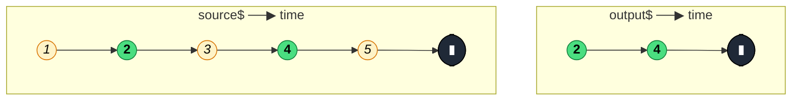

### `filter<T>(predicate: (value: T, index: number) => boolean, thisArg?: any)`

> Emits only those source values for which the predicate function returns `true` — the stream equivalent of `Array.prototype.filter`.

---

#### Policies

| Policy | Value |
|--------|-------|
| **Family** | Filtering |
| **Arity** | Unary (single source) |
| **Time-sensitive** | No |
| **Value-sensitive** | Yes — inspects each value to decide whether to emit |
| **Lossy** | Yes — values failing the predicate are silently dropped |
| **Completion required** | No — passes completion through immediately |
| **Backpressure policy** | Drop — non-matching values are discarded |
| **Scheduler-aware** | No |
| **Multicast** | Unicast — each subscriber gets its own source subscription |
| **Error propagation** | Forward — upstream errors pass through unchanged |
| **Subscription lifecycle** | Per-subscriber |
| **Purity** | Pure — predicate should have no side effects |
| **Synchronicity** | Sync-by-default — emits inline without scheduling |

**Completion behaviour** — `filter` is transparent to completion: when the source completes, `filter` completes immediately, emitting no extra values. It does not buffer or delay completion.

**Lossy behaviour** — every source value for which `predicate(value, index)` returns `false` is dropped without being emitted downstream. Values that return `true` pass through unchanged.

---

#### ASCII Marble Diagram

```
source:  --1--2--3--4--5--|
         filter(x => x % 2 === 0)
output:  -----2-----4-----|
```

---

#### Mermaid Marble Diagram



---

#### Signature

```typescript
function filter<T>(
  predicate: (value: T, index: number) => boolean,
  thisArg?: any
): MonoTypeOperatorFunction<T>
```

The `index` parameter is the zero-based emission count (not the value itself). `thisArg` sets `this` inside the predicate — rarely used in modern TypeScript.

---

#### Five Use Cases

- **Search result guard** — filter an autocomplete stream to only emit when the query is at least 3 characters long before firing API calls.
- **Permission gate** — strip events from a shared action$ stream that the current user is not authorised to perform.
- **Type narrowing** — discard `null`/`undefined` sentinels from a stream that mixes real values with loading placeholders.
- **Log level routing** — from a mixed log$ stream, separate `ERROR` entries from `INFO` entries into two derived streams.
- **UI event deduplication** — in combination with `distinctUntilChanged`, filter a form value stream to skip empty submissions.

---

#### Primary Code Sample

```typescript
import { fromEvent, filter, map, debounceTime, distinctUntilChanged, switchMap } from 'rxjs'
import type { Observable } from 'rxjs'

// Scenario: only fire search when query has 3+ chars
const input = document.querySelector<HTMLInputElement>('#search')!

const results$: Observable<string[]> = fromEvent<InputEvent>(input, 'input').pipe(
	map((e: InputEvent): string => (e.target as HTMLInputElement).value.trim()),
	filter((query: string): boolean => query.length >= 3),
	debounceTime(300),
	distinctUntilChanged(),
	switchMap((query: string): Observable<string[]> => fetchResults(query))
)
```

---

#### Gotchas

1. **Predicate must be synchronous** — `filter` does not accept a predicate that returns a Promise or Observable; use `switchMap` + `filter` inside if async gating is needed.
2. **Type guards narrow the type** — `filter((x): x is NonNullable<T> => x != null)` correctly narrows `Observable<T | null>` to `Observable<NonNullable<T>>`. Without the type-guard overload, TypeScript keeps the original type.
3. **Index resets per subscription** — the `index` argument starts at 0 for every new subscriber, not at any global position in the stream.
4. **Silent drops** — values that fail the predicate emit nothing; if you need a "else" branch, split the source with two `filter` calls on a `share()`-d stream, not nested subscriptions.

---

#### Related Operators

| Operator | Key difference | Choose when |
|----------|---------------|-------------|
| `first` | Completes after the first matching value | You only need the first passing value |
| `take` | Count-based, not value-based | You need the first N values regardless of content |
| `distinctUntilChanged` | Drops consecutive duplicates, not arbitrary values | You want to suppress unchanged emissions |
| `skipWhile` | Drops values until predicate first returns `false` | You want a leading-edge gate that opens permanently |
| `takeWhile` | Completes when predicate first returns `false` | You want to terminate the stream on a condition |

---

#### Decision Rule

> Use `filter` when you need to pass or block individual values based on their content throughout the entire lifetime of the stream. Prefer `first` when you only care about the first matching value and want the stream to complete after that.
