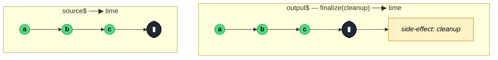

### `finalize<T>(callback: () => void): MonoTypeOperatorFunction<T>`

> Mirrors the source and invokes `callback` exactly once when the stream terminates — by completion, error, or explicit unsubscription.

---

#### Policies

| Policy | Value |
|--------|-------|
| **Family** | Utility / Side Effects |
| **Arity** | Unary |
| **Time-sensitive** | No |
| **Value-sensitive** | No |
| **Lossy** | No |
| **Completion required** | No — callback fires on any termination path |
| **Backpressure policy** | None |
| **Scheduler-aware** | No |
| **Multicast** | Unicast — each subscriber's callback fires independently |
| **Error propagation** | Forward — callback doesn't catch errors, it fires alongside them |
| **Subscription lifecycle** | Per-subscriber — each subscription owns its finalize call |
| **Purity** | **Side-effectful** (intended for cleanup) |
| **Synchronicity** | Sync-by-default |

**Completion behaviour** — Callback fires on **every** termination: `complete`, `error`, or explicit `unsubscribe`. Fires exactly once per subscription. Even synchronous errors at subscription time trigger the callback.

**Lossy behaviour** — Not lossy.

**Implementation note** — The RxJS 8 source is a remarkably short `subscriber.add(callback)` — it uses the Subscription's teardown mechanism, which guarantees callback invocation on any teardown path.

---

#### ASCII Marble Diagram

```
source:  --a--b--c--|
         finalize(() => console.log('done'))
output:  --a--b--c--|
         (console prints 'done' after completion)

source:  --a--b--#
         finalize(() => console.log('done'))
output:  --a--b--#
         (console prints 'done' after error)

source:  --a--b-- (unsubscribed)
         finalize(() => console.log('done'))
output:  --a--b--
         (console prints 'done' on unsubscribe)
```

---

#### Mermaid Marble Diagram



---

#### Signature

```typescript
export function finalize<T>(callback: () => void): MonoTypeOperatorFunction<T>
```

The callback takes no arguments — if you need to know which termination path triggered it, capture state via closures or use `tap({ complete, error, unsubscribe })` instead.

---

#### Five Use Cases

- **Resource cleanup** — close a WebSocket, cancel a timer, release a file handle regardless of how the stream ended
- **Loading spinner toggle** — turn off a loading indicator on completion, error, or cancellation alike
- **Metric commit** — record the total duration or count of a subscription, once it terminates
- **Test teardown** — unwind test-harness state at the end of a stream-based test
- **Subscription-count tracking** — decrement a reference counter when any subscription ends (analytics, leak detection)

---

#### Primary Code Sample

```typescript
import { defer, finalize, Observable, BehaviorSubject } from 'rxjs'

// Scenario: loading spinner — off on any termination (complete, error, unsubscribe)
interface Result { data: string }

const isLoading$: BehaviorSubject<boolean> = new BehaviorSubject<boolean>(false)

declare function fetchResult(): Promise<Result>

const loadData$: Observable<Result> = defer((): Promise<Result> => {
	isLoading$.next(true)
	return fetchResult()
}).pipe(
	finalize((): void => isLoading$.next(false))
)
```

The `defer` + `finalize` pair is the canonical "lifecycle-tracking" shape: set up state at subscription, tear it down on termination — safe even if the subscriber bails out mid-request.

---

#### Gotchas

1. **Fires on every termination path** — `complete`, `error`, *and* `unsubscribe`. If you only want cleanup on specific paths, use `tap({ complete })` or `tap({ error })`.
2. **Runs *after* downstream error handling** — if downstream operators or subscribers handle the error, `finalize`'s callback still fires. Often desirable; occasionally surprising for state that depends on outcome.
3. **Callback errors are thrown synchronously** — if the callback throws, the exception propagates up through the teardown chain and can surface as an uncaught error. Wrap risky cleanup in try/catch.
4. **Per-subscriber — not shared** — each subscriber triggers its own `finalize`. If you want a single cleanup on a shared source, put `finalize` *upstream* of the `share`/`shareReplay`.
5. **Not the same as `complete` handler in subscribe** — the `subscribe({ complete })` callback only runs on `complete`, not `error` or `unsubscribe`. `finalize` runs on all three.

---

#### Related Operators

| Operator | Key difference | Choose when |
|----------|---------------|-------------|
| `tap({ finalize })` | Same behaviour, but alongside other observers | Mixing with other `tap` hooks |
| `tap({ complete })` | Only on completion, not error/unsubscribe | You only care about success-path cleanup |
| `catchError` | Handles errors, replaces the stream | You need to recover, not just clean up |
| `Subscription.add(fn)` | Imperative teardown via Subscription object | You're managing subscriptions manually |

---

#### Decision Rule

> Use `finalize` when you need **cleanup that runs regardless of how the stream ended**. Prefer `tap({ complete })` / `tap({ error })` for path-specific side effects, or `catchError` for actual error recovery.
