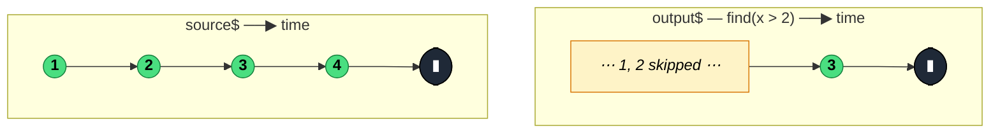

### `find<T>(predicate: (value: T, index: number, source: Observable<T>) => boolean)`

> Emits the first value that satisfies `predicate` and completes; emits `undefined` and completes if the source completes without a match — never errors on "not found".

---

#### Policies

| Policy | Value |
|--------|-------|
| **Family** | Filtering / Selection |
| **Arity** | Unary |
| **Time-sensitive** | No |
| **Value-sensitive** | Yes — predicate inspects values |
| **Lossy** | Yes — values after the first match (or all values if no match) are not emitted individually |
| **Completion required** | No — completes on the first match; only waits for completion if no match yet |
| **Backpressure policy** | None — at most one emission |
| **Scheduler-aware** | No |
| **Multicast** | Unicast |
| **Error propagation** | Forward |
| **Subscription lifecycle** | Per-subscriber |
| **Purity** | Pure |
| **Synchronicity** | Sync-by-default |

**Completion behaviour** — On match: emits the matched value and completes immediately. On source completion without match: emits `undefined` and completes. On infinite source without match: never emits, never completes — subscribers stay pending.

**Lossy behaviour** — Lossy. Every value before the match is ignored, and every value after unsubscription is never seen. On a no-match completion, all values are discarded and only `undefined` is emitted.

---

#### ASCII Marble Diagram

```
source:  --1--2--3--4--|
         find(x => x > 2)
output:  -------3|

source:  --1--2--|               (predicate never matches)
         find(x => x > 10)
output:  --------(undefined|)
```

---

#### Mermaid Marble Diagram



---

#### Signature

```typescript
export function find<T>(
	predicate: (value: T, index: number, source: Observable<T>) => boolean
): OperatorFunction<T, T | undefined>

// Type-guard variant
export function find<T, S extends T>(
	predicate: (value: T, index: number, source: Observable<T>) => value is S
): OperatorFunction<T, S | undefined>
```

Unlike `first`, the predicate is **required** (there is no no-arg overload).

---

#### Five Use Cases

- **Search-by-id** — locate the first item in a stream of records with a matching identifier
- **First validation failure** — in a stream of check results, surface the first failure (if any) with no error on all-pass
- **Feature flag probing** — find the first flag matching a name pattern without treating "not present" as a failure
- **UI element discovery** — find the first DOM event whose target matches a selector, tolerate "no match" silently
- **Optional configuration** — locate a preferred config entry, falling back to `undefined` if the stream did not contain one

---

#### Primary Code Sample

```typescript
import { from, find, Observable } from 'rxjs'

// Scenario: search-by-id — locate the first user matching an id in an event stream
interface User {
	id: number
	name: string
}

declare const users$: Observable<User>

const targetUser$: Observable<User | undefined> = users$.pipe(
	find((u: User): boolean => u.id === 42)
)

targetUser$.subscribe((user: User | undefined): void => {
	if (user) {
		console.log('Found:', user.name)
	} else {
		console.log('No user with id 42 in the stream.')
	}
})
```

The return type is `T | undefined` — the caller must handle both branches. This is `find`'s defining feature: absence is a first-class outcome, not an error.

---

#### Gotchas

1. **Emits `undefined`, not an error, on no match** — compare to `first(predicate)` which errors with `EmptyError`. This is the main reason to choose `find`: absence is normal.
2. **Predicate is required** — `find()` with no arguments is a type error. Use `first()` for "get me the first value without a predicate".
3. **Type-guard overload narrows `S | undefined`** — passing a type-guard predicate narrows the output, but the `undefined` case is always possible. Always check for it.
4. **Stalls on infinite sources with no match** — unlike a match case (which terminates), the no-match case waits for source completion. On `interval()` or a live WebSocket with no matching message, the stream hangs forever.
5. **Don't confuse with `filter`** — `filter` emits *every* match and stays subscribed. `find` emits only the *first* match, then unsubscribes.

---

#### Related Operators

| Operator | Key difference | Choose when |
|----------|---------------|-------------|
| `first(predicate)` | Errors on no match | Absence should surface as an error |
| `filter` | Emits every match, stays subscribed | You want all matches |
| `findIndex` | Emits the index rather than the value | You need positional info, not the value |
| `take(1)` + `filter` | Manual composition | You want `undefined` semantics but with different error handling |

---

#### Decision Rule

> Use `find` when you want **the first matching value and "not found" is a valid outcome** yielding `undefined`. Prefer `first(predicate)` when absence should be an error, or `filter` when you want every match.
