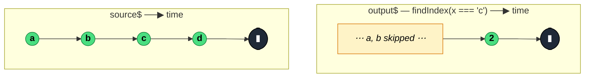

### `findIndex<T>(predicate: (value: T, index: number, source: Observable<T>) => boolean)`

> Emits the zero-based index of the first value that satisfies `predicate` and completes; emits `-1` and completes if the source completes without a match.

---

#### Policies

| Policy | Value |
|--------|-------|
| **Family** | Filtering / Selection |
| **Arity** | Unary |
| **Time-sensitive** | No |
| **Value-sensitive** | Yes (predicate) |
| **Lossy** | Yes — values themselves are discarded; only the index is emitted |
| **Completion required** | No — completes on first match; waits for completion otherwise |
| **Backpressure policy** | None — at most one emission |
| **Scheduler-aware** | No |
| **Multicast** | Unicast |
| **Error propagation** | Forward |
| **Subscription lifecycle** | Per-subscriber — index counter is local per subscription |
| **Purity** | Pure |
| **Synchronicity** | Sync-by-default |

**Completion behaviour** — On match: emits the index and completes. On source completion without match: emits `-1` and completes. On infinite source without match: stalls forever.

**Lossy behaviour** — Lossy. The values themselves never appear in the output — only the index. Internally, `findIndex` delegates to the same `createFind` helper as `find`, with an `emit: 'index'` flag.

---

#### ASCII Marble Diagram

```
source:  --a--b--c--d--|
         findIndex(x => x === 'c')
output:  --------2|

source:  --a--b--|
         findIndex(x => x === 'z')
output:  --------(-1|)
```

---

#### Mermaid Marble Diagram



---

#### Signature

```typescript
export function findIndex<T>(
	predicate: (value: T, index: number, source: Observable<T>) => boolean
): OperatorFunction<T, number>
```

Output is always `number` — the matched index, or `-1` if no match.

---

#### Five Use Cases

- **Position detection** — find "at which step did the user abandon" in an ordered event stream
- **First-error index** — in a stream of validation results, report the *position* of the first failure for highlighting
- **Stateful indexing** — pair with `scan` or downstream logic that needs the position rather than the value
- **Pagination helper** — given a stream of page IDs, locate the index of a target page
- **Analytics** — track "which try was the first success" without caring about the payload

---

#### Primary Code Sample

```typescript
import { from, findIndex, Observable } from 'rxjs'

// Scenario: first-error index — locate the position of the first failed check
interface CheckResult {
	step: string
	passed: boolean
}

declare const checks$: Observable<CheckResult>

const firstFailureIndex$: Observable<number> = checks$.pipe(
	findIndex((r: CheckResult): boolean => !r.passed)
)

firstFailureIndex$.subscribe((idx: number): void => {
	if (idx === -1) {
		console.log('All checks passed')
	} else {
		console.log('First failure at step', idx)
	}
})
```

The `-1` sentinel mirrors `Array.prototype.findIndex`, which makes the API familiar but requires the subscriber to remember to branch on it.

---

#### Gotchas

1. **`-1` sentinel on no match** — just like `Array.prototype.findIndex`. Easy to forget to handle, leading to "index off by one" bugs downstream.
2. **Predicate is required** — no no-arg overload. If you want "index of the first value", use `scan` with a counter or just emit `0` via `mapTo`/`map`.
3. **Index is per-subscription** — for multicasted sources, a late subscriber's counter starts at 0 when they subscribe, not at the source's absolute start. Use `shareReplay` for consistent indexing.
4. **Value is thrown away** — if you need *both* the value and the index, use `find` with a predicate that captures the index into an outer scope, or use `scan` to carry a `{ index, value }` pair.
5. **Stalls on infinite sources when predicate never matches** — like `find`, will never emit `-1` on unterminated streams because it waits for source completion.

---

#### Related Operators

| Operator | Key difference | Choose when |
|----------|---------------|-------------|
| `find` | Emits the value, not the index | You want the matched value |
| `filter` | Emits every match | You want all matching values |
| `scan + filter` | Carry both index and value manually | You need both index and value |
| `first` (with predicate) | Errors on no match; emits value | Absence is an error |

---

#### Decision Rule

> Use `findIndex` when you need **the position** (zero-based) of the first matching value and `-1` is acceptable for "not found". Prefer `find` for the value itself, or `scan` when you need both.
