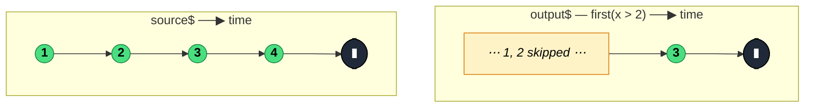

### `first<T, D>(predicate?, defaultValue?)`

> Emits the first value from the source — optionally the first that matches a predicate — then completes; errors with `EmptyError` if the source completes with no match and no default.

---

#### Policies

| Policy | Value |
|--------|-------|
| **Family** | Filtering / Selection |
| **Arity** | Unary |
| **Time-sensitive** | No |
| **Value-sensitive** | Yes (when a predicate is supplied) |
| **Lossy** | Yes — all values after the first match are ignored and the source is unsubscribed |
| **Completion required** | No — completes itself on the first match, not on source completion |
| **Backpressure policy** | None — at most one emission |
| **Scheduler-aware** | No |
| **Multicast** | Unicast |
| **Error propagation** | Forward — source errors pass through; also emits `EmptyError` if source completes empty with no default |
| **Subscription lifecycle** | Per-subscriber |
| **Purity** | Pure |
| **Synchronicity** | Sync-by-default |

**Completion behaviour** — `first` completes itself as soon as a matching value arrives (and immediately unsubscribes from the source). If the source completes without any (matching) value, `first` emits the `defaultValue` if one was supplied, otherwise it emits an `EmptyError`. On infinite sources it works fine — it never needs source completion when a match exists.

**Lossy behaviour** — Lossy. Everything after the first (matching) value is discarded and the source is disconnected. Unlike `filter`, `first` is a terminating filter.

---

#### ASCII Marble Diagram

```
source:  --1--2--3--4--|
         first()
output:  --1|

source:  --1--2--3--4--|
         first(x => x > 2)
output:  -------3|

source:  -----|               (empty source)
         first(x => x > 0, -1)
output:  -----(-1|)
```

---

#### Mermaid Marble Diagram



---

#### Signature

```typescript
export function first<T, D = T>(
	predicate?: ((value: T, index: number, source: Observable<T>) => boolean) | null,
	defaultValue?: D
): OperatorFunction<T, T | D>

// Truthy narrowing overload
export function first<T>(predicate: BooleanConstructor): OperatorFunction<T, TruthyTypesOf<T>>
```

---

#### Five Use Cases

- **One-shot bootstrap** — await the first auth token, config response, or ready signal before starting the rest of the pipeline
- **First match search** — locate the first list element meeting a condition (first `<div>` click, first error log)
- **Promise conversion** — convert an Observable to a `Promise<T>` that resolves with the first value via `firstValueFrom`
- **Gated completion** — force a stream to terminate as soon as an expected event arrives (e.g., first `complete` acknowledgement from a WebSocket handshake)
- **Default fallback** — provide a safe default when the source might be empty, preventing downstream `undefined` handling

---

#### Primary Code Sample

```typescript
import { fromEvent, first, Observable } from 'rxjs'

// Scenario: one-shot bootstrap — await the first "ready" DOM event, then proceed
const ready$: Observable<Event> = fromEvent(window, 'DOMContentLoaded').pipe(
	first()
)

ready$.subscribe((): void => startApp())

function startApp(): void {
	/* initialise */
}
```

For `first(predicate)` to find an event that may never occur, always supply a `defaultValue` or wrap the subscription with a `catchError` for the `EmptyError`.

---

#### Gotchas

1. **Errors with `EmptyError` when source completes empty** — unlike `take(1)` which completes silently, `first()` treats an empty source as an error. This is the single most frequent surprise. Use `take(1)` if you want silent completion, or pass a `defaultValue` to `first`.
2. **Predicate never matches → `EmptyError`** — if you give a predicate and the source completes without any matching value and no `defaultValue`, you also get `EmptyError`. The default-value parameter is a runtime safety net.
3. **Distinguish `first()` from `find()`** — `find(predicate)` emits `undefined` (not error) when nothing matches. Pick `find` when "not found" is normal; pick `first` when "not found" is exceptional.
4. **`first(predicate)` vs `filter(predicate) + take(1)`** — semantically equivalent when the value exists; when it doesn't, `first` errors and `take(1)` completes. Use `first` when absence is a bug, `take(1)` when absence is acceptable.
5. **Unsubscribes the source immediately on match** — if the source has expensive cleanup, ensure it handles early unsubscription. This is usually desirable (no wasted work), but surprising if you expect the source to run to completion.

---

#### Related Operators

| Operator | Key difference | Choose when |
|----------|---------------|-------------|
| `take(1)` | Completes silently when source completes empty | You do not want an error on empty |
| `find` | Emits `undefined` when no match; predicate required | "Not found" is a normal outcome |
| `single` | Requires exactly one match; errors if 0 or >1 | You want to assert uniqueness |
| `last` | Emits the last value instead of the first | You need to wait for completion |
| `elementAt(0)` | Same effect for index 0, different error type | Indexed access rather than predicate |

---

#### Decision Rule

> Use `first()` when you want **the first value and treat "no value" as an error**. Prefer `take(1)` when absence is acceptable, `find` when you expect a predicate may not match, or `single` when you want to assert uniqueness.
