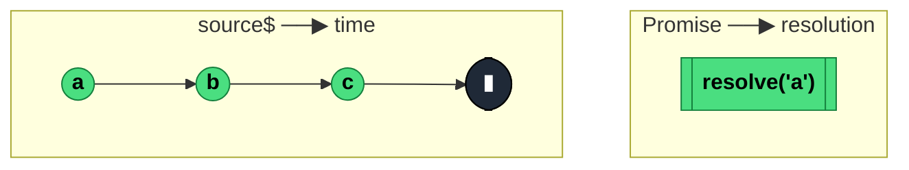

### `firstValueFrom<T, D>(source: Observable<T>, config?: { defaultValue: D }): Promise<T | D>`

> Converts an Observable into a Promise that resolves with the **first emitted value** (and unsubscribes) — or rejects with `EmptyError` if the source completes empty and no default was provided.

---

#### Policies

| Policy | Value |
|--------|-------|
| **Family** | Utility / Interop |
| **Arity** | N-ary (source + optional config) |
| **Time-sensitive** | No |
| **Value-sensitive** | No |
| **Lossy** | Yes — everything after the first value is ignored |
| **Completion required** | No — resolves on first value; only waits for completion if no value arrives |
| **Backpressure policy** | None — at most one resolution |
| **Scheduler-aware** | No |
| **Multicast** | Unicast — subscribes once to the source per call |
| **Error propagation** | Forward — source errors become Promise rejections |
| **Subscription lifecycle** | Per-call — one Subscription created and torn down |
| **Purity** | Side-effectful (creates a Promise, subscribes to source) |
| **Synchronicity** | Async-by-default — returns a Promise |

**Completion behaviour** — Subscribes to `source`. On the first `next`, resolves the Promise with that value and unsubscribes. If `source` completes without emitting: rejects with `EmptyError`, or resolves with `config.defaultValue` if provided. If source errors: Promise rejects with the error.

**Lossy behaviour** — Lossy. Only the first value matters; subsequent emissions (if any) are unreachable because the subscription is torn down immediately.

---

#### ASCII Marble Diagram

```
source:        --a--b--c--|
               firstValueFrom(source)
Promise:       resolves with 'a', unsubscribes

source:        -----|                 (empty)
               firstValueFrom(source)
Promise:       rejects with EmptyError

source:        -----|
               firstValueFrom(source, { defaultValue: 'x' })
Promise:       resolves with 'x'
```

---

#### Mermaid Marble Diagram



---

#### Signature

```typescript
interface FirstValueFromConfig<T> {
	defaultValue: T
}

export function firstValueFrom<T>(source: Observable<T>): Promise<T>
export function firstValueFrom<T, D>(
	source: Observable<T>,
	config: FirstValueFromConfig<D>
): Promise<T | D>
```

---

#### Five Use Cases

- **Async-function interop** — `await firstValueFrom(api$)` for one-shot HTTP calls that emit a single response
- **Config / bootstrap values** — resolve the first value from a `ReplaySubject(1)` to get the current config in an async function
- **One-shot first event** — await the first click, the first auth-ready signal, the first WebSocket message
- **Default-substituted resolution** — `firstValueFrom(maybeEmpty$, { defaultValue: 0 })` for safe async defaults
- **Promise-based tests** — in unit tests, `await firstValueFrom(source$)` is cleaner than a subscribe + manual waiter

---

#### Primary Code Sample

```typescript
import { firstValueFrom, Observable } from 'rxjs'

// Scenario: async-function interop — await a single API response
interface UserProfile {
	id: string
	name: string
}

declare const getUser$: (id: string) => Observable<UserProfile>

async function loadUser(id: string): Promise<UserProfile> {
	const profile = await firstValueFrom(getUser$(id))
	return profile
}
```

`firstValueFrom` replaced the deprecated `Observable.prototype.toPromise()` — same intent, but without the ambiguity over whether it waits for the first or the last value (the old `toPromise` actually waited for the *last*).

---

#### Gotchas

1. **Rejects with `EmptyError` if source completes empty** — mirrors the `first()` operator's error semantics. Always pass `{ defaultValue }` if empty is possible.
2. **Use it only on sources that emit or complete** — on an infinite silent source, the Promise hangs forever with no way to cancel. The JSDoc literally warns about this.
3. **Unsubscribes the source after first value** — if the source has expensive cleanup, it fires immediately. Usually desirable; occasionally surprising.
4. **Not for multi-value use cases** — if you need all values, use `lastValueFrom` with an upstream `toArray()`, or keep it as an Observable.
5. **`defaultValue` is only used on empty completion, not on error** — source errors still reject the Promise. Pair with `catchError(() => of(fallback))` upstream if you want error fallback too.

---

#### Related Operators

| Operator | Key difference | Choose when |
|----------|---------------|-------------|
| `lastValueFrom` | Resolves with the *last* value, waits for completion | You want the final value of a finite stream |
| `first()` + subscribe | Operator form | You want to stay in a `pipe` chain |
| `Observable.prototype.toPromise()` (removed) | Legacy ambiguous API | Never — removed in RxJS 8 |
| `take(1)` + subscribe-callbacks | Imperative | You want callbacks, not a Promise |

---

#### Decision Rule

> Use `firstValueFrom` when you want to **await the first emission of an Observable as a Promise**. Prefer `lastValueFrom` when you need the final value of a finite stream, or stay in the Observable world for multi-value scenarios.
