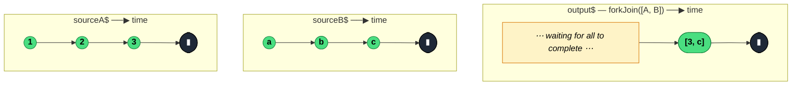

### `forkJoin(sources: [...] | {...}): Observable<...>`

> Waits for every input Observable to complete, then emits exactly one value containing the **last** value from each — an array or dictionary matching the input shape.

---

#### Policies

| Policy | Value |
|--------|-------|
| **Family** | Combination / Aggregation |
| **Arity** | N-ary — takes an array or object of sources |
| **Time-sensitive** | No |
| **Value-sensitive** | No |
| **Lossy** | Yes — only the final value from each source survives; intermediate values are dropped |
| **Completion required** | **Yes** — all sources must complete |
| **Backpressure policy** | Latest — one slot per source, overwritten on each emission |
| **Scheduler-aware** | No |
| **Multicast** | Unicast |
| **Error propagation** | Forward — any source error immediately errors the output and unsubscribes all |
| **Subscription lifecycle** | Per-subscriber — fresh subscriptions to all sources per subscribe |
| **Purity** | Pure |
| **Synchronicity** | Sync-by-default |

**Completion behaviour** — Subscribes to all sources concurrently. On each source's completion, checks if all have completed; when the last one does, emits the array/object of last values and completes. If any source completes **without emitting any value**, `forkJoin` completes without emitting (empty case) OR errors with `EmptyError` if other sources had emitted. If any source errors, the output errors and all other sources are unsubscribed.

**Lossy behaviour** — Lossy of intermediate values. Only the final emission from each source is kept.

---

#### ASCII Marble Diagram

```
sourceA:  --1--2--3--|
sourceB:  --a----b-----c--|

          forkJoin([sourceA, sourceB])
output:   --------------------([3, c]|)
          (emits when both have completed; uses last values)

          forkJoin({ nums: sourceA, letters: sourceB })
output:   --------------------({ nums: 3, letters: c }|)
```

---

#### Mermaid Marble Diagram



---

#### Signature

```typescript
// Array form
export function forkJoin<A extends readonly unknown[]>(
	sources: readonly [...ObservableInputTuple<A>]
): Observable<A>

// Object form
export function forkJoin<T extends Record<string, ObservableInput<unknown>>>(
	sourcesObject: T
): Observable<{ [K in keyof T]: ObservedValueOf<T[K]> }>

// Deprecated: rest-parameter variadic form
export function forkJoin<A extends readonly unknown[]>(
	...sources: [...ObservableInputTuple<A>]
): Observable<A>
```

Prefer the array or object form. Variadic is deprecated for v8 removal.

---

#### Five Use Cases

- **Parallel HTTP fetches with combined result** — fire N requests concurrently, wait for all, emit the combined response object
- **Page-load data aggregation** — bundle user profile, permissions, and settings fetches into a single "page ready" emission
- **Validate batch** — run a set of async validations in parallel, emit success only when all pass
- **Await multiple ready signals** — wait for DOM ready, fonts loaded, and service worker registered before starting UI
- **Shape-preserving multi-fetch** — `forkJoin({ user, posts, comments })` returns `{ user, posts, comments }` typed correctly

---

#### Primary Code Sample

```typescript
import { forkJoin, Observable } from 'rxjs'

// Scenario: page-load aggregation — bundle three parallel fetches into one emission
interface User { id: string; name: string }
interface Post { id: string; title: string }
interface Permission { action: string; allowed: boolean }

declare const user$: Observable<User>
declare const posts$: Observable<Post[]>
declare const permissions$: Observable<Permission[]>

interface PageData {
	user: User
	posts: Post[]
	permissions: Permission[]
}

const pageReady$: Observable<PageData> = forkJoin({
	user: user$,
	posts: posts$,
	permissions: permissions$
})

pageReady$.subscribe((data: PageData): void => {
	renderPage(data)
})

function renderPage(_d: PageData): void { /* ... */ }
```

The object form preserves property types, producing a strongly-typed combined emission — the natural fit for "page data" or similar bundled responses.

---

#### Gotchas

1. **Never emits if any source is infinite** — `forkJoin` waits for completion. Wrapping an infinite source in `first()` or `take(1)` is typically what you want.
2. **Empty source kills the whole result** — if one source completes without ever emitting, `forkJoin` emits nothing (or errors, depending on whether others emitted). Often surprising.
3. **Any error aborts the entire result** — a single failing source errors the output and unsubscribes all others. Wrap individual sources in `catchError(() => of(fallback))` if partial failure is acceptable.
4. **Values are the *last* ones seen — not an aggregate of all emissions** — only the final `next` from each source matters. Use `zip` if you want to pair emissions by arrival order.
5. **Static version vs the deprecated `forkJoinWith` operator** — there's no operator-form `forkJoinWith`; `forkJoin` is always a static creator.
6. **Short-circuit on all-complete-without-emitting** — `forkJoin([EMPTY, of(1)])` errors with `EmptyError` because `EMPTY` completed without ever emitting.

---

#### Related Operators

| Operator | Key difference | Choose when |
|----------|---------------|-------------|
| `combineLatest` | Emits on every value-change, not just on complete | You want live ongoing combinations |
| `zip` | Pairs by position, doesn't require completion | You want ordered pair-wise combinations |
| `merge` | Interleaves values without combining | You want all values, not aggregated |
| `Promise.all` | JavaScript equivalent for Promises | You're outside RxJS — use promises |
| `concat` | Sequential, not parallel | Sources must run one after the other |

---

#### Decision Rule

> Use `forkJoin` when you need the **last value from each of several finite sources, delivered as one combined emission**. Prefer `combineLatest` for live updates, `zip` for position-paired sequences, or `merge` when you want all values individually.
