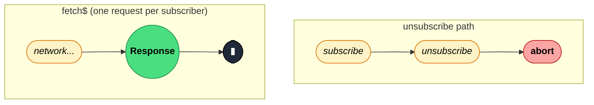

### `fromFetch(input, init?)`

> Wraps the browser Fetch API in an Observable — each subscription fires one `fetch()` call and automatically aborts it via `AbortController` when the subscriber unsubscribes.

---

#### Policies

| Policy | Value |
|--------|-------|
| **Family** | Creation |
| **Arity** | Unary (creation — no source Observable) |
| **Time-sensitive** | No |
| **Value-sensitive** | No |
| **Lossy** | No |
| **Completion required** | No — completes itself after one response (or one error) |
| **Backpressure policy** | None — emits exactly one value then completes |
| **Scheduler-aware** | No |
| **Multicast** | Unicast — each subscriber triggers its own `fetch()` call |
| **Error propagation** | Forward — network errors and non-OK responses (when using a selector) surface as stream errors |
| **Subscription lifecycle** | Per-subscriber — each subscription creates its own `AbortController` |
| **Purity** | Side-effectful — fires an HTTP request on every subscription |
| **Synchronicity** | Async-by-default — the response arrives on a microtask after the network round-trip |

**Completion behaviour** — `fromFetch` emits exactly one value (the `Response` object, or the result of the `selector` function) then completes. If the source never resolves (e.g. network timeout), the stream stays open until unsubscribed, which triggers abort. It does not stall on completion — it drives its own completion.

**Lossy behaviour** — Non-lossy. One subscription → one fetch → one emitted value. Nothing is dropped.

---

#### ASCII Marble Diagram

```
subscribe:  --(subscribe)------------(response)|
             fromFetch('/api/data')
output:     ----------------------r--|
            (r = Response object)

unsubscribe before response:
subscribe:  --(subscribe)--x
             fromFetch('/api/data')
output:     (fetch aborted, no emission)
```

---

#### Mermaid Marble Diagram



---

#### Signature

```typescript
// Without selector — emits the raw Response
fromFetch(input: string | Request, init?: RequestInit): Observable<Response>

// With selector — emits the transformed result
fromFetch<T>(
  input: string | Request,
  init: RequestInitWithSelector<T>
): Observable<T>

// Where RequestInitWithSelector adds:
interface RequestInitWithSelector<T> extends RequestInit {
  selector: (response: Response) => ObservableInput<T>
}
```

---

#### Five Use Cases

- **REST GET request** — fetch a JSON resource and parse the body in the `selector`, completing the stream with the typed payload.
- **Autocancellable search** — combine with `switchMap` so that navigating away or typing a new query aborts the in-flight request automatically.
- **Authenticated requests** — pass `Authorization` headers via `init` without managing `AbortController` lifecycle manually.
- **Streaming response** — use the `selector` to read a `ReadableStream` chunk by chunk and emit each chunk as a separate Observable value.
- **Retry with backoff** — compose with `retry({ delay: exponentialBackoff })` to transparently re-fire the request on transient network errors.

---

#### Primary Code Sample

```typescript
import { fromFetch } from 'rxjs/fetch'
import { switchMap, catchError } from 'rxjs'
import type { Observable } from 'rxjs'

interface User {
	id: number
	name: string
}

// Scenario: type-safe JSON fetch with abort-on-unsubscribe
const user$ = (id: number): Observable<User> =>
	fromFetch(`/api/users/${id}`, {
		selector: (res: Response): Observable<User> => {
			if (!res.ok) throw new Error(`HTTP ${res.status}`)
			return res.json() as Observable<User>
		},
	}).pipe(
		catchError((err: unknown): Observable<never> => {
			console.error('Fetch failed', err)
			throw err
		})
	)

// In a switchMap context — previous request is aborted automatically
const userId$ = new Subject<number>()
const currentUser$ = userId$.pipe(
	switchMap((id: number): Observable<User> => user$(id))
)
```

---

#### Gotchas

1. **Import path is `rxjs/fetch`, not `rxjs`** — `fromFetch` lives in a sub-entry point. `import { fromFetch } from 'rxjs/fetch'` — forgetting this gives a confusing "not exported" error.
2. **HTTP error status codes do not throw by default** — a 404 or 500 resolves the Observable normally with a `Response` whose `ok` is `false`. You must check `res.ok` inside the `selector` and throw explicitly to route errors into the error channel.
3. **Abort only works for the network round-trip** — once the response body has started streaming, aborting cancels the body read but the server has already received the request. Plan your server interactions accordingly.
4. **Not a replacement for `HttpClient` in Angular** — Angular's `HttpClient` provides interceptors, progress events, and typed responses. Use `fromFetch` in framework-agnostic or vanilla TS contexts.

---

#### Related Operators

| Operator | Key difference | Choose when |
|----------|---------------|-------------|
| `from(fetch(...))` | No automatic abort on unsubscribe | You don't need cancellation and prefer the simpler form |
| `ajax()` (rxjs/ajax) | XMLHttpRequest-based, supports upload progress and older environments | You need IE11 support, upload progress, or XHR-specific features |
| `defer(() => from(fetch(...)))` | Manual abort setup required | You need full control over the fetch lifecycle |

---

#### Decision Rule

> Use `fromFetch` when you want a fetch request that **automatically aborts on unsubscribe** — the common case with `switchMap` in search or navigation. Use `ajax()` when you need XMLHttpRequest-specific features (upload progress, IE11, response type control).
