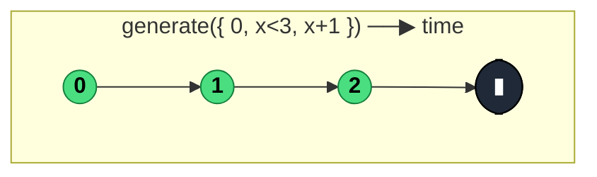

### `generate<T, S>({ initialState, condition, iterate, resultSelector?, scheduler? })`

> Emits a state-driven sequence like a reactive `for` loop — `initialState`, emit `resultSelector(state)` while `condition(state)` holds, then `state = iterate(state)`.

---

#### Policies

| Policy | Value |
|--------|-------|
| **Family** | Creation |
| **Arity** | Unary (options object) |
| **Time-sensitive** | No (unless scheduler is provided) |
| **Value-sensitive** | Yes — condition and iterate inspect the state |
| **Lossy** | No |
| **Completion required** | No — completes when `condition` returns `false`, or runs forever if omitted |
| **Backpressure policy** | None |
| **Scheduler-aware** | **Yes** — optional `scheduler` defers emissions |
| **Multicast** | Unicast |
| **Error propagation** | Forward — errors in any callback error the stream |
| **Subscription lifecycle** | Per-subscriber |
| **Purity** | Pure (callbacks should be) |
| **Synchronicity** | Sync-by-default (unless scheduler is passed) |

**Completion behaviour** — Starts with `initialState`. If `condition(state)` is `true`, emits `resultSelector(state)` (or state itself if no selector), then sets `state = iterate(state)`, and repeats. When `condition(state)` is `false`, completes. If `condition` is omitted, loops forever.

**Lossy behaviour** — Not lossy.

**Implementation note** — `generate` is implemented via `defer(gen)` where `gen` is a JS generator function — essentially wrapping `function*` semantics in an Observable.

---

#### ASCII Marble Diagram

```
             generate({ initialState: 0, condition: x => x < 3, iterate: x => x + 1 })
output:      (012|)   (synchronous)

             generate({ initialState: 1, condition: x => x < 10, iterate: x => x * 2, resultSelector: x => `v${x}` })
output:      (v1 v2 v4 v8|)
```

---

#### Mermaid Marble Diagram



---

#### Signature

```typescript
interface GenerateBaseOptions<S> {
	initialState: S
	condition?: (state: S) => boolean   // defaults to () => true (infinite)
	iterate: (state: S) => S
	scheduler?: SchedulerLike
}

interface GenerateOptions<T, S> extends GenerateBaseOptions<S> {
	resultSelector: (state: S) => T
}

// Preferred options-object form
export function generate<S>(options: GenerateBaseOptions<S>): Observable<S>
export function generate<T, S>(options: GenerateOptions<T, S>): Observable<T>

// Deprecated positional form (removed in v8)
export function generate<T, S>(
	initialState: S,
	condition: (s: S) => boolean,
	iterate: (s: S) => S,
	resultSelector?: (s: S) => T,
	scheduler?: SchedulerLike
): Observable<T>
```

Always use the options-object form in new code.

---

#### Five Use Cases

- **Custom sequences** — emit non-linear progressions (Fibonacci, geometric, exponential) that `range` can't express
- **State-machine enumeration** — walk through states of a deterministic state machine, emitting transitions
- **Bounded iterator** — replace a `for (let i = 0; i < N; i++)` loop with a reactive version
- **Test scenarios** — produce a deterministic but non-trivial sequence for load testing downstream operators
- **Data-generation pipelines** — synthesise input for a transformation pipeline based on a state-driven schedule

---

#### Primary Code Sample

```typescript
import { generate, Observable } from 'rxjs'

// Scenario: custom sequence — powers of 2 up to 64
const powers$: Observable<number> = generate({
	initialState: 1,
	condition: (n: number): boolean => n <= 64,
	iterate: (n: number): number => n * 2
})

powers$.subscribe((n: number): void => console.log(n))
// logs: 1, 2, 4, 8, 16, 32, 64
```

For simpler cases (integer ranges), prefer `range`. Reach for `generate` when the iteration step or termination depends on non-trivial state.

---

#### Gotchas

1. **Omitting `condition` creates an infinite source** — without a termination predicate, `generate` loops forever. Always pair with `take(n)` downstream if you haven't provided a condition.
2. **Synchronous by default** — without a scheduler, the entire sequence runs inside `subscribe()`. Use `scheduler: asyncScheduler` for async delivery, or pipe through `observeOn`.
3. **Positional form is deprecated** — the legacy multi-argument call is removed in v8. Use the options object.
4. **Pure functions only** — `iterate` and `condition` should not mutate external state. If you need effects, move them into a `tap` downstream.
5. **State type `S` vs result type `T`** — `resultSelector` transforms state into emitted values. Without it, state and emitted value are the same type. Match your types carefully.

---

#### Related Operators

| Operator | Key difference | Choose when |
|----------|---------------|-------------|
| `range(start, count)` | Specialised integer sequence | You want sequential integers |
| `of(...)` | Static known values | Values are known literal constants |
| `from(iterable)` | Pulls from an existing iterable | You already have a generator or array |
| `interval(ms)` | Time-spaced infinite numeric stream | You want a clock |
| `scan + take` on `of(seed)` | Functional equivalent | You're already using `scan` and want to merge |

---

#### Decision Rule

> Use `generate` when you need **a state-driven sequence with non-trivial step or termination logic** (geometric, Fibonacci, state-machine walk). Prefer `range` for integer sequences, `of` for known literal values, or `from` when you already have an iterable.
