### `groupBy<T, K>(key: (value: T) => K, options?)`

> Partitions a stream into a higher-order stream of `GroupedObservable<K, T>` — one inner Observable per unique key — routing each source value to the group it belongs to.

---

#### Policies

| Policy | Value |
|--------|-------|
| **Family** | Transformation (Higher-order / Partitioning) |
| **Arity** | Higher-order — emits Observables (`GroupedObservable<K, T>`) |
| **Time-sensitive** | No |
| **Value-sensitive** | Yes — the key selector reads the value |
| **Lossy** | No — every source value is routed to exactly one group |
| **Completion required** | No — emits new `GroupedObservable`s as new keys arrive |
| **Backpressure policy** | Buffer — each group holds a Subject that buffers until subscribed |
| **Scheduler-aware** | No |
| **Multicast** | Multicast — each group is a Subject shared across its subscribers |
| **Error propagation** | Forward — a source error is broadcast to all groups and the outer stream |
| **Subscription lifecycle** | Shared — unsubscribing from a group does not unsubscribe the source; the source stays live for the remaining groups |
| **Purity** | Pure (key selector should be) |
| **Synchronicity** | Sync-by-default |

**Completion behaviour** — When the source completes, *every* live group Observable also completes, and then the outer higher-order stream completes. Groups can also complete early if you pass a `duration` selector: each group closes when the duration Observable emits or completes. Groups are then evicted from the internal `Map`, and a new source value with the same key creates a fresh group.

**Lossy behaviour** — Not lossy. Every source value is delivered to exactly one group. However, if a subscriber is late to attach to a `GroupedObservable`, it misses values that arrived before it subscribed (default `connector` is a plain `Subject`, not a `ReplaySubject`).

---

#### ASCII Marble Diagram

```
source:       --A1--B1--A2--C1--B2--A3--|
              groupBy(v => v[0])

outer$:       --g(A)-g(B)------g(C)------|
                  |      \          \
group A:          --A1-------A2--------A3--|
group B:                --B1-----------B2--|
group C:                        --C1-------|
```

The outer stream emits one new `GroupedObservable` per unique key; each inner group receives only the values that share its key.

---

#### Mermaid Marble Diagram

```mermaid
flowchart LR
    subgraph source["source$ ──▶ time"]
        direction LR
        s1((A1)):::emit --> s2((B1)):::emit --> s3((A2)):::emit --> s4((C1)):::emit --> s5((B2)):::emit --> s6((A3)):::emit --> sEnd([ ▮ ]):::done
    end
    subgraph outer["outer$ (groups) ──▶ time"]
        direction LR
        g1((g:A)):::emit --> g2((g:B)):::emit --> g3((g:C)):::emit --> gEnd([ ▮ ]):::done
    end
    subgraph groupA["group A$ ──▶ time"]
        direction LR
        a1((A1)):::emit --> a2((A2)):::emit --> a3((A3)):::emit --> aEnd([ ▮ ]):::done
    end
    subgraph groupB["group B$ ──▶ time"]
        direction LR
        b1((B1)):::emit --> b2((B2)):::emit --> bEnd([ ▮ ]):::done
    end
    subgraph groupC["group C$ ──▶ time"]
        direction LR
        c1((C1)):::emit --> cEnd([ ▮ ]):::done
    end
    source ~~~ outer
    outer ~~~ groupA
    groupA ~~~ groupB
    groupB ~~~ groupC
    classDef emit fill:#4ade80,stroke:#15803d,color:#000,font-weight:bold
    classDef quiet fill:#fef3c7,stroke:#d97706,color:#000,font-style:italic
    classDef err fill:#fca5a5,stroke:#b91c1c,color:#000,font-weight:bold
    classDef done fill:#1f2937,stroke:#000,color:#fff
```



---

#### Signature

```typescript
// Modern options-based form
export function groupBy<T, K>(
	key: (value: T) => K,
	options?: {
		element?: (value: T) => E
		duration?: (grouped: GroupedObservable<K, E>) => ObservableInput<unknown>
		connector?: () => SubjectLike<E>
	}
): OperatorFunction<T, GroupedObservable<K, E>>

// Type-guard overload
export function groupBy<T, K extends T>(
	key: (value: T) => value is K
): OperatorFunction<T, GroupedObservable<true, K> | GroupedObservable<false, Exclude<T, K>>>

interface GroupedObservable<K, T> extends Observable<T> {
	readonly key: K
}
```

- `element` — projects the value before it enters the group (e.g. emit only `value.name` rather than the full object)
- `duration` — controls how long each group lives; when the returned Observable emits, the group completes
- `connector` — custom Subject factory, e.g. `() => new ReplaySubject(1)` for late subscribers

---

#### Five Use Cases

- **Per-user rate limiting** — group an incoming request stream by `userId`, then `throttleTime` each group independently so one noisy user cannot starve another
- **Chat room routing** — partition a single WebSocket message stream by `roomId` into one Observable per room, each feeding its own component
- **Log aggregation by severity** — split a log stream into per-level groups (`info`, `warn`, `error`) and handle each with a different sink
- **Metric bucketing** — group measurements by category, then `reduce` each group to summary statistics
- **Per-entity debouncing** — group form-field changes by field name so each field debounces independently rather than blocking on others

---

#### Primary Code Sample

```typescript
import { Subject, groupBy, mergeMap, throttleTime, GroupedObservable, Observable } from 'rxjs'

// Scenario: per-user rate limiting — throttle each user's requests independently
interface ApiRequest {
	userId: string
	path: string
}

const incoming$: Subject<ApiRequest> = new Subject<ApiRequest>()

const rateLimited$: Observable<ApiRequest> = incoming$.pipe(
	groupBy((req: ApiRequest): string => req.userId),
	mergeMap((userGroup$: GroupedObservable<string, ApiRequest>): Observable<ApiRequest> =>
		userGroup$.pipe(throttleTime(1000))
	)
)

rateLimited$.subscribe((req: ApiRequest): void => handle(req))

function handle(_req: ApiRequest): void {
	/* forward to backend */
}
```

The canonical shape: `groupBy(keyFn)` → `mergeMap(group$ => group$.pipe(perGroupOperator))`. Each user's emissions are throttled independently, which is impossible with a single top-level `throttleTime`.

---

#### Gotchas

1. **Groups never evict by default** — every unique key creates a group that stays alive until the source completes. On high-cardinality keys (e.g. millions of unique IDs) this is a memory leak. Use the `duration` option to close inactive groups: `duration: g$ => g$.pipe(debounceTime(60_000))`.
2. **Must subscribe to every group** — if you receive a `GroupedObservable` but never subscribe to it, its emissions buffer forever inside the internal Subject. `mergeMap` the outer stream to ensure every group is drained.
3. **Late subscribers miss values** — the default connector is a plain `Subject`. If you subscribe to a group after values have arrived, you lose them. Pass `connector: () => new ReplaySubject(N)` for replay semantics.
4. **Type-guard overload produces `true`/`false` keys** — `groupBy((v): v is Cat => v.kind === 'cat')` emits two groups: `GroupedObservable<true, Cat>` and `GroupedObservable<false, Exclude<T, Cat>>`. Useful for partitioning but different from `partition()`.
5. **Source errors hit every group** — if the source errors, every live group errors too, and the error propagates to every group subscriber. Wrap upstream with `catchError` if you want to isolate failures.

---

#### Related Operators

| Operator | Key difference | Choose when |
|----------|---------------|-------------|
| `partition` | Splits into exactly two Observables by predicate, no key-based routing | Binary split (match / no-match) |
| `window` / `windowTime` | Time-based chunking, not key-based | You want slices by time, not by category |
| `buffer` / `bufferCount` | Collects values into arrays | You need the collection, not per-category streams |
| `reduce` | Single-emission aggregate | The aggregation is across the whole stream, no categorisation |
| `mergeScan` | Threads state, no partitioning | State accumulation without per-key isolation |

---

#### Decision Rule

> Use `groupBy` when **each value's key determines an independent sub-stream** that needs its own operator pipeline (rate limit, debounce, reduce). Prefer `partition` for a simple two-way split, or plain `filter` when you only care about one category.
