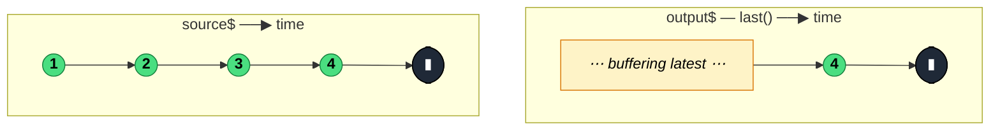

### `last<T, D>(predicate?, defaultValue?)`

> Holds onto the most recent value (optionally filtered by a predicate) and emits it once the source completes — errors with `EmptyError` if nothing matched and no default was supplied.

---

#### Policies

| Policy | Value |
|--------|-------|
| **Family** | Filtering / Selection |
| **Arity** | Unary |
| **Time-sensitive** | No |
| **Value-sensitive** | Yes (when predicate supplied) |
| **Lossy** | Yes — all but the final match are silently dropped |
| **Completion required** | Yes — cannot emit until source completes |
| **Backpressure policy** | Latest — retains exactly one value at a time |
| **Scheduler-aware** | No |
| **Multicast** | Unicast |
| **Error propagation** | Forward; also emits `EmptyError` on no-match + no-default |
| **Subscription lifecycle** | Per-subscriber |
| **Purity** | Pure |
| **Synchronicity** | Sync-by-default |

**Completion behaviour** — `last` is a classic "emit on complete" operator. It keeps replacing an internal `lastValue` slot on every match, then emits that slot on source completion. If the source never completes (e.g. `interval()`), `last` stalls forever. If source completes with no match and no default, it errors with `EmptyError`.

**Lossy behaviour** — Lossy. Only the final matching value reaches the output; every preceding matching value is overwritten in the internal slot.

---

#### ASCII Marble Diagram

```
source:  --1--2--3--4--|
         last()
output:  --------------(4|)

source:  --1--2--3--4--|
         last(x => x < 3)
output:  --------------(2|)

source:  --1--2--3--|
         last(x => x > 100, 0)
output:  -----------(0|)
```

---

#### Mermaid Marble Diagram



---

#### Signature

```typescript
export function last<T, D = T>(
	predicate?: ((value: T, index: number, source: Observable<T>) => boolean) | null,
	defaultValue?: D
): OperatorFunction<T, T | D>

export function last<T>(predicate: BooleanConstructor): OperatorFunction<T, TruthyTypesOf<T>>
```

---

#### Five Use Cases

- **Final-answer aggregation** — wait for a multi-step pipeline to complete and take only the last emitted result
- **Terminal state snapshot** — observe a finite state-machine stream and report the ending state only
- **Completion-based promise** — convert a finite Observable into a `Promise<T>` of its final value via `lastValueFrom`
- **Latest match by predicate** — of all candidates that passed during the source's lifetime, take the latest that matched a condition
- **Fallback to default** — ensure the subscriber always gets a terminal value even when the source emitted nothing

---

#### Primary Code Sample

```typescript
import { defer, from, last, Observable } from 'rxjs'

// Scenario: final-answer aggregation — take the last HTTP polling response
// before the stream terminates (e.g., after takeUntil(stopPoll$))
interface PollResult {
	status: 'pending' | 'done'
	value: number
}

declare const poll$: Observable<PollResult>
declare const stopPoll$: Observable<void>

const finalResult$: Observable<PollResult> = poll$.pipe(last())

finalResult$.subscribe((r: PollResult): void => {
	console.log('final', r)
})
```

`last` is the natural partner of `takeUntil` or any terminator: the stream runs, values flow through, and on termination the *most recent* snapshot is what the subscriber cares about.

---

#### Gotchas

1. **Stalls on infinite sources** — `last` must wait for source completion. On an `interval()` or unbounded WebSocket it never emits and the internal `lastValue` slot grows stale forever. Pair with `takeUntil` or `take(n)` to force termination.
2. **Errors with `EmptyError` on empty source** — same trap as `first`. Supply a `defaultValue` or handle `EmptyError` in a `catchError`.
3. **Holds a reference to the last value** — for large objects on high-throughput streams, the internal slot keeps the most recent object alive across GC until completion. Usually harmless, occasionally relevant.
4. **Not the same as `takeLast(1)`** — `takeLast(1)` emits the last value without erroring when empty; `last()` errors. Use `takeLast(1)` when empty is acceptable.

---

#### Related Operators

| Operator | Key difference | Choose when |
|----------|---------------|-------------|
| `takeLast(1)` | Completes silently when empty | You want the last value with no error on empty |
| `takeLast(n)` | Keeps the last N values | You need a trailing window, not just one |
| `first` | Emits on the first match, not the last | You want the earliest match |
| `reduce` | Accumulates across values | You need a computation, not just selection |
| `defaultIfEmpty` + `takeLast(1)` | Composable no-error version | You want to spell out "last or fallback" without the error |

---

#### Decision Rule

> Use `last` when you want **the final value on a guaranteed-finite source** and empty is an error. Prefer `takeLast(1)` when empty is acceptable, or `reduce` when the result depends on all values rather than just the last one.
