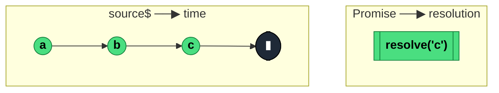

### `lastValueFrom<T, D>(source: Observable<T>, config?: { defaultValue: D }): Promise<T | D>`

> Converts a finite Observable into a Promise that resolves with the **last emitted value** when the source completes — rejects with `EmptyError` if the source completes empty and no default was provided.

---

#### Policies

| Policy | Value |
|--------|-------|
| **Family** | Utility / Interop |
| **Arity** | N-ary |
| **Time-sensitive** | No |
| **Value-sensitive** | No |
| **Lossy** | Yes — all intermediate values are replaced by each new one; only the last survives |
| **Completion required** | **Yes** — Promise only resolves on source completion |
| **Backpressure policy** | Latest — retains one value at a time |
| **Scheduler-aware** | No |
| **Multicast** | Unicast |
| **Error propagation** | Forward — source errors become Promise rejections |
| **Subscription lifecycle** | Per-call |
| **Purity** | Side-effectful |
| **Synchronicity** | Async-by-default |

**Completion behaviour** — Subscribes to source. Retains the latest `next` in an internal slot. On source completion: resolves with the retained value (if any), `config.defaultValue` (if no value and config provided), or rejects with `EmptyError` otherwise. On source error: Promise rejects.

**Lossy behaviour** — Lossy of intermediate values. Every source emission replaces the held last-value.

---

#### ASCII Marble Diagram

```
source:        --a--b--c--|
               lastValueFrom(source)
Promise:       resolves with 'c' when source completes

source:        -----|                 (empty)
               lastValueFrom(source)
Promise:       rejects with EmptyError

source:        -----|
               lastValueFrom(source, { defaultValue: 'x' })
Promise:       resolves with 'x'
```

---

#### Mermaid Marble Diagram



---

#### Signature

```typescript
interface LastValueFromConfig<T> {
	defaultValue: T
}

export function lastValueFrom<T>(source: Observable<T>): Promise<T>
export function lastValueFrom<T, D>(
	source: Observable<T>,
	config: LastValueFromConfig<D>
): Promise<T | D>
```

---

#### Five Use Cases

- **Finite stream → Promise** — `await lastValueFrom(source$.pipe(take(10)))` gets the 10th value from an interval stream
- **Array aggregation** — `await lastValueFrom(source$.pipe(toArray()))` gets every value as a single array
- **Final state snapshot** — await a state-stream that completes at shutdown to get the final state
- **Test assertion** — `expect(await lastValueFrom(stream$)).toBe(expected)` for simpler test assertions than subscribe-based setups
- **Batch processing** — await the last emission of a multi-step pipeline to confirm completion and capture the final result

---

#### Primary Code Sample

```typescript
import { interval, take, toArray, lastValueFrom, Observable } from 'rxjs'

// Scenario: finite stream → array aggregation via toArray + lastValueFrom
async function firstFiveTicks(): Promise<number[]> {
	const ticks$: Observable<number[]> = interval(100).pipe(
		take(5),
		toArray()
	)
	return await lastValueFrom(ticks$)
	// resolves with [0, 1, 2, 3, 4] after ~500ms
}
```

The `toArray` + `lastValueFrom` combo is the canonical way to collect a finite stream into a single Promise-of-array.

---

#### Gotchas

1. **Hangs forever on infinite sources** — like `last()`, requires source completion. The JSDoc warning is explicit: only use with sources that *will* complete. Pair with `take` / `takeUntil` / `timeout`.
2. **Rejects with `EmptyError` on empty source** — mirrors the `last()` operator. Supply `{ defaultValue }` if empty is possible.
3. **Holds only the last value** — intermediate values are discarded from memory as they arrive. For arrays, pipe through `toArray()` first.
4. **Default is only for empty completion, not for error** — source errors reject the Promise unconditionally. Pair with `catchError` upstream if you want error fallback.
5. **Replaced deprecated `.toPromise()`** — in RxJS 6, `toPromise()` waited for the last value (same as `lastValueFrom`). The explicit name is preferred.

---

#### Related Operators

| Operator | Key difference | Choose when |
|----------|---------------|-------------|
| `firstValueFrom` | Resolves with the *first* value | You want one-shot early resolution |
| `last()` + subscribe | Operator form | You want to stay in a `pipe` chain |
| `toArray()` + `lastValueFrom` | Collects all values | You need every emission as an array |
| `Observable.toPromise()` (removed) | Legacy | Never — removed in RxJS 8 |

---

#### Decision Rule

> Use `lastValueFrom` when you want to **await the final emission of a finite Observable as a Promise**. Prefer `firstValueFrom` for one-shot early resolution, or stay reactive when multi-value consumption is fine.
