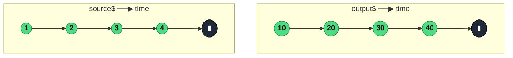

### `map<T, R>(project: (value: T, index: number) => R)`

> Applies a pure transformation function to each source value and emits the result — the stream equivalent of `Array.prototype.map`.

---

#### Policies

| Policy | Value |
|--------|-------|
| **Family** | Transformation |
| **Arity** | Unary |
| **Time-sensitive** | No |
| **Value-sensitive** | Yes — the projection operates on the value |
| **Lossy** | No — every source value produces exactly one output value |
| **Completion required** | No — emits on each source value |
| **Backpressure policy** | None — 1:1 pass-through |
| **Scheduler-aware** | No |
| **Multicast** | Unicast — each subscriber gets its own subscription to the source |
| **Error propagation** | Forward — errors thrown inside `project` become stream errors |
| **Subscription lifecycle** | Per-subscriber (the `index` counter is per-subscription) |
| **Purity** | Pure (by contract — side effects should go in `tap`) |
| **Synchronicity** | Sync-by-default |

**Completion behaviour** — `map` is a straight pass-through for the completion signal. When the source completes, the output completes immediately after flushing the last value. It never buffers. On an infinite source, it emits indefinitely without ever needing completion.

**Lossy behaviour** — Not lossy. Every source emission produces exactly one output emission. If you want to drop values, compose with `filter`.

---

#### ASCII Marble Diagram

```
source:  --1--2--3--4--|
         map(x => x * 10)
output:  --10-20-30-40-|
```

---

#### Mermaid Marble Diagram



---

#### Signature

```typescript
export function map<T, R>(
	project: (value: T, index: number) => R
): OperatorFunction<T, R>
```

The `index` argument is the 0-based index of the emission within the current subscription.

---

#### Five Use Cases

- **DTO extraction** — pull a single field or projected shape out of a larger API response object
- **Unit conversion** — transform domain values (Celsius → Fahrenheit, cents → dollars, Date → ISO string)
- **Event → payload** — convert a DOM event into the relevant piece of data (`event.target.value`, `event.clientX`)
- **MVU action shaping** — turn raw input events into typed actions that will flow into a reducer
- **Index-aware labelling** — use the second `index` argument to tag emissions (`{value, position: index}`) without an external counter

---

#### Primary Code Sample

```typescript
import { fromEvent, map, Observable } from 'rxjs'

// Scenario: MVU action shaping — turn keystroke events into typed actions
type Action = { type: 'queryChanged'; query: string }

const input: HTMLInputElement = document.querySelector('#search')!

const action$: Observable<Action> = fromEvent<InputEvent>(input, 'input').pipe(
	map((e: InputEvent): Action => ({
		type: 'queryChanged',
		query: (e.target as HTMLInputElement).value,
	}))
)
```

In an MVU architecture, `map` is the canonical way to adapt the shape of an event stream to match the `Action` type your reducer expects — it lives at the very top of the effect pipeline, before any operators that depend on the action shape.

---

#### Gotchas

1. **Never do side effects inside `map`** — a throwing side effect or mutation makes the operator non-pure and causes the stream to error or leak state. Put logging, subscriptions, or mutations in `tap` instead.
2. **`map` errors are stream errors** — if `project` throws synchronously (e.g. reading a property on `undefined`), the stream errors and terminates. Guard with optional chaining or move the risky work into a `switchMap` with `catchError`.
3. **The `index` argument resets per subscription** — because `map` is unicast, each subscriber gets its own counter starting at 0. If you need a globally shared index, put `map` downstream of a `share()`/`shareReplay()`.
4. **Don't return Observables from `map`** — the output will be `Observable<Observable<T>>`, which is almost never what you want. Use `switchMap` / `mergeMap` / `concatMap` for projections that return streams.

---

#### Related Operators

| Operator | Key difference | Choose when |
|----------|---------------|-------------|
| `mapTo` | Emits a fixed constant regardless of value | You want to signal "something happened" without caring about the payload (deprecated — use `map(() => value)`) |
| `pluck` (removed v8) | Shorthand for `map(o => o.key)` | Obsolete — use `map(o => o.key)` with optional chaining |
| `scan` | Carries accumulated state across emissions | The projection needs access to prior values |
| `switchMap` | Projection returns an Observable, flattens | The projection is async (API call, timer) |
| `tap` | Inspects without transforming | You need a side effect (logging) without changing the value |

---

#### Decision Rule

> Use `map` when the transformation is **a pure synchronous function of a single value**. Prefer `scan` when the transformation needs prior state, `switchMap` when it returns an Observable, or `tap` when you only want a side effect.
