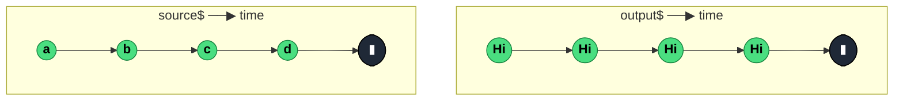

### `mapTo<R>(value: R)`

> Replaces every source emission with a fixed constant — deprecated in RxJS 8, removed in RxJS 9; use `map(() => value)` instead.

---

#### Policies

| Policy | Value |
|--------|-------|
| **Family** | Transformation |
| **Arity** | Unary |
| **Time-sensitive** | No |
| **Value-sensitive** | No — ignores the source value entirely |
| **Lossy** | No — every emission produces an output, though the input value is discarded |
| **Completion required** | No — emits on each source value |
| **Backpressure policy** | None — 1:1 pass-through |
| **Scheduler-aware** | No |
| **Multicast** | Unicast |
| **Error propagation** | Forward |
| **Subscription lifecycle** | Per-subscriber |
| **Purity** | Pure |
| **Synchronicity** | Sync-by-default |

**Completion behaviour** — Pure pass-through. Source completion triggers immediate output completion. Never buffers.

**Lossy behaviour** — The *values* are effectively discarded (only the emission timing is preserved), but no emission itself is dropped — one source value ⇒ one output value. Classifying as non-lossy because the emission count is 1:1.

---

#### ASCII Marble Diagram

```
source:  --a--b--c--d--|
         mapTo('Hi')
output:  --Hi-Hi-Hi-Hi-|
```

---

#### Mermaid Marble Diagram



---

#### Signature

```typescript
// Deprecated — use map(() => value) instead
export function mapTo<R>(value: R): OperatorFunction<unknown, R>
```

**Implementation:** `mapTo(value)` is literally `map(() => value)` under the hood — the source file in RxJS 8 is a one-line re-export.

---

#### Five Use Cases

- **Heartbeat signal** — convert any activity stream into a steady `'tick'` emission for a keep-alive channel
- **Action constant emission** — turn a button click into a typed action constant like `{ type: 'SUBMIT' }`
- **Boolean flag streams** — emit `true` on one event source and `false` on another, then merge to track state
- **Trigger-to-fetch** — signal "refresh now" downstream without carrying the triggering event payload
- **Visual status** — map any emission on a loading stream to a progress indicator value

---

#### Primary Code Sample

```typescript
import { fromEvent, merge, map, Observable } from 'rxjs'

// Scenario: boolean flag streams — track "is mouse inside element"
type HoverState = boolean

const el: HTMLElement = document.querySelector('#card')!

const enter$: Observable<HoverState> = fromEvent(el, 'mouseenter').pipe(
	map((): HoverState => true)
)
const leave$: Observable<HoverState> = fromEvent(el, 'mouseleave').pipe(
	map((): HoverState => false)
)
const hover$: Observable<HoverState> = merge(enter$, leave$)
```

**Note:** the code uses `map(() => true)` rather than `mapTo(true)` because `mapTo` is deprecated. Shown here so the pattern is still recognisable in older codebases.

---

#### Gotchas

1. **Deprecated — use `map(() => value)`** — `mapTo` is flagged for removal in RxJS 9. New code should use `map`. The two are semantically identical.
2. **The constant is captured by reference** — if `value` is an object (`mapTo({ type: 'CLICK' })`), every emission emits the *same object reference*. Downstream mutations affect all emissions. Use `map(() => ({ type: 'CLICK' }))` to produce a fresh object each time.
3. **Still lossy of *information*** — the source value is permanently discarded. If a later stage needs it, capture it with `map` instead of `mapTo`.

---

#### Related Operators

| Operator | Key difference | Choose when |
|----------|---------------|-------------|
| `map` | Accepts a projection function with access to the value | Always preferred — `map(() => value)` is the supported replacement |
| `mapTo` | Fixed constant, ignores value | Legacy code — do not introduce in new code |
| `ignoreElements` | Drops all values entirely, passes only complete/error | You want only the completion signal, not a constant per emission |
| `scan` | Accumulates state | You need to carry context across emissions |

---

#### Decision Rule

> Do not use `mapTo` in new code. Use `map(() => value)` — it's the supported replacement, is strictly more flexible, and avoids the v9 deprecation.
