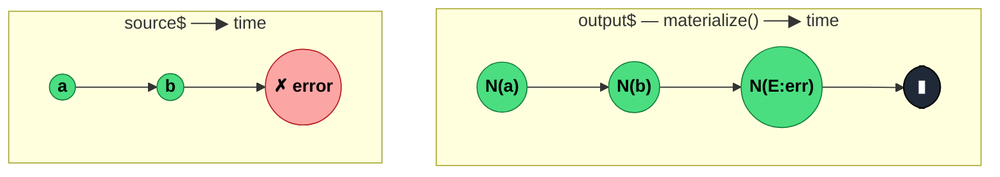

### `materialize<T>(): OperatorFunction<T, ObservableNotification<T>>`

> Wraps every source notification (`next`, `error`, `complete`) into an `ObservableNotification` object and emits it as a regular `next` — turns control-flow signals into first-class data values.

---

#### Policies

| Policy | Value |
|--------|-------|
| **Family** | Notification / Utility |
| **Arity** | Unary |
| **Time-sensitive** | No |
| **Value-sensitive** | No |
| **Lossy** | No — every notification is preserved as data |
| **Completion required** | No |
| **Backpressure policy** | None |
| **Scheduler-aware** | No |
| **Multicast** | Unicast |
| **Error propagation** | **Catch** — source errors are converted to data `next` emissions, so the output never errors from the source |
| **Subscription lifecycle** | Per-subscriber |
| **Purity** | Pure |
| **Synchronicity** | Sync-by-default |

**Completion behaviour** — Every `next` from the source → `next({ kind: 'N', value })` on output. Source `error` → `next({ kind: 'E', error })` followed by **output `complete`**. Source `complete` → `next({ kind: 'C' })` followed by output `complete`. After materialization the output always completes normally; any source error has been turned into data.

**Lossy behaviour** — Not lossy; the opposite — it *preserves* information that would otherwise be control-flow-only (errors, completions).

---

#### ASCII Marble Diagram

```
source:     --a--b--c--|
            materialize()
output:     --N(a)--N(b)--N(c)--N(C)|
            (each value wrapped; completion wrapped too)

source:     --a--#(err)
            materialize()
output:     --N(a)--N(E:err)|
            (error wrapped as a value; output completes normally)
```

Notation: `N(x)` = Notification `{kind:'N', value:x}`; `N(E:…)` = Notification `{kind:'E', error:…}`; `N(C)` = Notification `{kind:'C'}`.

---

#### Mermaid Marble Diagram



---

#### Signature

```typescript
export function materialize<T>(): OperatorFunction<T, ObservableNotification<T>>

// ObservableNotification<T> is a union:
type ObservableNotification<T> =
	| { kind: 'N'; value: T }
	| { kind: 'E'; error: unknown }
	| { kind: 'C' }
```

Paired with `dematerialize()` for the reverse transformation.

---

#### Five Use Cases

- **Error buffering** — treat errors as data so downstream operators can buffer, group, or analyse them
- **Log all notifications uniformly** — send every emission, completion, and error through a single sink
- **Retry analytics** — count errors vs successes across a pipeline by materializing and filtering `{kind: 'E'}`
- **Time-travel debugging** — record the stream of notifications into an array for later replay via `dematerialize`
- **Convert to generic data pipeline** — when downstream is array/data-oriented and doesn't understand Observable error channel

---

#### Primary Code Sample

```typescript
import { of, map, materialize, dematerialize, filter, Observable } from 'rxjs'

// Scenario: log all notifications uniformly and filter out errors
const source$: Observable<number> = of(1, 2, 3).pipe(
	map((n: number): number => {
		if (n === 2) throw new Error('bad value')
		return n * 10
	})
)

const safe$: Observable<number> = source$.pipe(
	materialize(),
	filter((n): boolean => n.kind !== 'E'),
	dematerialize()
)

safe$.subscribe((v: number): void => console.log(v))
// logs: 10, (then completes — the error was filtered out)
```

**Advanced:** the `materialize → inspect → dematerialize` sandwich is how many custom "error-aware" operators are built. Place processing between the two to treat errors as values temporarily.

---

#### Gotchas

1. **Output completes even if source errored** — because the error becomes a data `next`, the output stream itself doesn't error. Downstream error handlers will never fire on the original error unless you `dematerialize` downstream.
2. **`kind: 'E'` contains `error`, not `value`** — don't blindly read `.value`. Narrow the notification type first.
3. **Source completion also becomes a data emission** — the `{kind: 'C'}` notification is emitted, then the output completes. A downstream observer that isn't expecting it will see one extra "value" before the completion.
4. **Doesn't preserve scheduling** — notifications are re-emitted synchronously as they arrive. If you want to add timing metadata, compose with `timestamp` before materializing.
5. **Pairs with `dematerialize`** — if you want "error-as-data temporarily, then real errors again", always round-trip through both. `materialize` alone is rarely the final form.

---

#### Related Operators

| Operator | Key difference | Choose when |
|----------|---------------|-------------|
| `dematerialize` | Inverse — unwraps Notifications back into signals | You're ending the error-as-data section |
| `catchError` | Replaces source with another Observable | You want to recover, not introspect |
| `timestamp` | Adds timing metadata to each emission | You want timestamps, not notification kinds |
| `tap({ error })` | Observes errors without changing the stream | You only want a side-effect on error |

---

#### Decision Rule

> Use `materialize` when you need to **inspect or transform error/complete notifications as data**. Almost always paired with `dematerialize` downstream to restore normal signal semantics.
