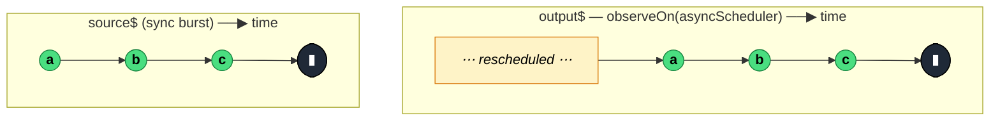

### `observeOn<T>(scheduler: SchedulerLike, delay = 0): MonoTypeOperatorFunction<T>`

> Reschedules every notification from the source (including `error` and `complete`) onto the specified scheduler, controlling *when* downstream observers receive them.

---

#### Policies

| Policy | Value |
|--------|-------|
| **Family** | Utility / Scheduling |
| **Arity** | Unary |
| **Time-sensitive** | Yes — optional `delay` parameter shifts all notifications by that many ms |
| **Value-sensitive** | No |
| **Lossy** | No |
| **Completion required** | No |
| **Backpressure policy** | None |
| **Scheduler-aware** | **Yes** — takes a `SchedulerLike` parameter |
| **Multicast** | Unicast |
| **Error propagation** | Forward — errors are also rescheduled (unlike `delay`) |
| **Subscription lifecycle** | Per-subscriber |
| **Purity** | Pure |
| **Synchronicity** | Async-by-default — emissions are rescheduled off the current stack |

**Completion behaviour** — Reschedules `next`, `error`, and `complete` through the given scheduler. All three notification kinds are delayed uniformly. The source's internal scheduling isn't replaced — it emits when it would anyway, then `observeOn` re-schedules each arrival.

**Lossy behaviour** — Not lossy. Every notification passes through, just with a different execution timing.

---

#### ASCII Marble Diagram

```
source (sync):  (abc|)
                observeOn(asyncScheduler)
output (async): -a-b-c-|      (each emission on a microtask tick)

source:         --a--b--c--#
                observeOn(asyncScheduler)
output:         ---a--b--c--#  (error is rescheduled too)
```

---

#### Mermaid Marble Diagram



---

#### Signature

```typescript
export function observeOn<T>(
	scheduler: SchedulerLike,
	delay?: number
): MonoTypeOperatorFunction<T>
```

Common schedulers:
- `asyncScheduler` — `setTimeout(..., 0)` microtask queue
- `asapScheduler` — Promise microtask queue (faster than `async`)
- `queueScheduler` — synchronous recursive queue, re-entrant safe
- `animationFrameScheduler` — `requestAnimationFrame`

---

#### Five Use Cases

- **Animation smoothness** — re-emit onto `animationFrameScheduler` so DOM updates align with browser repaints
- **Microtask deferral** — break up a synchronous burst using `asyncScheduler` so the event loop can interleave other work
- **Test virtualisation** — feed `TestScheduler` into `observeOn` in marble tests to control timing
- **Responsive UI slicing** — slice heavy work into `asapScheduler` frames to yield back to user input
- **Zone-safe scheduling in Angular** — move emissions onto a specific scheduler that matches Angular's change-detection cycle

---

#### Primary Code Sample

```typescript
import { interval, observeOn, animationFrameScheduler, Observable } from 'rxjs'

// Scenario: animation smoothness — observe each tick in a repaint frame
const animationProgress$: Observable<number> = interval(10).pipe(
	observeOn(animationFrameScheduler)
)

animationProgress$.subscribe((val: number): void => {
	document.getElementById('bar')!.style.height = `${val % 200}px`
})
```

`observeOn(animationFrameScheduler)` is the idiomatic way to tie an RxJS stream to browser repaints — the `interval`'s internal timer runs on `asyncScheduler`, but the emissions arrive at the subscriber aligned to the next repaint.

---

#### Gotchas

1. **Doesn't change the source's own scheduling** — `observeOn` reschedules the *arrival* of notifications at downstream, not the source's internal work. An `interval(10, asyncScheduler)` keeps its 10ms timer; `observeOn(animationFrameScheduler)` only affects when the subscriber is called.
2. **Anti-pattern: chunking synchronous bursts** — using `observeOn(asyncScheduler)` on a very fast synchronous source to "spread out" emissions is wasteful — it schedules per-emission, creating micro-task pressure. For that, inject the scheduler into the source itself.
3. **Errors are also rescheduled** — unlike `delay` (which passes errors through immediately), `observeOn` reschedules `error` notifications. If your error handling assumes synchronous arrival, this can be subtle.
4. **Use `subscribeOn` for subscription-time scheduling** — `observeOn` controls when *notifications* are observed; `subscribeOn` controls when the source is *subscribed*. They solve different problems.
5. **Default `delay` is 0** — even with 0, the scheduler still reschedules — for `asyncScheduler`, that means a macro task; for `asapScheduler`, a microtask. There is no "just switch scheduler with zero latency" option — switching always costs one scheduler tick.

---

#### Related Operators

| Operator | Key difference | Choose when |
|----------|---------------|-------------|
| `subscribeOn` | Controls subscription timing, not emission timing | You need to defer the source's own work |
| `delay(ms)` | Only delays `next`; errors pass through immediately | You want predictable delay without error rescheduling |
| `debounceTime` | Drops intermediate values during silence | You want to limit rate, not just reschedule |
| `throttleTime` | Rate-limits | Same |

---

#### Decision Rule

> Use `observeOn(scheduler)` when you want downstream consumers to receive notifications on a **specific scheduler** (animation frames, async queue) regardless of the source's own scheduling. Prefer `subscribeOn` for subscription-time scheduling, or `delay` when errors should not be delayed.
