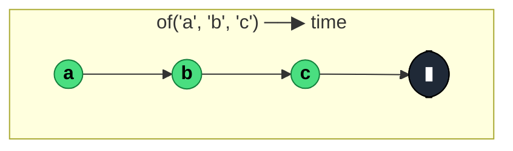

### `of<T>(...values: T[]): Observable<T>`

> Synchronously emits each argument as a separate `next`, then completes — the Observable equivalent of `[value1, value2, ...].forEach(emit)`.

---

#### Policies

| Policy | Value |
|--------|-------|
| **Family** | Creation |
| **Arity** | N-ary — takes any number of constant values |
| **Time-sensitive** | No — emits synchronously at subscription time |
| **Value-sensitive** | No — values are passed through unchanged |
| **Lossy** | No — every argument is emitted |
| **Completion required** | No — completes itself after the last value |
| **Backpressure policy** | None |
| **Scheduler-aware** | No (deprecated scheduler parameter was removed) |
| **Multicast** | Unicast — each subscriber gets a fresh synchronous run |
| **Error propagation** | Forward — cannot error during emission (no user code runs) |
| **Subscription lifecycle** | Per-subscriber |
| **Purity** | Pure |
| **Synchronicity** | Sync-by-default — entire sequence runs on subscribe |

**Completion behaviour** — `of(a, b, c)` synchronously emits `a`, `b`, `c`, then completes — all in the same tick as `.subscribe()`. A subscriber whose `next` handler does async work won't pause the stream. `of()` with no arguments completes immediately without any `next` emission.

**Lossy behaviour** — Not lossy. Every argument becomes one `next`. Unlike `from()`, it does **not** flatten arrays — `of([1, 2, 3])` emits a single value: the array.

**Implementation note** — In RxJS 8, `of(...values)` delegates to `fromArrayLike(values)`, so it's essentially a thin wrapper over `from(arrayLike)`.

---

#### ASCII Marble Diagram

```
              of('a', 'b', 'c')
output:      (abc|)
             (all synchronous at t=0)
```

---

#### Mermaid Marble Diagram



---

#### Signature

```typescript
export function of(): Observable<never>
export function of<T>(value: T): Observable<T>
export function of<A extends readonly unknown[]>(...values: A): Observable<ValueFromArray<A>>
```

The variadic overload with `readonly unknown[]` preserves tuple types — `of(1, 'a', true)` yields `Observable<1 | 'a' | true>`, not `Observable<number | string | boolean>`.

---

#### Five Use Cases

- **Synchronous seed value** — prepend a known starting value to a cold stream (see `startWith`)
- **Test fixtures** — emit a deterministic list of values in unit tests: `of(fixture1, fixture2, fixture3)`
- **Type-preserving constants** — emit typed literal values into a pipeline where the exact type matters
- **Fallback in `catchError`** — return a canned replacement stream on error: `catchError(() => of(defaultValue))`
- **Composition building block** — combine with `concat` / `merge` / `startWith` to construct ad-hoc streams

---

#### Primary Code Sample

```typescript
import { of, catchError, Observable } from 'rxjs'

// Scenario: fallback in catchError — API failure yields a typed default
interface Response {
	data: number[]
}

declare const api$: Observable<Response>

const safe$: Observable<Response> = api$.pipe(
	catchError((): Observable<Response> => of({ data: [] }))
)
```

`of` shines inside `catchError` and `switchMap` callbacks — anywhere a pipeline needs an Observable quickly from known values.

---

#### Gotchas

1. **Does not flatten** — `of([1, 2, 3])` emits **one** value (the array), not three. Use `from([1, 2, 3])` for per-element emission.
2. **Synchronous** — all values emit before `subscribe()` returns. If a subscriber unsubscribes before subscribe returns (e.g., via teardown returned from the observer), subsequent values are skipped.
3. **`of()` with no arguments equals `EMPTY` semantically** — completes immediately. Use whichever reads clearer.
4. **No scheduler argument in RxJS 8** — the deprecated `of(values, scheduler)` form is gone. For scheduled emission, use `from(values).pipe(observeOn(scheduler))`.

---

#### Related Operators

| Operator | Key difference | Choose when |
|----------|---------------|-------------|
| `from(array)` | Flattens arrays/iterables into per-element emissions | You have a collection to emit one-by-one |
| `EMPTY` | Completes without emission | You want an empty stream |
| `startWith(...values)` | Prepends values to an existing source | You're extending a pipeline, not building one |
| `range(start, count)` | Emits sequential integers | You want a numeric range |

---

#### Decision Rule

> Use `of(a, b, c)` when you need **a finite synchronous sequence of known literal values**. Use `from(array)` to flatten collections, `range` for integers, or `EMPTY` for a no-emission completion.
