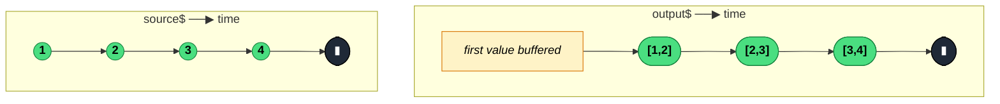

### `pairwise<T>(): OperatorFunction<T, [T, T]>`

> Emits each source value paired with its predecessor as a tuple `[previous, current]` — the first source value is swallowed because it has no predecessor.

---

#### Policies

| Policy | Value |
|--------|-------|
| **Family** | Transformation |
| **Arity** | Unary |
| **Time-sensitive** | No |
| **Value-sensitive** | No — does not inspect values, only pairs them |
| **Lossy** | No — all values are used; the first is merely delayed to act as the "previous" for the second emission |
| **Completion required** | No — emits on the second and subsequent source values |
| **Backpressure policy** | Latest — holds exactly one prior value (O(1) memory) |
| **Scheduler-aware** | No |
| **Multicast** | Unicast — each subscriber has its own `prev` buffer |
| **Error propagation** | Forward |
| **Subscription lifecycle** | Per-subscriber |
| **Purity** | Pure |
| **Synchronicity** | Sync-by-default |

**Completion behaviour** — Emits immediately on every source value *except the first*. If the source completes after emitting only one value, `pairwise` emits nothing before forwarding the completion. Works fine on infinite streams.

**Lossy behaviour** — Not lossy in the value-counting sense (N source values produce N−1 pairs, each pair referencing every source value), but the *first* source value is never emitted in isolation — it only appears as the `prev` element of the first pair.

---

#### ASCII Marble Diagram

```
source:  --1--2--3--4--|
         pairwise()
output:  -----[1,2]-[2,3]-[3,4]-|
```

Note: the first source value `1` is held in internal state until value `2` arrives; the first output `[1,2]` coincides with `2`'s arrival.

---

#### Mermaid Marble Diagram



---

#### Signature

```typescript
export function pairwise<T>(): OperatorFunction<T, [T, T]>
```

No parameters. The output tuple type is `[T, T]` regardless of the source type.

---

#### Five Use Cases

- **Scroll-direction detection** — compare consecutive `scrollY` values to decide whether the user is scrolling up or down
- **Mouse-move distance** — compute the pixel delta between consecutive pointer positions (velocity, gestures)
- **State-transition logging** — on each state change, log the before/after pair for debugging or analytics
- **Change-rate calculation** — derivative-like measurements from a stream of sensor readings or numeric values
- **Undo baseline** — capture the previous state alongside the current one so a reducer can build an undo frame

---

#### Primary Code Sample

```typescript
import { fromEvent, map, pairwise, Observable } from 'rxjs'

// Scenario: scroll-direction detection
type ScrollDirection = 'up' | 'down' | 'none'

const direction$: Observable<ScrollDirection> = fromEvent(window, 'scroll').pipe(
	map((): number => window.scrollY),
	pairwise(),
	map(([prev, curr]: [number, number]): ScrollDirection => {
		if (curr > prev) return 'down'
		if (curr < prev) return 'up'
		return 'none'
	})
)
```

The `pairwise()` call sits between the source measurement (`window.scrollY`) and the derivation of a semantic value from the delta — a common shape for any "change rate" stream.

---

#### Gotchas

1. **Swallows the very first emission** — if you need the first value in the output too, prepend with `startWith(initialValue)` so `pairwise` sees a synthetic predecessor: `source$.pipe(startWith(null), pairwise())` and then handle the `null` case in the consumer.
2. **Each subscriber has its own `prev`** — because `pairwise` is unicast, a late subscriber on a multicasted source (via `share()`) only sees pairs from values that arrive *after* it subscribes, not the last source value paired with its first seen value.
3. **Pairs reference — not copy — the prior value** — if `T` is a mutable object and the consumer mutates `prev`, the mutation persists in later pair emissions. Treat pair elements as immutable or clone before mutating.
4. **Need triples or N-wise?** Use `bufferCount(3, 1)` for sliding triples, or `scan` with an accumulator that keeps the last N values.

---

#### Related Operators

| Operator | Key difference | Choose when |
|----------|---------------|-------------|
| `bufferCount(n, 1)` | Sliding window of `n` values (configurable size) | You need more than two consecutive values |
| `scan` | Carries arbitrary accumulated state | You need prior state but not as a pure tuple |
| `startWith(seed) + pairwise` | Includes the first value as part of a pair | You want the first emission to produce output |
| `distinctUntilChanged` | Drops duplicates based on comparison | You only care about *changes*, not the pair itself |

---

#### Decision Rule

> Use `pairwise` when you need to compare each value with **its immediate predecessor** as a tuple. Prefer `bufferCount(n, 1)` for wider sliding windows, or `scan` when the comparison needs more than the prior value.
