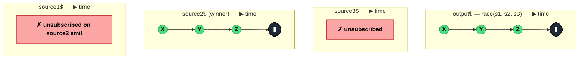

### `race<T>(...sources): Observable<T>`

> Subscribes to every source concurrently; the first one to emit (a `next`, `error`, or `complete`) wins — its lifecycle drives the output, and the losers are immediately unsubscribed.

---

#### Policies

| Policy | Value |
|--------|-------|
| **Family** | Combination / Concurrency |
| **Arity** | N-ary |
| **Time-sensitive** | **Yes** — the winner is whichever emits first |
| **Value-sensitive** | No |
| **Lossy** | Yes — losers' entire output is discarded |
| **Completion required** | No |
| **Backpressure policy** | None |
| **Scheduler-aware** | No |
| **Multicast** | Unicast |
| **Error propagation** | Forward — an error counts as a "notification", so an early erroring source wins and errors the output |
| **Subscription lifecycle** | Per-subscriber |
| **Purity** | Pure |
| **Synchronicity** | Async-by-default |

**Completion behaviour** — All sources are subscribed eagerly. The first to send *any* notification wins; its subsequent lifecycle is forwarded. Losers are unsubscribed the moment the winner emits. If a single source is passed, it's returned unwrapped.

**Lossy behaviour** — Every other source's entire output is discarded after the race resolves. Nothing is buffered before the race resolves — "first notification" includes the very first emission, not a collection of early ones.

---

#### ASCII Marble Diagram

```
source1:  -----a----b----c--|
source2:  --X----Y----Z-----|     (wins — emitted first)
source3:  --------------W-----|

          race(source1, source2, source3)

output:   --X----Y----Z-----|     (mirrors source2 entirely)
```

---

#### Mermaid Marble Diagram



---

#### Signature

```typescript
// Rest-parameter form
export function race<T extends readonly unknown[]>(
	...inputs: [...ObservableInputTuple<T>]
): Observable<T[number]>

// Array form (preferred)
export function race<T extends readonly unknown[]>(
	inputs: [...ObservableInputTuple<T>]
): Observable<T[number]>
```

`raceWith` (the operator form) is the `.pipe`-friendly equivalent.

---

#### Five Use Cases

- **Multi-mirror fetch** — subscribe to several CDN mirrors and take the fastest responder
- **Timeout pattern** — race data source against a `timer(ms)` to enforce a deadline (though `timeout` operator is usually cleaner)
- **User action dispatch** — race mouse click, keypress, and touch streams; first gesture wins
- **Geolocation strategies** — race GPS, IP-based, and network-based locators; fastest reliable answer wins
- **Graceful degradation** — primary source + immediate-emitting fallback; if primary is slow, fallback wins

---

#### Primary Code Sample

```typescript
import { race, Observable } from 'rxjs'

// Scenario: multi-mirror fetch — subscribe to all, take the fastest
declare function fetchFromMirror(name: string): Observable<string>

const cdnEu$: Observable<string> = fetchFromMirror('cdn-eu')
const cdnUs$: Observable<string> = fetchFromMirror('cdn-us')
const origin$: Observable<string> = fetchFromMirror('origin')

const fastest$: Observable<string> = race(cdnEu$, cdnUs$, origin$)

fastest$.subscribe((data: string): void => console.log('got:', data))
```

Ideally each mirror's Observable wraps a cancellable request (via `AbortController` in a custom Observable) so the losing requests are torn down, not just ignored.

---

#### Gotchas

1. **All sources subscribe eagerly** — every input starts running at subscribe time. If the side effects are expensive, this can multiply load. Use `defer` to delay construction, but the subscription itself will still happen.
2. **Errors are valid "first notifications"** — a source that errors instantly wins the race and errors the output. Wrap individual sources with `catchError` if losing-via-error shouldn't propagate.
3. **Synchronous sources race by argument order** — `race(of(1), of(2))` picks `of(1)` because it's first in the args and both emit synchronously. Don't rely on this for real branching logic.
4. **One-source form returns that source unwrapped** — `race(a$)` is effectively `from(a$)`. No racing occurs.
5. **Losing sources' cleanup is async** — the `unsubscribe` happens synchronously when the winner emits, but any pending timers/fetches inside loser sources depend on the source's own cancellation support.

---

#### Related Operators

| Operator | Key difference | Choose when |
|----------|---------------|-------------|
| `raceWith` | `.pipe`-friendly operator form | Inside a pipe chain |
| `merge` | Combines all streams; no losers | You want every value from every source |
| `combineLatest` | Waits for all to emit, then combines | You want the latest from all, not the fastest |
| `forkJoin` | Waits for all to complete, emits last | You want all results, not the fastest |
| `timeout` | Built-in timeout-as-error | You just want deadline enforcement |

---

#### Decision Rule

> Use `race(...sources)` when you want **whichever source emits first to drive the output**, and the rest should be discarded. Prefer `timeout` for deadline enforcement, `merge` for combining all streams, or `raceWith` when composing inside a pipe.
