### `raceWith<T, A>(...otherSources: [...ObservableInputTuple<A>])`

> Subscribes to the source and every other input, then mirrors whichever of them emits first — the losers are immediately unsubscribed.

---

#### Policies

| Policy | Value |
|--------|-------|
| **Family** | Combination / Concurrency |
| **Arity** | N-ary — source + N others, all race each other |
| **Time-sensitive** | Yes — the winner is the first to emit (or error/complete), timing is everything |
| **Value-sensitive** | No |
| **Lossy** | Yes — all losing streams are discarded entirely (never seen) |
| **Completion required** | No — the winner's lifecycle drives the output |
| **Backpressure policy** | None |
| **Scheduler-aware** | No (inherits from input scheduling) |
| **Multicast** | Unicast — each subscriber runs its own race |
| **Error propagation** | Forward — even the winner's error (including a race where the first notification is an error) propagates |
| **Subscription lifecycle** | Per-subscriber — losers are unsubscribed on the first emission from any participant |
| **Purity** | Pure |
| **Synchronicity** | Async-by-default — racing typically involves async sources |

**Completion behaviour** — All inputs subscribe in parallel. The first stream to emit (a `next`, `error`, or `complete` notification) wins; its lifecycle is forwarded from that point on. Losers are unsubscribed. If all inputs complete synchronously at subscription time, the first in argument order wins.

**Lossy behaviour** — Lossy. Every other input's entire output is discarded after the race resolves. Before the race resolves, nothing is buffered — winning means "first notification", not "first value collected".

---

#### ASCII Marble Diagram

```
source:  -----a----b----c--|
other1:  --X----Y----Z-----|
other2:  -------------W----|

         raceWith(other1, other2)

output:  --X----Y----Z-----|   (other1 emits first, wins)
```

Note: `source` and `other2` are unsubscribed the moment `other1` emits `X`.

---

#### Mermaid Marble Diagram

```mermaid
flowchart LR
    subgraph source["source$ ──▶ time"]
        direction LR
        sGap[ ⋯ ]:::quiet --> sDrop[ ✗ unsubscribed ]:::err
    end
    subgraph other1["other1$ (winner) ──▶ time"]
        direction LR
        w1((X)):::emit --> w2((Y)):::emit --> w3((Z)):::emit --> wEnd([ ▮ ]):::done
    end
    subgraph other2["other2$ ──▶ time"]
        direction LR
        o2Drop[ ✗ unsubscribed ]:::err
    end
    subgraph output["output$ — raceWith(other1, other2)  ──▶ time"]
        direction LR
        p1((X)):::emit --> p2((Y)):::emit --> p3((Z)):::emit --> pEnd([ ▮ ]):::done
    end
    source ~~~ other1
    other1 ~~~ other2
    other2 ~~~ output
    classDef emit fill:#4ade80,stroke:#15803d,color:#000,font-weight:bold
    classDef quiet fill:#fef3c7,stroke:#d97706,color:#000,font-style:italic
    classDef err fill:#fca5a5,stroke:#b91c1c,color:#000,font-weight:bold
    classDef done fill:#1f2937,stroke:#000,color:#fff
```



---

#### Signature

```typescript
export function raceWith<T, A extends readonly unknown[]>(
	...otherSources: [...ObservableInputTuple<A>]
): OperatorFunction<T, T | A[number]>
```

When called with no arguments, returns `identity` — a no-op.

---

#### Five Use Cases

- **Timeout vs result** — race a request against a `timer()` so whichever finishes first drives the output (usually paired with `throwIfEmpty` or a timeout error on the timer's branch)
- **Primary + fallback source** — race a primary API against a cached fallback; whichever responds first wins
- **Geolocation strategies** — race GPS, IP-based, and network-based geolocation and take the fastest reliable answer
- **Responsive UI "first user action wins"** — race mouse click, keyboard shortcut, and gesture sources; the first action taken resolves the prompt
- **Dual-subscribe with tie-breaking** — race equivalent pipelines where one is expected to be faster, letting the stream auto-select

---

#### Primary Code Sample

```typescript
import { interval, map, raceWith, Observable } from 'rxjs'

// Scenario: multi-endpoint race — subscribe to mirror endpoints, take whichever responds first
declare function fetchFromMirror(name: string): Observable<string>

const fast$: Observable<string> = fetchFromMirror('cdn-eu')
const medium$: Observable<string> = fetchFromMirror('cdn-us')
const slow$: Observable<string> = fetchFromMirror('origin')

const fastest$: Observable<string> = fast$.pipe(
	raceWith(medium$, slow$)
)

fastest$.subscribe((data: string): void => console.log('got:', data))
```

Once any mirror emits, the other two are unsubscribed — their pending requests should ideally be cancellable (e.g. via `AbortController` inside a custom Observable) to avoid wasted work.

---

#### Gotchas

1. **An error from the fastest stream wins too** — the winner is whoever sends *any* notification first, including `error`. If a source errors instantly and another would have succeeded, the output errors. Wrap individual losers with `catchError` if their errors shouldn't win the race.
2. **Losers are subscribed eagerly** — every auxiliary is subscribed at subscription time. Side effects (HTTP, WebSocket connect) fire on all of them. If only the winner should do work, use `defer` wrappers and cancel aggressively.
3. **Synchronous sources race by argument order** — if all inputs emit synchronously at subscription (e.g. `of(1)` vs `of(2)`), the first one in the argument list wins. Don't rely on this for behavioural distinctions.
4. **No grace window for tied results** — `raceWith` is strict "first-past-the-post". There is no way to wait for a second emission to compare. Use `forkJoin` if you need all results.
5. **Replaced the old `race` operator creator in pipelines** — in RxJS 7+, use the `raceWith` operator inside a `pipe`, and the standalone `race()` creator function when racing from scratch. Don't mix.

---

#### Related Operators

| Operator | Key difference | Choose when |
|----------|---------------|-------------|
| `race` (creator) | Standalone function, same semantics | You're starting from scratch rather than inside a pipe |
| `merge` | Combines all streams, no losers | You want every emission from every source |
| `combineLatest` | Needs all to emit first, then combines | You want the latest from every source, not "first wins" |
| `forkJoin` | Waits for all to complete, emits last values | You want all results, not just the fastest |
| `timeout` | Built-in timeout error | You just want a timeout, not a full race |

---

#### Decision Rule

> Use `raceWith` when you want **exactly one of several streams to drive the output** based on which emits first. Prefer `merge` when you want all emissions, or `timeout` when you just want to error on inactivity.
