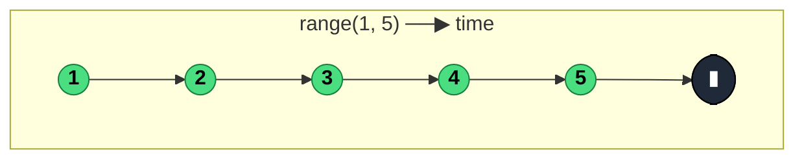

### `range(start: number, count?: number): Observable<number>`

> Emits a sequence of `count` sequential integers beginning at `start`, synchronously, then completes — the stream equivalent of a `for (let i = start; i < start + count; i++)` loop.

---

#### Policies

| Policy | Value |
|--------|-------|
| **Family** | Creation |
| **Arity** | Unary |
| **Time-sensitive** | No |
| **Value-sensitive** | No |
| **Lossy** | No |
| **Completion required** | No — completes itself after `count` emissions |
| **Backpressure policy** | None |
| **Scheduler-aware** | Deprecated scheduler parameter (removed in v8) |
| **Multicast** | Unicast |
| **Error propagation** | Forward (cannot error — all values are known) |
| **Subscription lifecycle** | Per-subscriber |
| **Purity** | Pure |
| **Synchronicity** | Sync-by-default — emits all values inside `subscribe()` |

**Completion behaviour** — Emits each integer from `start` through `start + count - 1`, then `complete()`. If `count <= 0`, returns `EMPTY`. If only one argument is passed, it's interpreted as `count` with `start = 0` — so `range(5)` emits `0, 1, 2, 3, 4`.

**Lossy behaviour** — Not lossy.

---

#### ASCII Marble Diagram

```
             range(1, 5)
output:      (12345|)        (all synchronous at t=0)

             range(3)
output:      (012|)           (start defaults to 0)

             range(10, 0)
output:      |                (empty — count = 0 → EMPTY)
```

---

#### Mermaid Marble Diagram



---

#### Signature

```typescript
export function range(start: number, count?: number): Observable<number>

// Deprecated overload (v8 removal)
export function range(start: number, count: number | undefined, scheduler: SchedulerLike): Observable<number>
```

Single-argument form treats the argument as `count` with `start = 0`.

---

#### Five Use Cases

- **Iteration over an index range** — emit page indices 1–N for sequential fetching via `concatMap`
- **Test data generation** — produce a deterministic numeric sequence for test fixtures or demos
- **Pagination driver** — feed `range(1, totalPages)` into a `concatMap(fetchPage)` for bounded paginated fetching
- **Numeric visualisations** — generate the X-axis ticks for a chart or animation frame counter
- **Retry enumeration** — pair with `map(n => attempt(n))` to represent attempts as a numbered sequence

---

#### Primary Code Sample

```typescript
import { range, concatMap, Observable } from 'rxjs'

// Scenario: pagination driver — fetch pages 1..totalPages sequentially
declare function fetchPage(n: number): Observable<string[]>

const totalPages = 5

const allPages$: Observable<string[]> = range(1, totalPages).pipe(
	concatMap((page: number): Observable<string[]> => fetchPage(page))
)

allPages$.subscribe((items: string[]): void => console.log('page:', items))
```

`range + concatMap` is the idiomatic "do N things in order" pattern when N is known up front.

---

#### Gotchas

1. **Count, not end — the second argument is how many, not the last value** — `range(1, 5)` emits `1..5`, not `1..4`. Off-by-one bugs are common.
2. **Non-positive count returns `EMPTY`** — `range(10, 0)` or `range(5, -3)` produces no values. Guard if input might be non-positive.
3. **Entirely synchronous by default** — `range(0, 1_000_000)` will block the thread. For async delivery, pipe through `observeOn(asyncScheduler)`.
4. **Scheduler parameter is deprecated** — the legacy `range(start, count, scheduler)` form is removed in v8. Use `range(start, count).pipe(observeOn(scheduler))`.
5. **Floating-point start not supported** — `range(1.5, 3)` emits `1.5, 2.5, 3.5` (just increments by 1 from the start). Usually unintentional; use `of(1.5, 2.5, 3.5)` for explicit floats.

---

#### Related Operators

| Operator | Key difference | Choose when |
|----------|---------------|-------------|
| `of(...values)` | Variadic list of explicit values | Values are heterogeneous or literal |
| `from(array)` | Flattens any iterable | You already have an array |
| `interval(ms)` | Time-spaced infinite emission | You want a clock, not a bounded range |
| `generate({ initialState, condition, iterate })` | General-purpose loop | You need non-linear step or complex state |

---

#### Decision Rule

> Use `range(start, count)` when you want **a bounded synchronous sequence of sequential integers**. Prefer `generate` for non-linear progressions, `interval` for time-spaced emissions, or `of(...)` for heterogeneous explicit values.
