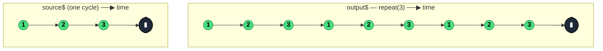

### `repeat<T>(countOrConfig?: number | RepeatConfig)`

> Re-subscribes to the source each time it **completes** — up to `count` times, optionally with a delay between repetitions; it does **not** catch errors.

---

#### Policies

| Policy | Value |
|--------|-------|
| **Family** | Error Handling / Retry (but for completion, not errors) |
| **Arity** | Unary |
| **Time-sensitive** | Yes — optional delay between repetitions is time-based |
| **Value-sensitive** | No |
| **Lossy** | No — every value from every repetition is forwarded |
| **Completion required** | No — re-subscription reuses the source; final completion only after `count` repetitions |
| **Backpressure policy** | None |
| **Scheduler-aware** | No explicit scheduler param, but delays use `timer()` internally |
| **Multicast** | Unicast |
| **Error propagation** | Forward — errors are **not** caught; a single error terminates the output |
| **Subscription lifecycle** | Per-subscriber — each subscriber runs its own repeat cycle |
| **Purity** | Pure |
| **Synchronicity** | Async-by-default (delays are async; without delay, synchronous repetition is possible) |

**Completion behaviour** — Mirrors the source. On source `complete`, if the repeat count has not been reached, re-subscribes (after optional delay). On the final allowed repetition's `complete`, the output completes. On source `error`, the output errors immediately (no repeat). `repeat(0)` returns `EMPTY`; `repeat()` or `repeat(Infinity)` repeats forever.

**Lossy behaviour** — Not lossy. All values from all repetitions are forwarded.

---

#### ASCII Marble Diagram

```
source:           --1--2--3--|
                  repeat(3)
output:           --1--2--3--1--2--3--1--2--3--|

source:           --1--2--3--|
                  repeat({ count: Infinity, delay: 1000 })
output:           --1--2--3-(1s)-1--2--3-(1s)-1--2--3-...

source:           --1--2--#
                  repeat(3)
output:           --1--2--#              (error stops it — no repetition)
```

---

#### Mermaid Marble Diagram



---

#### Signature

```typescript
interface RepeatConfig {
	count?: number                                   // default: Infinity
	delay?: number | ((count: number) => ObservableInput<unknown>)
}

export function repeat<T>(
	countOrConfig?: number | RepeatConfig
): MonoTypeOperatorFunction<T>
```

- `repeat()` — repeat forever
- `repeat(3)` — repeat 3 times total (source runs 3 times)
- `repeat({ count: 3, delay: 500 })` — with 500ms gap between cycles
- `repeat({ delay: n => timer(n * 1000) })` — linearly increasing delay per cycle

---

#### Five Use Cases

- **Polling loop** — re-subscribe to a one-shot HTTP request every N seconds (source completes → repeat with delay)
- **Looping playback** — replay a finite media stream, animation, or tutorial on loop
- **Exponential-delay polling** — combine `repeat({ delay: n => timer(2 ** n * 1000) })` for backoff-style polling
- **Test fixtures** — repeat a deterministic source multiple times to stress-test downstream stages
- **Periodic task batch** — re-run a "process one batch" stream until cancelled upstream

---

#### Primary Code Sample

```typescript
import { defer, repeat, Observable } from 'rxjs'

// Scenario: polling loop — re-run a one-shot HTTP fetch every 5 seconds
interface Status { ok: boolean }

declare function getStatus(): Promise<Status>

const polled$: Observable<Status> = defer((): Promise<Status> => getStatus()).pipe(
	repeat({ count: Infinity, delay: 5000 })
)

polled$.subscribe((s: Status): void => console.log('status:', s.ok))
```

The `defer` wrapper is critical — without it, the `Promise` would be created once and reused. `defer` ensures each repetition triggers a fresh HTTP call.

---

#### Gotchas

1. **Does not catch errors** — if the source errors, the output errors; no repeat occurs. Combine with `retry` if you want both error recovery *and* periodic re-subscription.
2. **Hot sources don't behave the way you might hope** — re-subscribing to a hot source (a `Subject`, a live WebSocket) doesn't "restart" it; it just attaches a new subscriber. For restartability, use `defer` to create a fresh cold Observable each cycle.
3. **`repeat(0)` returns `EMPTY`** — zero repetitions = empty stream. Easy to mis-parameterise into "emitting nothing" silently.
4. **Delay function receives cycle count** — `delay: n => timer(...)` gets `n` starting at 1 after the first completion. Useful for backoff schedules but requires care with indexing.
5. **Infinite repeat + finite source = infinite output** — `repeat()` on a synchronous finite source (like `of(1, 2, 3)`) without a delay produces a synchronous infinite loop that blocks the thread. Always have either a delay or an async source.

---

#### Related Operators

| Operator | Key difference | Choose when |
|----------|---------------|-------------|
| `retry` | Re-subscribes on error, not completion | You want retry on failure |
| `repeatWhen` | Notifier-controlled repetition (deprecated in favour of `repeat({ delay })`) | Use `repeat({ delay: () => notifier$ })` instead |
| `interval` | Produces a steady timer stream | You want a clock, not a re-subscription |
| `timer` + `switchMap` | Manual polling | You want full control of timing and cancellation |

---

#### Decision Rule

> Use `repeat` when you want to **re-run a finite source repeatedly** (polling, looping playback) and errors should stop the pipeline. Prefer `retry` for error recovery, or `repeat({ delay: () => notifier$ })` for notifier-driven timing (replaces `repeatWhen`).
