### `repeatWhen<T>(notifier: (notifications: Observable<void>) => ObservableInput<any>)`

> **Deprecated** — Re-subscribes to the source when a user-supplied `notifier` Observable emits; the notifier receives a stream of `void` completions. In RxJS 9+ use `repeat({ delay: () => notifier$ })` instead.

---

#### Policies

| Policy | Value |
|--------|-------|
| **Family** | Error Handling / Retry |
| **Arity** | Higher-order — notifier factory returns an Observable |
| **Time-sensitive** | No (depends on notifier) |
| **Value-sensitive** | No |
| **Lossy** | No |
| **Completion required** | No |
| **Backpressure policy** | None |
| **Scheduler-aware** | No |
| **Multicast** | Unicast |
| **Error propagation** | Forward — source errors pass through unchanged; notifier errors also terminate the output |
| **Subscription lifecycle** | Per-subscriber |
| **Purity** | Pure |
| **Synchronicity** | Async-by-default (notifier typically emits asynchronously) |

**Completion behaviour** — Mirrors the source. On source completion, pushes a `void` into the `completions$` Subject that was passed into `notifier`. If the notifier Observable emits a value in response, the source is re-subscribed. If the notifier *completes* or *errors*, the output completes or errors respectively. Source errors pass through directly (bypassing the notifier).

**Lossy behaviour** — Not lossy for values; every source value across every cycle is forwarded.

---

#### ASCII Marble Diagram

```
source:          --1--2--|--1--2--|--1--2--|
                 repeatWhen(completions$ => click$)

click$:                  --C--------C-------

output:          --1--2---1--2------1--2--(then no more clicks, stalls)
```

The notifier receives a stream of `void` signals on each completion; emitting back triggers a repeat.

---

#### Mermaid Marble Diagram

```mermaid
flowchart LR
    subgraph source["source$ (per cycle) ──▶ time"]
        direction LR
        s1((1)):::emit --> s2((2)):::emit --> sEnd([ ▮ ]):::done
    end
    subgraph notifier["notifier$ (click$) ──▶ time"]
        direction LR
        n1((click)):::emit --> n2((click)):::emit
    end
    subgraph output["output$ — repeatWhen(=> click$)  ──▶ time"]
        direction LR
        a1((1)):::emit --> a2((2)):::emit --> waitC1[ ⋯ wait for click ⋯ ]:::quiet --> b1((1)):::emit --> b2((2)):::emit --> waitC2[ ⋯ wait for click ⋯ ]:::quiet --> c1((1)):::emit --> c2((2)):::emit
    end
    source ~~~ notifier
    notifier ~~~ output
    classDef emit fill:#4ade80,stroke:#15803d,color:#000,font-weight:bold
    classDef quiet fill:#fef3c7,stroke:#d97706,color:#000,font-style:italic
    classDef err fill:#fca5a5,stroke:#b91c1c,color:#000,font-weight:bold
    classDef done fill:#1f2937,stroke:#000,color:#fff
```



---

#### Signature

```typescript
// DEPRECATED - will be removed in v9/v10
export function repeatWhen<T>(
	notifier: (notifications: Observable<void>) => ObservableInput<unknown>
): MonoTypeOperatorFunction<T>
```

**Replacement in RxJS 9+:**
```typescript
// Old:
source$.pipe(repeatWhen(() => notifier$))

// New:
source$.pipe(repeat({ delay: () => notifier$ }))
```

---

#### Five Use Cases

- **Event-driven polling** — re-fetch data when user clicks a refresh button (notifier is the click stream)
- **Manual retry UI** — re-run a "load more" stream when a button-click Observable fires
- **Conditional repetition** — repeat only while a predicate stream is truthy (notifier filters its inputs)
- **Network-reconnect trigger** — re-subscribe when a connectivity stream emits `online`
- **Batch scheduler integration** — wait for an external scheduler to greenlight the next run

---

#### Primary Code Sample

```typescript
import { of, fromEvent, repeatWhen, repeat, Observable } from 'rxjs'

// Scenario (DEPRECATED pattern): repeat a one-shot load on each click
const data$: Observable<string> = of('Repeat message')
const documentClick$: Observable<Event> = fromEvent(document, 'click')

// OLD — repeatWhen
const legacyRepeated$: Observable<string> = data$.pipe(
	repeatWhen((): Observable<Event> => documentClick$)
)

// NEW — preferred, same behaviour via repeat({ delay })
const modernRepeated$: Observable<string> = data$.pipe(
	repeat({ delay: (): Observable<Event> => documentClick$ })
)

modernRepeated$.subscribe((msg: string): void => console.log(msg))
```

Both variants produce the same output. Use the `repeat({ delay })` form in new code — `repeatWhen` is slated for removal in RxJS 9/10.

---

#### Gotchas

1. **Deprecated — migrate to `repeat({ delay })`** — the notifier-style API is superseded. `repeat({ delay: () => notifier$ })` is the direct replacement with simpler semantics.
2. **Notifier completion completes the output** — if the notifier Observable completes (without emitting), the repetition loop ends and the output completes too. Easy to bite you with `take(1)` on the notifier.
3. **Does not catch errors** — source errors bypass the notifier entirely. Use `retryWhen` (also deprecated; migrate to `retry({ delay })`) if you want notifier-driven error recovery.
4. **Notifier sees completion signals, not values** — the `notifications` Observable passed in receives `void` per source completion. You can use it for exponential-backoff counts by pairing with `scan`, but the notifier has no visibility into source values.
5. **`notifier` factory is called once** — only one subscription to the factory-produced notifier Observable lifts the whole loop. Don't create side effects in the factory body; keep them inside the returned Observable.

---

#### Related Operators

| Operator | Key difference | Choose when |
|----------|---------------|-------------|
| `repeat({ delay: () => notifier$ })` | Modern replacement | Always preferred — identical semantics |
| `repeat(n)` / `repeat({ count })` | Fixed count, no notifier | You want a simple count, no external signal |
| `retryWhen` | Error-driven, not completion-driven (also deprecated) | Migrate to `retry({ delay })` |
| `switchMap` on notifier | Manual re-trigger pattern | You want full control of the repeat trigger |

---

#### Decision Rule

> **Don't use `repeatWhen` in new code.** Use `repeat({ delay: () => notifier$ })` — it's the supported replacement with identical behaviour and a cleaner API.
