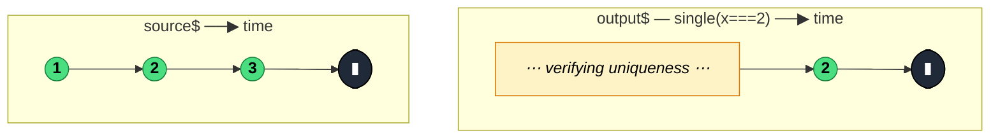

### `single<T>(predicate?)`

> Asserts that exactly **one** value (optionally matching a predicate) is emitted before completion — errors with `SequenceError` if more than one match, `NotFoundError` if none match, or `EmptyError` if the source is empty.

---

#### Policies

| Policy | Value |
|--------|-------|
| **Family** | Filtering / Selection (Assertion) |
| **Arity** | Unary |
| **Time-sensitive** | No |
| **Value-sensitive** | Yes (predicate) |
| **Lossy** | No — it asserts, it does not select from multiple; extra matches become errors |
| **Completion required** | Yes — must see source complete to know only one match existed |
| **Backpressure policy** | Latest — keeps at most one matched value |
| **Scheduler-aware** | No |
| **Multicast** | Unicast |
| **Error propagation** | Forward; also emits `EmptyError`, `NotFoundError`, or `SequenceError` |
| **Subscription lifecycle** | Per-subscriber |
| **Purity** | Pure |
| **Synchronicity** | Sync-by-default |

**Completion behaviour** — `single` collects at most one matching value and then waits for source completion. On completion it emits the captured value. If a second match occurs before completion, it errors *immediately* with `SequenceError` (does not wait for completion to detect). If the source completes without any value: `EmptyError`. Completes with values but none matched: `NotFoundError`.

**Lossy behaviour** — Not lossy in the usual "silently drops" sense. It either lets the single matching value through or errors — nothing is dropped quietly.

---

#### ASCII Marble Diagram

```
source:  --1--2--3--|
         single(x => x === 2)
output:  -----------(2|)

source:  --1--2--2--|
         single(x => x === 2)
output:  -----#        (SequenceError on second match)

source:  --1--3--|
         single(x => x === 2)
output:  --------#     (NotFoundError — values existed but none matched)

source:  --|
         single(x => x === 2)
output:  --#           (EmptyError — source never emitted)
```

---

#### Mermaid Marble Diagram



---

#### Signature

```typescript
export function single<T>(
	predicate?: (value: T, index: number, source: Observable<T>) => boolean
): MonoTypeOperatorFunction<T>

export function single<T>(predicate: BooleanConstructor): OperatorFunction<T, TruthyTypesOf<T>>
```

---

#### Five Use Cases

- **Uniqueness assertion** — verify at runtime that exactly one user record, one config match, or one handshake response is present
- **Database "by id" safety** — assert that a query result has a single hit, errors loudly if the constraint is violated
- **Test predicates** — in tests, assert that a stream emits exactly one value matching a condition before completing
- **Schema validation** — verify a parsed message contains one and only one of a required tag type
- **Contract enforcement at API boundaries** — ensure downstream code can rely on "exactly one" where schema or invariant guarantees it

---

#### Primary Code Sample

```typescript
import { from, single, catchError, EMPTY, Observable } from 'rxjs'

// Scenario: uniqueness assertion — find the single active session for a user
interface Session {
	id: string
	userId: string
	active: boolean
}

declare const sessions$: Observable<Session>
const userId = 'u-42'

const activeSession$: Observable<Session> = sessions$.pipe(
	single((s: Session): boolean => s.userId === userId && s.active),
	catchError((err: unknown): Observable<never> => {
		console.error('Session invariant violated:', err)
		return EMPTY
	})
)
```

The pattern is: use `single` where your domain model promises uniqueness, and handle the three error types (`EmptyError`, `NotFoundError`, `SequenceError`) in a `catchError` — each tells you a different kind of invariant violation.

---

#### Gotchas

1. **Three different error types, all different meanings** — `EmptyError` (source emitted nothing), `NotFoundError` (values existed, none matched), `SequenceError` (more than one matched). Branch on type if you want specific handling.
2. **Waits for completion before emitting the happy-path value** — even after the single match, `single` does not emit until source completion, because a second match could still arrive. On infinite sources this means it never emits on success.
3. **Errors early on second match** — unlike the empty/not-found cases (which wait for completion), `SequenceError` fires the moment a second match is detected. The subscriber cannot tell the difference from a regular stream error without inspecting the error type.
4. **Not the same as `first`** — `first` stops at the first match (lossy). `single` insists there is only one match in the whole stream (assertion). They are fundamentally different tools.
5. **Rarely the right operator in UI code** — in user-facing streams, `single`'s strictness usually produces surprise runtime errors. It is mostly a server-side or test-time assertion.

---

#### Related Operators

| Operator | Key difference | Choose when |
|----------|---------------|-------------|
| `first` | Emits on first match and unsubscribes | You want the first, don't care about uniqueness |
| `last` | Emits the last matching value | You want the most recent match |
| `elementAt(0)` | Indexed access, ignores others | You want the first by position |
| `filter` + `toArray` + manual check | Build your own assertion | You need different error semantics |
| `count` + `filter` | Count matches, decide downstream | You want to accept any count and handle branches |

---

#### Decision Rule

> Use `single` when **"exactly one match" is a hard invariant** and a violation should error. Prefer `first` for "give me the first", `last` for "give me the final", or `filter + toArray` when multiple matches are normal.
