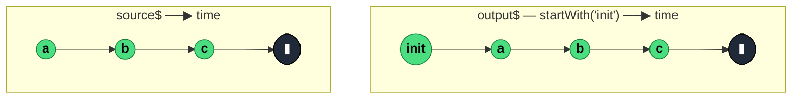

### `startWith<T, D>(...values: D[]): OperatorFunction<T, T | D>`

> Synchronously emits the given `values` at subscription time, then subscribes to the source and mirrors its emissions — a guaranteed initial value ahead of the real stream.

---

#### Policies

| Policy | Value |
|--------|-------|
| **Family** | Insertion / Prefix |
| **Arity** | Unary |
| **Time-sensitive** | No |
| **Value-sensitive** | No — values are injected literally |
| **Lossy** | No — all source values still flow through |
| **Completion required** | No — prefix emits immediately, source completion passes through |
| **Backpressure policy** | None |
| **Scheduler-aware** | No |
| **Multicast** | Unicast — each subscriber receives the prefix |
| **Error propagation** | Forward — source errors pass through; the prefix itself cannot error (primitive values) |
| **Subscription lifecycle** | Per-subscriber — prefix is replayed on each subscription |
| **Purity** | Pure |
| **Synchronicity** | Sync-by-default — prefix emits synchronously |

**Completion behaviour** — Prefix values emit synchronously at subscription time, then the source is subscribed. Source completion completes the output normally. Since the prefix doesn't need to wait for anything, `startWith` never stalls on its own — stalling only happens if the source itself stalls and you never see the values after the prefix.

**Lossy behaviour** — Not lossy. Prefix is added; nothing is dropped.

---

#### ASCII Marble Diagram

```
source:       --a--b--c--|
              startWith('init')
output:      init-a--b--c--|
              (`init` emits synchronously at t=0)

source:       --a--b--c--|
              startWith('x', 'y')
output:      xy-a--b--c--|
              (multiple prefix values, in order)
```

---

#### Mermaid Marble Diagram



---

#### Signature

```typescript
export function startWith<T, A extends readonly unknown[] = T[]>(
	...values: A
): OperatorFunction<T, T | ValueFromArray<A>>
```

Any number of prefix values, emitted in argument order.

---

#### Five Use Cases

- **Initial state for `combineLatest`** — ensure each branch emits at least once so the combinator produces a value
- **Loading-state seed** — emit `{ status: 'loading' }` before the actual data arrives to drive a progress UI
- **Reducer initial value** — feed the initial state into a `scan`-based reducer pipeline so the first view render has data
- **Default before fetch** — show an empty list or placeholder UI state before the API response arrives
- **Subscription notification** — emit a synthetic "I just subscribed" marker useful for logging or analytics

---

#### Primary Code Sample

```typescript
import { fromEvent, map, scan, startWith, Observable } from 'rxjs'

// Scenario: reducer initial value — MVU state stream with a guaranteed initial render
interface State { count: number }
type Action = { type: 'inc' } | { type: 'dec' }

const initialState: State = { count: 0 }

const action$: Observable<Action> = fromEvent<MouseEvent>(document, 'click').pipe(
	map((e: MouseEvent): Action => e.shiftKey ? { type: 'dec' } : { type: 'inc' })
)

const state$: Observable<State> = action$.pipe(
	scan((state: State, action: Action): State => {
		switch (action.type) {
			case 'inc': return { count: state.count + 1 }
			case 'dec': return { count: state.count - 1 }
		}
	}, initialState),
	startWith(initialState)
)
```

**MVU relevance:** `startWith(initialState)` is the canonical way to make a `scan`-based state stream emit on subscription — without it, the first render has to wait for the first action. Equivalent to `shareReplay(1)` + seed, but simpler for single-subscriber state.

---

#### Gotchas

1. **Prefix emits on every subscription** — because `startWith` is unicast, a second subscriber gets the prefix again. If you want a shared prefix (emitted once across subscribers), place `startWith` upstream of `shareReplay(1)` or `share()`.
2. **Not the same as `defaultIfEmpty`** — `startWith` always prepends, regardless of whether the source emits. `defaultIfEmpty` only emits if the source was empty.
3. **Prefix + combineLatest is a common idiom** — for `combineLatest([a$, b$])` to emit without waiting for both, apply `startWith(seedA)` and `startWith(seedB)` to each.
4. **Synchronous emission on subscribe** — subscribers that expect async scheduling may be surprised when their handler fires inside their own `subscribe()` call. Use `observeOn(asyncScheduler)` downstream if you need a microtask gap.
5. **Type widens to `T | D`** — if `T` and `D` differ, downstream code must handle both. Keep the types compatible (e.g. same shape) to avoid conditional branches.

---

#### Related Operators

| Operator | Key difference | Choose when |
|----------|---------------|-------------|
| `defaultIfEmpty` | Only emits if source is empty | You only want a fallback on empty |
| `concat(of(v), source$)` | Same effect, more verbose | You prefer concat's composition model |
| `endWith` | Appends values at completion | You want a suffix, not a prefix |
| `shareReplay(1)` + state | Replay the latest to late subscribers | You want a shared, always-latest start |
| `BehaviorSubject` | Always has a value | You want a subject, not an operator |

---

#### Decision Rule

> Use `startWith(...values)` when you need a **guaranteed initial value (or values) at subscription time** before the source is sampled. Prefer `defaultIfEmpty` for empty-only fallbacks, or a `BehaviorSubject` for stateful always-available values.
