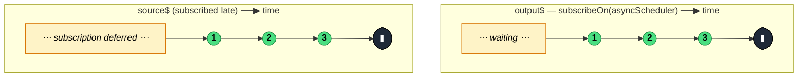

### `subscribeOn<T>(scheduler: SchedulerLike, delay = 0): MonoTypeOperatorFunction<T>`

> Schedules the **subscription** to the source on the given scheduler — controls *when the source starts running*, not when its emissions arrive downstream.

---

#### Policies

| Policy | Value |
|--------|-------|
| **Family** | Utility / Scheduling |
| **Arity** | Unary |
| **Time-sensitive** | Yes — optional `delay` for delaying subscription |
| **Value-sensitive** | No |
| **Lossy** | No |
| **Completion required** | No |
| **Backpressure policy** | None |
| **Scheduler-aware** | **Yes** |
| **Multicast** | Unicast |
| **Error propagation** | Forward |
| **Subscription lifecycle** | Per-subscriber — each subscription is scheduled |
| **Purity** | Pure |
| **Synchronicity** | Async-by-default |

**Completion behaviour** — Subscription to the source is **deferred** onto the given scheduler. Once subscribed, the source runs on its own scheduling; `subscribeOn` doesn't reschedule emissions. If the user unsubscribes before the scheduled subscription fires, the source never subscribes.

**Lossy behaviour** — Not lossy.

**Implementation note** — The operator schedules `source.subscribe(subscriber)` via `scheduler.schedule()`. The Subscription returned by `schedule()` is added to the subscriber so unsubscribing cancels the pending subscription.

---

#### ASCII Marble Diagram

```
merge(a$.pipe(subscribeOn(asyncScheduler)), b$)

Given:
a$:   (1,2,3 sync)
b$:   (4,5,6 sync)

Without subscribeOn:
output: 1,2,3,4,5,6  (a$ subscribed first, synchronously)

With subscribeOn(asyncScheduler) on a$:
output: 4,5,6,1,2,3  (b$ synchronously, a$ deferred to next tick)
```

---

#### Mermaid Marble Diagram



---

#### Signature

```typescript
export function subscribeOn<T>(
	scheduler: SchedulerLike,
	delay?: number
): MonoTypeOperatorFunction<T>
```

---

#### Five Use Cases

- **Defer expensive setup** — push a synchronous source's subscription off the current stack so the UI can paint first
- **Test interleaving** — in marble tests, control precisely when sources subscribe to simulate timing
- **Work prioritisation** — subscribe to low-priority sources on `asyncScheduler`, high-priority on `asapScheduler`
- **Breaking synchronous `merge` order** — when `merge(a$, b$)` subscribes both synchronously, `subscribeOn` lets you force one to run after the other
- **Delayed startup** — combine `subscribeOn(asyncScheduler, 500)` to defer subscription by 500ms without adding a `delay` that would also delay emissions

---

#### Primary Code Sample

```typescript
import { merge, of, subscribeOn, asyncScheduler, Observable } from 'rxjs'

// Scenario: break synchronous merge order — let b$ run first, then a$
const a$: Observable<string> = of('a1', 'a2', 'a3').pipe(subscribeOn(asyncScheduler))
const b$: Observable<string> = of('b1', 'b2', 'b3')

const merged$: Observable<string> = merge(a$, b$)
merged$.subscribe((val: string): void => console.log(val))

// Logs: b1, b2, b3, a1, a2, a3
// (b$ is subscribed synchronously; a$ is deferred to the next tick)
```

The practical use is rarer than `observeOn` — most "defer" scenarios are better handled with `defer()` at the source or `observeOn` for the emission side.

---

#### Gotchas

1. **Not the same as `observeOn`** — `subscribeOn` schedules the *start* of the source's work; `observeOn` schedules the arrival of its emissions at downstream. They solve different problems and often compose.
2. **Only the first `subscribeOn` in the chain matters** — because `subscribeOn` wraps the source in a scheduled subscription, chaining multiple `subscribeOn` calls is redundant. The innermost one wins.
3. **Pending subscription can be cancelled** — if the consumer unsubscribes before the scheduled subscription actually fires, the source is never subscribed. Useful for debounced-subscribe patterns.
4. **Doesn't affect sources that create their own schedulers** — `interval(1000)` uses its own scheduler internally; `subscribeOn` only changes *when* the `.subscribe()` call happens, not how the interval counts.
5. **Rarely the right answer** — real-world usage is niche. Most "defer work" intents are better expressed with `defer()` at the source or `observeOn` downstream. Reach for `subscribeOn` specifically when you need to control the *subscription side effect's timing*.

---

#### Related Operators

| Operator | Key difference | Choose when |
|----------|---------------|-------------|
| `observeOn` | Schedules emission timing, not subscription timing | You care about when downstream sees values |
| `defer` | Factory-creates the source on subscribe | You want lazy source creation |
| `delay(ms)` | Delays emissions, not subscription | You want to delay what the subscriber sees |
| `timer(delay) + switchMap` | Explicit delayed-trigger | You want a declarative "after N ms" pattern |

---

#### Decision Rule

> Use `subscribeOn` when you specifically need to **control when the source is subscribed** on a scheduler. In most cases, prefer `observeOn` for emission scheduling or `defer` for lazy source creation.
