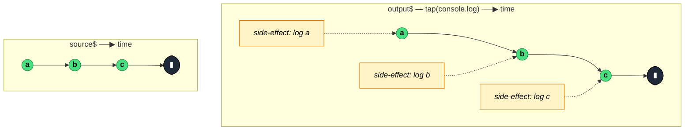

### `tap<T>(observerOrNext?: Partial<TapObserver<T>> | ((value: T) => void) | null)`

> Mirrors the source while invoking a side-effect callback for each notification — designated home for logging, debugging, and other side effects that don't alter the stream.

---

#### Policies

| Policy | Value |
|--------|-------|
| **Family** | Utility / Side Effects |
| **Arity** | Unary |
| **Time-sensitive** | No |
| **Value-sensitive** | No — pass-through transformation |
| **Lossy** | No — every value is forwarded |
| **Completion required** | No |
| **Backpressure policy** | None |
| **Scheduler-aware** | No |
| **Multicast** | Unicast — each subscriber's callbacks fire independently |
| **Error propagation** | Forward — synchronous errors thrown inside callbacks become stream errors |
| **Subscription lifecycle** | Per-subscriber — callbacks fire per subscription |
| **Purity** | **Side-effectful** (this is the *only* pure-side-effect operator) |
| **Synchronicity** | Sync-by-default |

**Completion behaviour** — Pure pass-through for `next`, `error`, `complete`. Additional lifecycle hooks in the `TapObserver` shape: `subscribe` (at subscription), `unsubscribe` (on explicit unsubscribe only), `finalize` (on any termination). `tap()` or `tap(null)` returns `identity` (no-op).

**Lossy behaviour** — Not lossy. `tap` never modifies or drops values — it only observes.

---

#### ASCII Marble Diagram

```
source:  --a--b--c--|
         tap(v => console.log(v))
output:  --a--b--c--|
         (console prints 'a', 'b', 'c' as they pass through)
```

---

#### Mermaid Marble Diagram



---

#### Signature

```typescript
interface TapObserver<T> extends Observer<T> {
	subscribe: () => void
	unsubscribe: () => void
	finalize: () => void
}

export function tap<T>(
	observerOrNext?: Partial<TapObserver<T>> | ((value: T) => void) | null
): MonoTypeOperatorFunction<T>
```

`tap(fn)` is shorthand for `tap({ next: fn })`. The observer form gives access to `next`, `error`, `complete`, `subscribe`, `unsubscribe`, `finalize`.

---

#### Five Use Cases

- **Debug logging** — drop `tap(console.log)` anywhere in a pipeline to see values as they flow
- **Metrics emission** — increment counters, report latencies, track events without altering the stream
- **Side-effect dispatch** — trigger a non-stream action (e.g. a Redux `store.dispatch`) on each emission
- **Assertion in tests** — verify invariants on values as they pass through, erroring the stream on violation
- **Lifecycle instrumentation** — hook into `subscribe`/`unsubscribe`/`finalize` to track stream lifecycles for diagnostics

---

#### Primary Code Sample

```typescript
import { fromEvent, map, tap, switchMap, Observable } from 'rxjs'

// Scenario: debug + metrics in an MVU effect pipeline
interface Action { type: string }

declare function logEvent(name: string, payload: unknown): void
declare function handleAction(a: Action): Observable<Action>

const actions$: Observable<Action> = fromEvent<MouseEvent>(document, 'click').pipe(
	map((e: MouseEvent): Action => ({ type: 'CLICK' })),
	tap((a: Action): void => logEvent('action-dispatched', a)),   // side-effect only
	switchMap((a: Action): Observable<Action> => handleAction(a))
)
```

**MVU relevance:** `tap` is where logging, analytics, and `dispatch` calls belong — *not* inside `map`, which must stay pure so the transformation is memoizable and testable.

---

#### Gotchas

1. **Synchronous errors in the callback terminate the stream** — throwing inside `tap(v => ...)` emits an `error`. If the callback could throw, wrap with try/catch or accept that the stream errors.
2. **Don't mutate values in `tap`** — technically possible, officially discouraged. The comment in the source says "You can mutate objects as they pass through" but mutation breaks downstream purity guarantees. Clone-and-mutate in `map` instead.
3. **Lifecycle hooks `subscribe`/`unsubscribe`/`finalize` are new in RxJS 7.3+** — older versions have only `next`/`error`/`complete`. `finalize` runs on any termination; `unsubscribe` only on explicit unsubscribe (not on `complete` or `error`).
4. **`tap(null)` or `tap()` is a no-op** — returns the identity function. Useful for conditional side effects: `shouldLog ? tap(log) : tap()`.
5. **Not a replacement for `finalize`** — if you only care about "clean up no matter how it ended", use `finalize`. `tap({ finalize })` does the same but mixed in with other observers.

---

#### Related Operators

| Operator | Key difference | Choose when |
|----------|---------------|-------------|
| `map` | Transforms values | You need to change the stream, not observe |
| `finalize` | Fires only on termination | You only need cleanup |
| `materialize` | Emits Notifications as data | You want errors/completions as values downstream |
| `do` (RxJS 5) | Legacy alias for `tap` | Do not use — replaced by `tap` |
| `subscribe` | Consumes the stream | You want to actually run the pipeline, not stay in `pipe` |

---

#### Decision Rule

> Use `tap` for **any side effect** (logging, metrics, dispatch) that must not alter the stream. Keep `map` and other transformation operators pure; side effects go here. For termination-only cleanup, prefer `finalize`.
