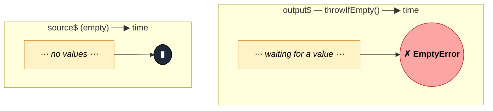

### `throwIfEmpty<T>(errorFactory?: () => any): MonoTypeOperatorFunction<T>`

> Mirrors the source; if the source completes without ever emitting, emits an error instead (default `EmptyError`, or the error returned by the optional factory).

---

#### Policies

| Policy | Value |
|--------|-------|
| **Family** | Filtering / Assertion |
| **Arity** | Unary |
| **Time-sensitive** | No |
| **Value-sensitive** | No — only checks "did any value arrive?" |
| **Lossy** | No — all source values pass through unchanged |
| **Completion required** | Partial — on empty completion only |
| **Backpressure policy** | None |
| **Scheduler-aware** | No |
| **Multicast** | Unicast |
| **Error propagation** | Forward; additionally injects its own error on empty completion |
| **Subscription lifecycle** | Per-subscriber — `hasValue` flag per subscription |
| **Purity** | Pure (the error factory should be) |
| **Synchronicity** | Sync-by-default |

**Completion behaviour** — If the source emits at least once, it's a pass-through including completion. If the source completes without any emission, it calls `errorFactory()` (default: `new EmptyError()`) and sends the error to the subscriber. On infinite sources with no values, stalls forever.

**Lossy behaviour** — Not lossy. The only modification to the stream is that empty completion is converted into an error — no values are dropped.

---

#### ASCII Marble Diagram

```
source:  --a--b--|
         throwIfEmpty()
output:  --a--b--|

source:  -----|          (empty)
         throwIfEmpty()
output:  -----#          (EmptyError)

source:  -----|
         throwIfEmpty(() => new Error('expected at least one click'))
output:  -----#          (custom Error)
```

---

#### Mermaid Marble Diagram



---

#### Signature

```typescript
export function throwIfEmpty<T>(
	errorFactory?: () => unknown
): MonoTypeOperatorFunction<T>
```

Default `errorFactory` returns `new EmptyError()`. The factory is called lazily — only when the error actually needs to be constructed.

---

#### Five Use Cases

- **Required API response** — treat an empty 204 / empty result stream as a failure to surface in a `catchError`
- **Mandatory handshake** — in a negotiated protocol, assert that at least one message was received before completion
- **Guarded timeouts** — after `takeUntil(timer(...))`, convert "no activity within window" into a timeout error
- **Form field requirement** — assert that a validated stream produced at least one valid value before close
- **Test preconditions** — in integration tests, demand that a setup stream produce ≥1 value or fail loudly

---

#### Primary Code Sample

```typescript
import { fromEvent, takeUntil, timer, throwIfEmpty, catchError, EMPTY, Observable } from 'rxjs'

// Scenario: guarded timeout — require at least one click in 3 seconds
const firstClickOrError$: Observable<MouseEvent> = fromEvent<MouseEvent>(document, 'click').pipe(
	takeUntil(timer(3000)),
	throwIfEmpty((): Error => new Error('No click within 3 seconds')),
	catchError((err: Error): Observable<never> => {
		console.warn('Timeout:', err.message)
		return EMPTY
	})
)

firstClickOrError$.subscribe((e: MouseEvent): void => console.log('clicked', e))
```

Pattern: `takeUntil(timeout)` caps the wait, `throwIfEmpty` converts "no value before cap" into a domain-meaningful error, and `catchError` decides what to do about it.

---

#### Gotchas

1. **Stalls on infinite sources with no values** — the error only fires on source completion. If your source never completes, the error never fires. Pair with `takeUntil(timer(...))` to force completion.
2. **Factory runs at most once per subscription** — but it's called fresh each time `throwIfEmpty` decides to error. Don't rely on side effects in the factory.
3. **Default error is `EmptyError`** — the same type as `first()` / `last()` emit on empty. Downstream `catchError` cannot distinguish them by type alone; supply a custom factory if you need a specific error class.
4. **Use with `takeUntil(timer(...))` for timeouts, not `timeout()`** — `timeout()` errors on *inter-emission silence*, not on "nothing ever emitted". For the latter, `takeUntil` + `throwIfEmpty` is the idiomatic combo.
5. **Not a validation operator** — it only checks for any emission, not whether the emissions are valid. Combine with `filter` upstream if you want "no valid value" to also error.

---

#### Related Operators

| Operator | Key difference | Choose when |
|----------|---------------|-------------|
| `defaultIfEmpty` | Substitutes a default instead of erroring | Empty is acceptable |
| `first` / `last` | Error on empty, but also select a single value | You want selection + assertion in one step |
| `isEmpty` | Emits a boolean instead of erroring | You want a yes/no answer downstream |
| `timeout` | Errors on idle time between emissions | You want inter-emission timeout, not empty-stream check |

---

#### Decision Rule

> Use `throwIfEmpty` when you want the source's values if any, but **empty completion should be a domain error**. Prefer `defaultIfEmpty` when empty is acceptable, or `first`/`last` when you also want to select a specific emission.
