### `withLatestFrom<T, O>(...inputs: [...ObservableInputTuple<O>])`

> On each source emission, pairs it with the most recent value from each auxiliary Observable — emitting nothing until every auxiliary has produced at least one value.

---

#### Policies

| Policy | Value |
|--------|-------|
| **Family** | Combination |
| **Arity** | N-ary — one primary source + N auxiliaries |
| **Time-sensitive** | No — emission cadence is driven purely by the primary source |
| **Value-sensitive** | No — values are passed through as tuples, not inspected |
| **Lossy** | Yes — source emissions **before** all auxiliaries have emitted once are silently dropped; auxiliary emissions between source emissions are overwritten (only the latest is kept) |
| **Completion required** | No — emits on every source emission once the "ready" latch flips |
| **Backpressure policy** | Latest — one slot per auxiliary, overwritten on each auxiliary emission |
| **Scheduler-aware** | No |
| **Multicast** | Unicast — each subscriber gets its own subscriptions to source and auxiliaries |
| **Error propagation** | Forward — error from any stream kills the combined output |
| **Subscription lifecycle** | Per-subscriber |
| **Purity** | Pure |
| **Synchronicity** | Sync-by-default |

**Completion behaviour** — Completion of an auxiliary is **ignored** (the source implementation uses `noop` as the auxiliary's complete handler). Completion of the primary source completes the output. Errors from any stream propagate. On infinite primary with finite auxiliary: `withLatestFrom` keeps using the last-seen auxiliary value forever.

**Lossy behaviour** — Two layers of lossiness:
- **Startup lossiness**: source emissions before every auxiliary has emitted once are dropped. A source that emits once early then stops may produce nothing.
- **Steady-state lossiness**: auxiliary values that arrive between source emissions are each overwritten by the next; only the one in the slot at the moment of the *next* source emission is sampled.

---

#### ASCII Marble Diagram

```
source:  --a----------b----c----|
other:   ----1---2---3----4------|
         withLatestFrom(other)

output:  -------------[b,3]-[c,3]--|
```

At time of `a`, `other` has no value → dropped. By the time `b` arrives, `other`'s latest is `3`. `4` arrives between `c` and completion — unused.

---

#### Mermaid Marble Diagram

```mermaid
flowchart LR
    subgraph source["source$ (primary) ──▶ time"]
        direction LR
        a((a)):::emit --> gap1[ ⋯ ]:::quiet --> b((b)):::emit --> c((c)):::emit --> sEnd([ ▮ ]):::done
    end
    subgraph other["other$ (auxiliary) ──▶ time"]
        direction LR
        o1((1)):::emit --> o2((2)):::emit --> o3((3)):::emit --> o4((4)):::emit
    end
    subgraph output["output$ ──▶ time"]
        direction LR
        drop[ a dropped: other not ready ]:::quiet --> p1(["[b,3]"]):::emit --> p2(["[c,3]"]):::emit --> oEnd([ ▮ ]):::done
    end
    source ~~~ other
    other ~~~ output
    classDef emit fill:#4ade80,stroke:#15803d,color:#000,font-weight:bold
    classDef quiet fill:#fef3c7,stroke:#d97706,color:#000,font-style:italic
    classDef err fill:#fca5a5,stroke:#b91c1c,color:#000,font-weight:bold
    classDef done fill:#1f2937,stroke:#000,color:#fff
```



---

#### Signature

```typescript
export function withLatestFrom<T, O extends unknown[]>(
	...inputs: [...ObservableInputTuple<O>]
): OperatorFunction<T, [T, ...O]>

// With projection function as last arg
export function withLatestFrom<T, O extends unknown[], R>(
	...inputs: [...ObservableInputTuple<O>, (...value: [T, ...O]) => R]
): OperatorFunction<T, R>
```

When the last argument is a function, it's used as a projection: `withLatestFrom(a$, b$, (src, a, b) => ...)`.

---

#### Five Use Cases

- **Command + current state** — on each user action, attach the latest UI state or store snapshot for handling in the reducer/effect
- **Event + auth token** — enrich each outbound request event with the most recent auth token from an auth stream
- **Click + current route** — on click, know which route the user is currently on without coupling routing into the click handler
- **Metric + config** — sample a monitoring metric with the latest config values to produce contextualised readings
- **Drag + mouse-move sampling** — on each "tick" source, read the latest mouse position from a pointer-move stream

---

#### Primary Code Sample

```typescript
import { Subject, BehaviorSubject, withLatestFrom, Observable, map } from 'rxjs'

// Scenario: command + current state — dispatch enriches each action with store state
interface Action { type: 'save' }
interface State { userId: string; draft: string }

const action$: Subject<Action> = new Subject<Action>()
const state$: BehaviorSubject<State> = new BehaviorSubject<State>({ userId: 'u1', draft: '' })

interface Command {
	action: Action
	userId: string
	draft: string
}

const enriched$: Observable<Command> = action$.pipe(
	withLatestFrom(state$),
	map(([action, state]: [Action, State]): Command => ({
		action,
		userId: state.userId,
		draft: state.draft,
	}))
)
```

**MVU relevance:** `withLatestFrom(state$)` is the canonical pattern inside an NgRx-style Effect — it attaches the current `State` snapshot to each dispatched Action without subscribing to state separately. Because `state$` is a `BehaviorSubject`, the "ready" latch flips synchronously on subscription — no dropped source emissions.

---

#### Gotchas

1. **Early source emissions are dropped** — if the source emits before every auxiliary has produced at least one value, those emissions vanish silently. Use `BehaviorSubject` auxiliaries (always have a value) or `startWith(seed)` to guarantee readiness.
2. **Auxiliary completion is ignored** — unlike `combineLatest`, one auxiliary completing does **not** complete the output. The last-seen value just keeps being used forever. This can mask bugs when you assumed the auxiliary would stay alive.
3. **Source completion completes the output** — symmetric with the above. Only the primary's completion matters.
4. **Use for "event + context", not for "merge everything"** — if you want every change on *any* source to emit, use `combineLatest`. `withLatestFrom` only emits when the *primary* emits.
5. **Projection function as last arg** — passing a function as the last argument is interpreted as a projection, not an Observable. Can confuse TypeScript if you pass a function-producing Observable (like `of(fn)`) by mistake.

---

#### Related Operators

| Operator | Key difference | Choose when |
|----------|---------------|-------------|
| `combineLatest` | Any source triggers an emission | You care about any change, not just source |
| `zip` | Pairs by position, waits for all | You need pairwise sequence alignment |
| `concatMap + take(1)` on auxiliary | Imperative snapshot | You want a once-only grab, not continuous sampling |
| `sample(notifier)` | Use auxiliary as the clock | Roles are reversed — auxiliary drives emission |
| `switchMap(s => state$.pipe(take(1), map(v => [s, v])))` | Explicit per-emission snapshot | You want to avoid the "dropped at startup" gotcha |

---

#### Decision Rule

> Use `withLatestFrom` when the **primary source drives emission** and you want to enrich each value with the latest from other streams. Prefer `combineLatest` when any source should trigger an emission, or explicit `switchMap + take(1)` if "always ready" snapshots matter more than the "latest" semantics.
