# Decision Trees Implementation Plan

> **For agentic workers:** REQUIRED SUB-SKILL: Use superpowers:subagent-driven-development (recommended) or superpowers:executing-plans to implement this plan task-by-task. Steps use checkbox (`- [ ]`) syntax for tracking.

**Goal:** Add 12 Mermaid flowchart decision-tree pages (one per operator category) to the `rxjs-operator-suffixes` VitePress site, each with clickable leaf nodes that link to operator deep-dive pages.

**Architecture:** New `docs/decisions/` directory with one `.md` per category plus an index. Each page contains one or two `flowchart TD` Mermaid diagrams. Category pages get a callout linking to their tree. Sidebar gets a new "Decision Trees" group.

**Tech Stack:** VitePress 1.6.4, Mermaid (built into VitePress), Markdown.

---

## File Map

| Action | Path |
|--------|------|
| Create | `docs/decisions/index.md` |
| Create | `docs/decisions/flattening.md` |
| Create | `docs/decisions/windowing-buffering.md` |
| Create | `docs/decisions/rate-limiting.md` |
| Create | `docs/decisions/transformation.md` |
| Create | `docs/decisions/filtering.md` |
| Create | `docs/decisions/combination.md` |
| Create | `docs/decisions/creation.md` |
| Create | `docs/decisions/multicasting.md` |
| Create | `docs/decisions/error-handling.md` |
| Create | `docs/decisions/side-effects.md` |
| Create | `docs/decisions/notification.md` |
| Create | `docs/decisions/scheduling-timing.md` |
| Modify | `docs/.vitepress/config.ts` — add Decision Trees sidebar group |
| Modify | `docs/categories/*.md` (all 12) — add decision-tree callout line |

---

## Mermaid Conventions (apply identically to every page)

- Questions: `{text}` diamond shape
- Terminal recommendations: `([operatorName])` stadium shape + `:::terminal`
- Color: `classDef terminal fill:#4ade80,stroke:#15803d,color:#000,font-weight:bold`
- Click target: `click NODE "/operators/name" "name — deep dive"`
- Footer on every decisions page: `→ [Category reference](../categories/<slug>) · [All decision trees](../decisions/)`

---

## Task 1 — Scaffold decisions directory + index page

**Files:**
- Create: `docs/decisions/index.md`

- [ ] **Create the index page**

```markdown
---
title: Decision Trees
---

# Which RxJS Operator Should I Use?

Answer a short sequence of questions to reach the right operator — every recommendation links directly to its full deep-dive page.

| Category | Key question |
|---|---|
| [Higher-Order / Flattening](./flattening) | Cancel, ignore, queue, or merge inner Observables? |
| [Windowing & Buffering](./windowing-buffering) | Collect into arrays or Observables? |
| [Rate Limiting](./rate-limiting) | Leading or trailing edge of a burst? |
| [Transformation](./transformation) | Stateless map or stateful accumulation? |
| [Filtering](./filtering) | Filter by position, count, or value? |
| [Combination](./combination) | Must sources complete, or emit continuously? |
| [Creation](./creation) | Adapt existing value or create from time? |
| [Multicasting & Sharing](./multicasting) | Replay to late subscribers? |
| [Error Handling & Recovery](./error-handling) | Error or completion triggered? |
| [Side Effects](./side-effects) | Per-value or on termination? |
| [Notification Objects](./notification) | Convert to or from Notification objects? |
| [Scheduling & Timing](./scheduling-timing) | New timer or decorate existing stream? |
```

- [ ] **Build to verify page renders**

```bash
npm run docs:build
```

Expected: `build complete` with no errors.

- [ ] **Commit**

```bash
git add docs/decisions/index.md
git commit -m "feat: add decisions/ index page"
```

---

## Task 2 — Flattening decision tree

**Files:**
- Create: `docs/decisions/flattening.md`

- [ ] **Create the file**

```markdown
---
title: "Which Flattening Operator?"
---

# Which Flattening Operator?

Each source value is projected into an inner Observable. The question is what happens to the *previous* inner when a *new* source value arrives.

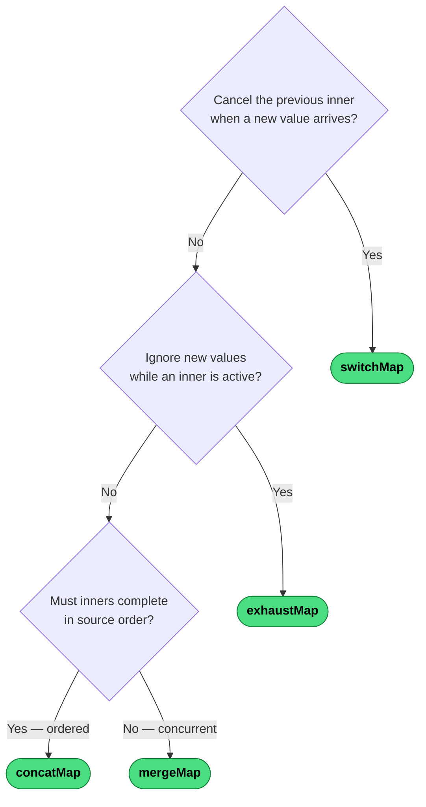

| Operator | Concurrency | On new inner |
|---|---|---|
| `switchMap` | 1 | Cancel previous |
| `exhaustMap` | 1 | Ignore new |
| `concatMap` | 1 | Queue new |
| `mergeMap` | ∞ | Subscribe immediately |

---
→ [Category reference](../categories/flattening) · [All decision trees](../decisions/)
```

- [ ] **Build and verify**

```bash
npm run docs:build
```

- [ ] **Commit**

```bash
git add docs/decisions/flattening.md
git commit -m "feat: add flattening decision tree"
```

---

## Task 3 — Windowing & Buffering decision tree

**Files:**
- Create: `docs/decisions/windowing-buffering.md`

- [ ] **Create the file**

````markdown
---
title: "Which Windowing or Buffering Operator?"
---

# Which Windowing or Buffering Operator?

Both families collect source emissions into groups. The first question is the output type; the second is what triggers the group boundary.

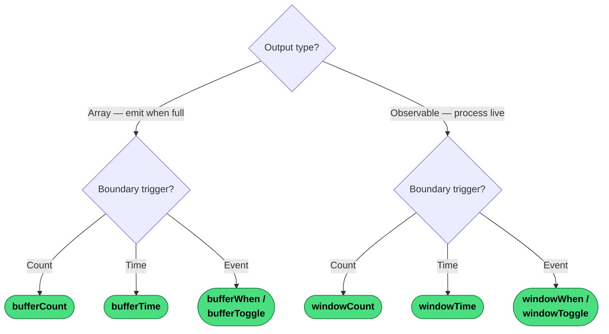

---
→ [Category reference](../categories/windowing-buffering) · [All decision trees](../decisions/)
````

- [ ] **Build and verify**

```bash
npm run docs:build
```

- [ ] **Commit**

```bash
git add docs/decisions/windowing-buffering.md
git commit -m "feat: add windowing & buffering decision tree"
```

---

## Task 4 — Rate Limiting decision tree

**Files:**
- Create: `docs/decisions/rate-limiting.md`

- [ ] **Create the file**

````markdown
---
title: "Which Rate-Limiting Operator?"
---

# Which Rate-Limiting Operator?

All four families are lossy — values that fall in the suppression window are dropped. The key question is which edge of a burst should survive.

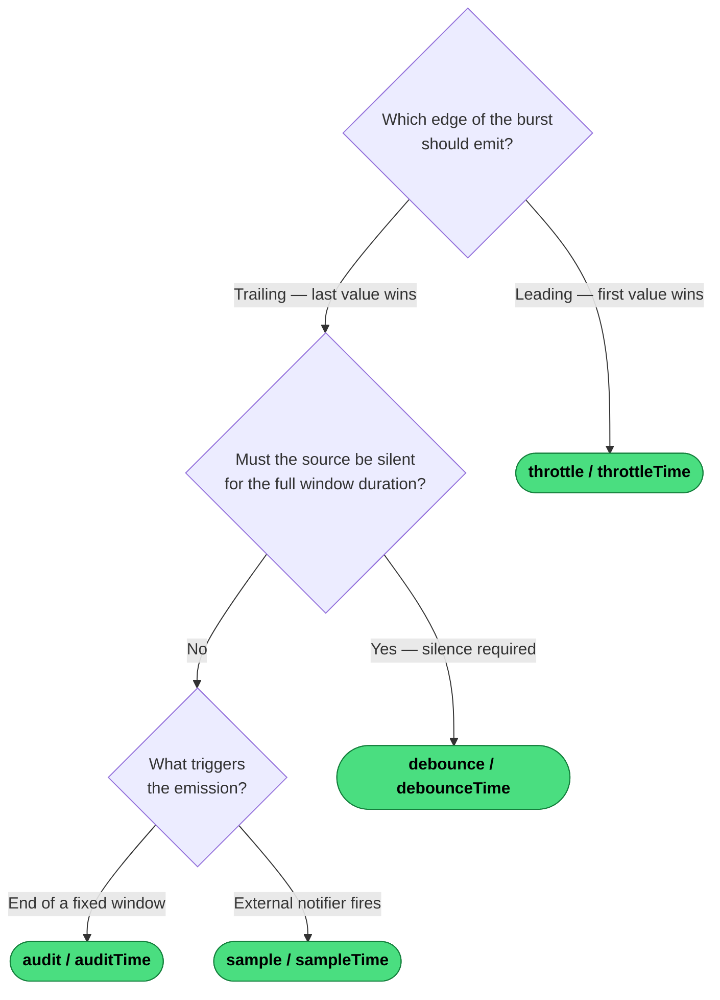

---
→ [Category reference](../categories/rate-limiting) · [All decision trees](../decisions/)
````

- [ ] **Build and verify**

```bash
npm run docs:build
```

- [ ] **Commit**

```bash
git add docs/decisions/rate-limiting.md
git commit -m "feat: add rate-limiting decision tree"
```

---

## Task 5 — Transformation decision tree

**Files:**
- Create: `docs/decisions/transformation.md`

- [ ] **Create the file**

````markdown
---
title: "Which Transformation Operator?"
---

# Which Transformation Operator?

Transformation operators reshape each emission without changing which values pass or how subscriptions work.

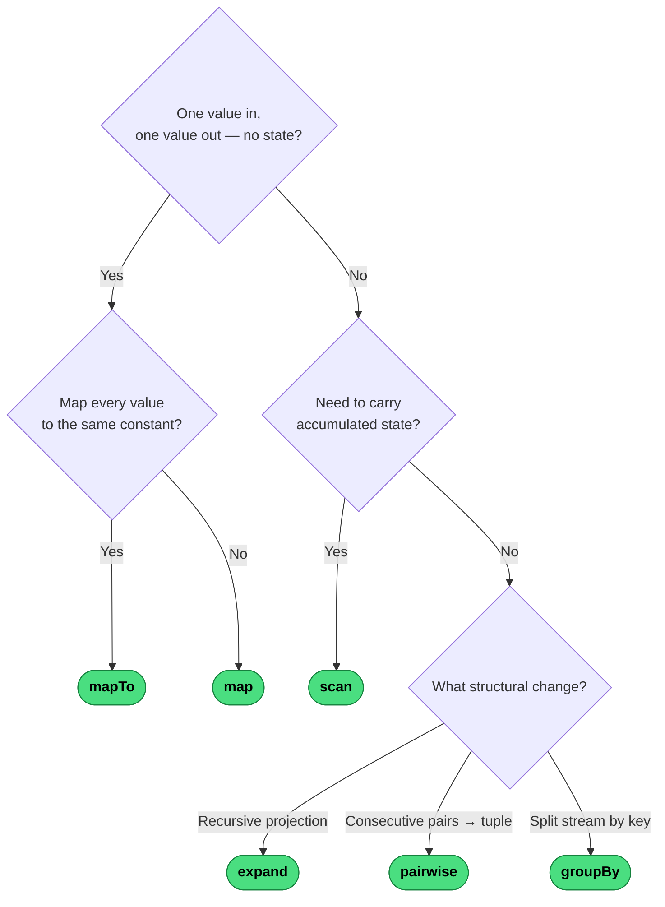

---
→ [Category reference](../categories/transformation) · [All decision trees](../decisions/)
````

- [ ] **Build and verify**

```bash
npm run docs:build
```

- [ ] **Commit**

```bash
git add docs/decisions/transformation.md
git commit -m "feat: add transformation decision tree"
```

---

## Task 6 — Filtering decision tree (two diagrams)

**Files:**
- Create: `docs/decisions/filtering.md`

- [ ] **Create the file**

````markdown
---
title: "Which Filtering Operator?"
---

# Which Filtering Operator?

Filtering has two distinct axes: **position/count** (where in the sequence) and **value/predicate** (what the value is). Use the diagram that matches your question.

## By Position or Count

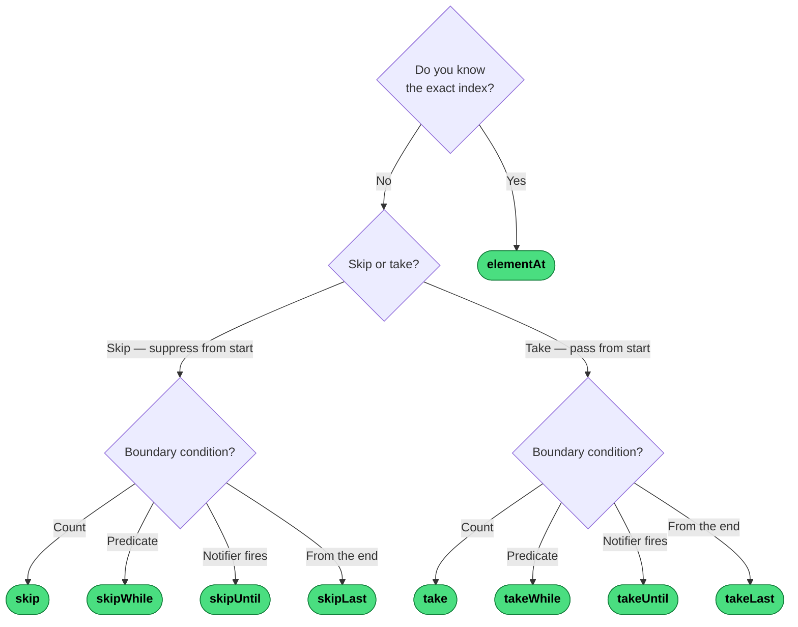

## By Value or Predicate

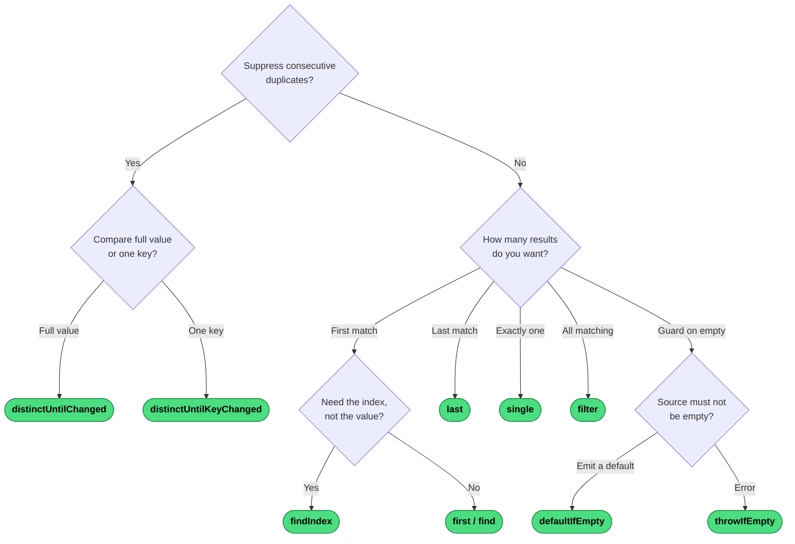

---
→ [Category reference](../categories/filtering) · [All decision trees](../decisions/)
````

- [ ] **Build and verify**

```bash
npm run docs:build
```

- [ ] **Commit**

```bash
git add docs/decisions/filtering.md
git commit -m "feat: add filtering decision tree (2 diagrams)"
```

---

## Task 7 — Combination decision tree

**Files:**
- Create: `docs/decisions/combination.md`

- [ ] **Create the file**

````markdown
---
title: "Which Combination Operator?"
---

# Which Combination Operator?

The first question divides the space cleanly: do all sources need to *complete* before you get a result?

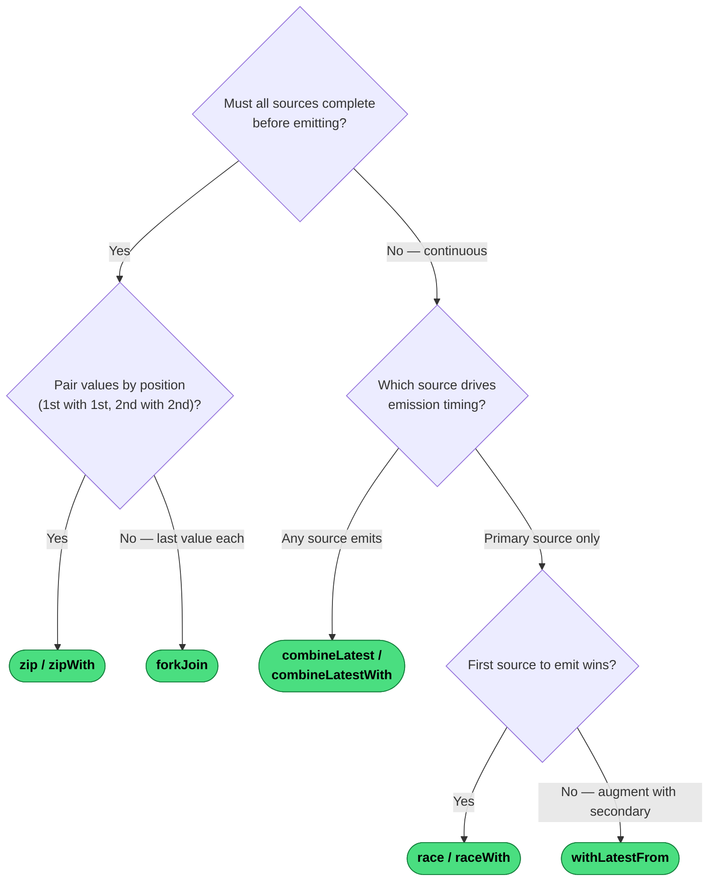

---
→ [Category reference](../categories/combination) · [All decision trees](../decisions/)
````

- [ ] **Build and verify**

```bash
npm run docs:build
```

- [ ] **Commit**

```bash
git add docs/decisions/combination.md
git commit -m "feat: add combination decision tree"
```

---

## Task 8 — Creation decision tree

**Files:**
- Create: `docs/decisions/creation.md`

- [ ] **Create the file**

````markdown
---
title: "Which Creation Operator?"
---

# Which Creation Operator?

Creation operators produce an Observable from scratch — no upstream source needed.

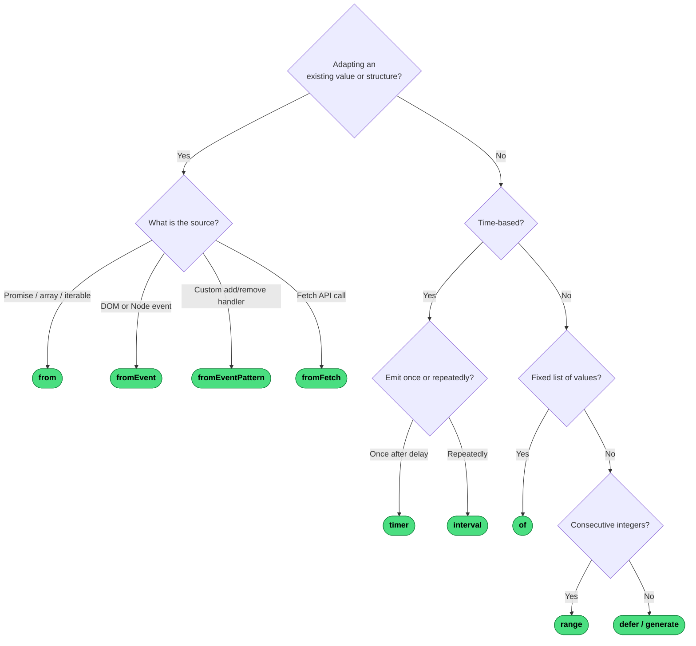

---
→ [Category reference](../categories/creation) · [All decision trees](../decisions/)
````

- [ ] **Build and verify**

```bash
npm run docs:build
```

- [ ] **Commit**

```bash
git add docs/decisions/creation.md
git commit -m "feat: add creation decision tree"
```

---

## Task 9 — Multicasting, Error Handling, Side Effects, Notification, Scheduling trees

**Files:**
- Create: `docs/decisions/multicasting.md`
- Create: `docs/decisions/error-handling.md`
- Create: `docs/decisions/side-effects.md`
- Create: `docs/decisions/notification.md`
- Create: `docs/decisions/scheduling-timing.md`

- [ ] **Create `docs/decisions/multicasting.md`**

````markdown
---
title: "Which Multicasting Operator?"
---

# Which Multicasting Operator?

All multicasting operators share one upstream subscription. The questions are whether you need replay and whether you need explicit `connect()` control.

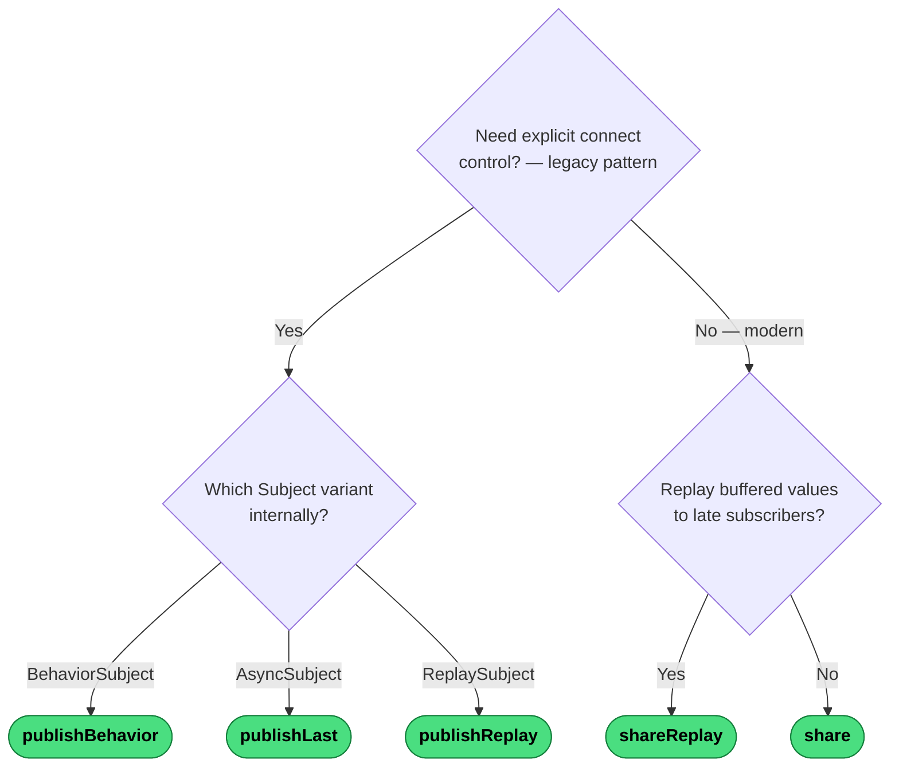

---
→ [Category reference](../categories/multicasting) · [All decision trees](../decisions/)
````

- [ ] **Create `docs/decisions/error-handling.md`**

````markdown
---
title: "Which Error Handling Operator?"
---

# Which Error Handling Operator?

The first split: are you reacting to an upstream **error** or an upstream **completion**?

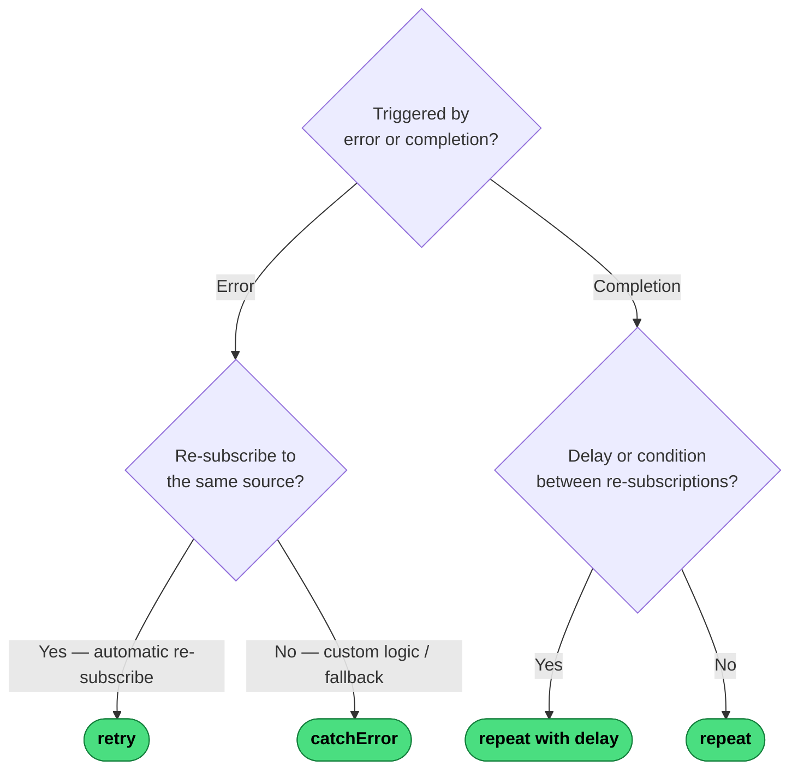

---
→ [Category reference](../categories/error-handling) · [All decision trees](../decisions/)
````

- [ ] **Create `docs/decisions/side-effects.md`**

````markdown
---
title: "Which Side-Effect Operator?"
---

# Which Side-Effect Operator?

Both operators are transparent to the data flow — they observe without altering. The only question is *when* the effect runs.

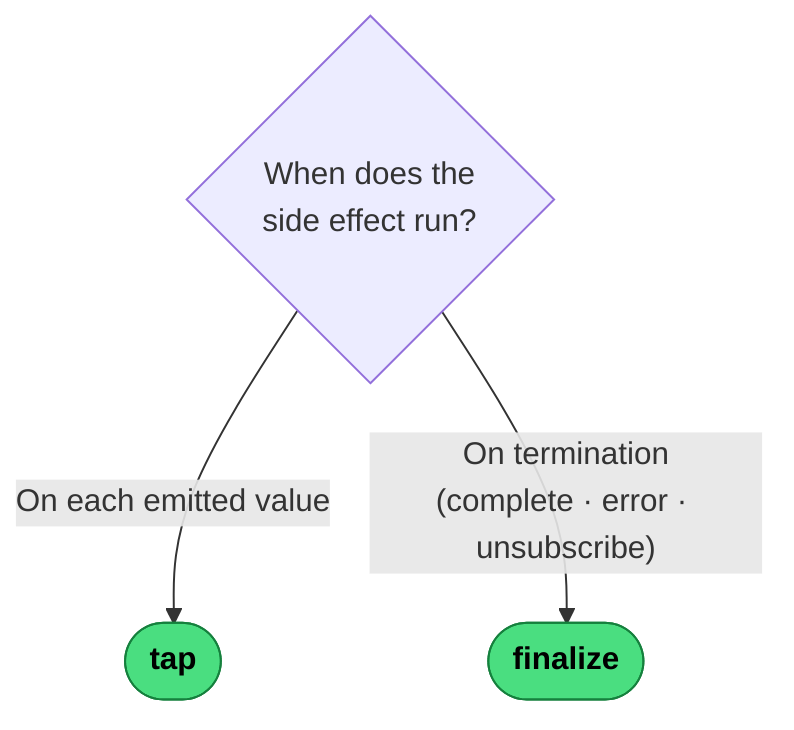

---
→ [Category reference](../categories/side-effects) · [All decision trees](../decisions/)
````

- [ ] **Create `docs/decisions/notification.md`**

````markdown
---
title: "Which Notification Operator?"
---

# Which Notification Operator?

`materialize` and `dematerialize` are inverse pairs — one converts events *to* objects, the other converts objects *back to* events.

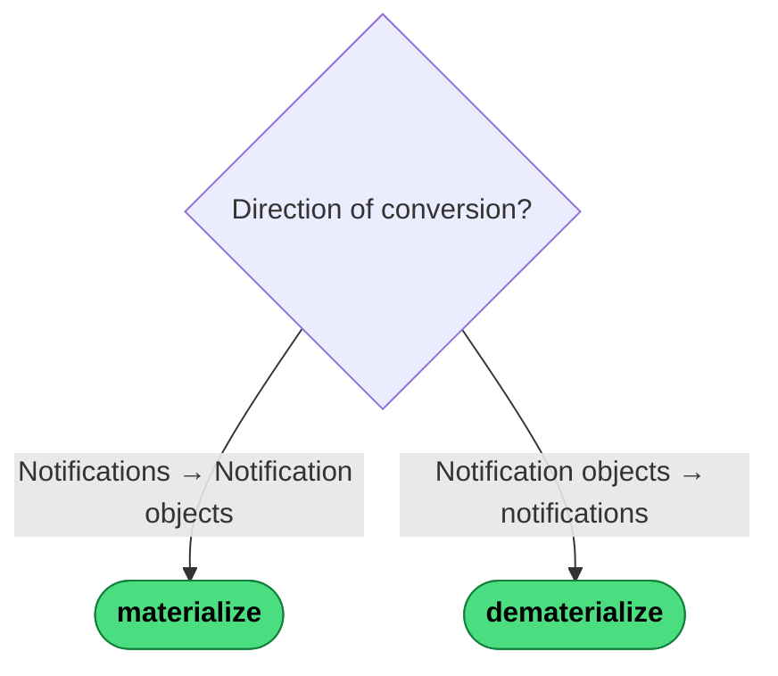

---
→ [Category reference](../categories/notification) · [All decision trees](../decisions/)
````

- [ ] **Create `docs/decisions/scheduling-timing.md`**

````markdown
---
title: "Which Scheduling or Timing Operator?"
---

# Which Scheduling or Timing Operator?

Start by asking whether you are *creating* a new time-based Observable or *decorating* an existing stream.

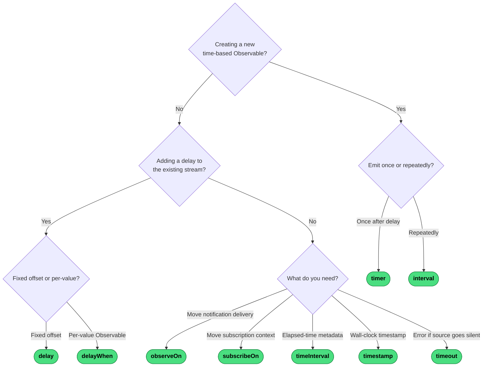

---
→ [Category reference](../categories/scheduling-timing) · [All decision trees](../decisions/)
````

- [ ] **Build and verify all five new pages**

```bash
npm run docs:build
```

Expected: `build complete` — all decision pages rendered without errors.

- [ ] **Commit**

```bash
git add docs/decisions/
git commit -m "feat: add remaining 5 decision trees (multicasting, error-handling, side-effects, notification, scheduling-timing)"
```

---

## Task 10 — Add decision-tree callouts to all 12 category pages

**Files:**
- Modify: `docs/categories/flattening.md`
- Modify: `docs/categories/windowing-buffering.md`
- Modify: `docs/categories/rate-limiting.md`
- Modify: `docs/categories/transformation.md`
- Modify: `docs/categories/filtering.md`
- Modify: `docs/categories/combination.md`
- Modify: `docs/categories/creation.md`
- Modify: `docs/categories/multicasting.md`
- Modify: `docs/categories/error-handling.md`
- Modify: `docs/categories/side-effects.md`
- Modify: `docs/categories/notification.md`
- Modify: `docs/categories/scheduling-timing.md`

- [ ] **Add callout to each category page**

In each `docs/categories/<slug>.md`, insert this line immediately after the frontmatter block (after the closing `---`), before the first paragraph:

| File | Line to insert |
|------|---------------|
| `flattening.md` | `> Not sure which to use? [Decision tree →](../decisions/flattening)` |
| `windowing-buffering.md` | `> Not sure which to use? [Decision tree →](../decisions/windowing-buffering)` |
| `rate-limiting.md` | `> Not sure which to use? [Decision tree →](../decisions/rate-limiting)` |
| `transformation.md` | `> Not sure which to use? [Decision tree →](../decisions/transformation)` |
| `filtering.md` | `> Not sure which to use? [Decision tree →](../decisions/filtering)` |
| `combination.md` | `> Not sure which to use? [Decision tree →](../decisions/combination)` |
| `creation.md` | `> Not sure which to use? [Decision tree →](../decisions/creation)` |
| `multicasting.md` | `> Not sure which to use? [Decision tree →](../decisions/multicasting)` |
| `error-handling.md` | `> Not sure which to use? [Decision tree →](../decisions/error-handling)` |
| `side-effects.md` | `> Not sure which to use? [Decision tree →](../decisions/side-effects)` |
| `notification.md` | `> Not sure which to use? [Decision tree →](../decisions/notification)` |
| `scheduling-timing.md` | `> Not sure which to use? [Decision tree →](../decisions/scheduling-timing)` |

Use the Edit tool for each file. The `old_string` to match in every file is the first content line after the frontmatter. For example in `flattening.md`:

```
old_string: "Each source value is projected"
new_string: "> Not sure which to use? [Decision tree →](../decisions/flattening)\n\nEach source value is projected"
```

- [ ] **Build and verify**

```bash
npm run docs:build
```

- [ ] **Commit**

```bash
git add docs/categories/
git commit -m "feat: add decision-tree callouts to all category pages"
```

---

## Task 11 — Update VitePress sidebar

**Files:**
- Modify: `docs/.vitepress/config.ts`

- [ ] **Insert Decision Trees sidebar group**

In `docs/.vitepress/config.ts`, find the `sidebar` array. Insert the following group **between** the `'Suffix Reference'` group and the `'Operator Deep Dives'` group:

```typescript
{
    text: 'Decision Trees',
    items: [
        { text: 'Overview', link: '/decisions/' },
        { text: 'Higher-Order / Flattening', link: '/decisions/flattening' },
        { text: 'Windowing & Buffering', link: '/decisions/windowing-buffering' },
        { text: 'Rate Limiting', link: '/decisions/rate-limiting' },
        { text: 'Transformation', link: '/decisions/transformation' },
        { text: 'Filtering', link: '/decisions/filtering' },
        { text: 'Combination', link: '/decisions/combination' },
        { text: 'Creation', link: '/decisions/creation' },
        { text: 'Multicasting & Sharing', link: '/decisions/multicasting' },
        { text: 'Error Handling & Recovery', link: '/decisions/error-handling' },
        { text: 'Side Effects', link: '/decisions/side-effects' },
        { text: 'Notification Objects', link: '/decisions/notification' },
        { text: 'Scheduling & Timing', link: '/decisions/scheduling-timing' },
    ],
},
```

Also update the `nav` array to add a Decision Trees entry:

```typescript
{ text: 'Decision Trees', link: '/decisions/' },
```

- [ ] **Final build**

```bash
npm run docs:build
```

Expected: `build complete` with 123+ HTML pages rendered.

- [ ] **Commit**

```bash
git add docs/.vitepress/config.ts
git commit -m "feat: add Decision Trees sidebar group and nav entry"
```
